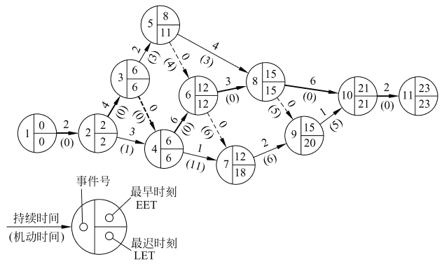

‍

‍

* **软件项目管理：**  通过计划、组织和控制等一系列活动，合理地配置和使用各种资源，以达到既定目标的过程
* 软件项目管理始于项目计划。为了估算项目工作量和完成期限，首先需要预测软件规模
* 软件质量保证是在软件过程中的每一步都进行的活动
* 软件配置管理是应用于整个软件过程中的保护性活动，是在软件整个生命期内管理变化的一组活动
* 能力成熟度模型（CMM）是改进软件过程的有效策略

‍

‍

## 1 估算软件规模

‍

### 代码行技术

当程序较小时常用的单位是代码行数（LOC），当程序较大时常用的单位是千行代码数（KLOC）

根据以往开发经验和开发数据，估算实现一个功能所需要的源代码行数

‍

**优点：**

* 代码是所有项目都有的“产品”，容易计算代码行数

‍

**缺点：**

* 源代码为软件配置的一个部分，用来衡量整个软件规模不太合理
* 不同语言实现同一软件所需要的代码行数不相同
* 不适用于非过程语言

‍

‍

### 功能点技术

以功能点（FP）为单位度量软件规模

(略)

‍

#### 信息域特性

(略)

‍

#### 估算功能点的步骤

(简单了解标题即可)

FP = UFP × TCF

‍

##### 计算未调整的功能点数UFP

‍

##### 计算技术复杂性因子TCF

‍

##### 计算功能点数 FP = UFP × TCF

‍

‍

## 2 工作量估算

工作量是软件规模的函数，工作量的单位通常是**人月(pm)**

‍

* 静态单变量模型（基本的COCOMO模型）
* 静态多变量模型（COCOMO2模型）
* 动态多变量模型（putnam模型）

‍

## 3 进度计划

‍

### 估算开发时间

成本估算模型也同时提供了估算开发时间T的方程。与工作量方程不同，各种模型估算开发时间的方程很相似

> Brooks规律： 向一个已经延期的项目增加人力，只会使得它更加延期

‍

生产率略

‍

### 甘特图

甘特图是制定进度计划的工具，优点是能形象描述任务分解情况，直观简洁和容易掌握

‍

**缺点**

(1) 不能显式地描绘各项作业彼此间的依赖关系。

(2) 进度计划的关键部分不明确，难于判定哪些部分应当是主攻和主控的对象。

(3) 计划中有潜力的部分及潜力的大小不明确，往往造成潜力的浪费

‍

‍

### 工程网络

> 当把一个工程项目分解成许多子任务，并且它们彼此间的依赖关系又比较复杂时，仅仅用Gantt图作为安排进度的工具是不够的，不仅难于做出既节省资源又保证进度的计划，而且还容易发生差错

工程网络是制定进度计划时另一种常用的图形工具，它同样能描绘任务分解情况以及每项作业的开始时间和结束时间，此外，它还显式地描绘各个作业彼此间的依赖关系

‍

#### 绘制

‍

* 用箭头表示作业(例如，刮旧漆，刷新漆，清理等)
* 用圆圈表示事件(一项作业开始或结束)
* 事件仅仅是可以明确定义的时间点，它并不消耗时间和资源
* 作业通常既消耗资源又需要持续一定时间
* 用开始事件和结束事件的编号标识一个作业
* 虚线箭头表示虚拟作业，也就是事实上并不存在的作业。为了显式地表示作业之间的依赖关系

‍

‍

### 估算工程进度

画出工程网络之后，系统分析员就可以借助它的帮助估算工程进度了。为此需要在工程网络上增加一些必要的信息

‍

#### 补充图例

* 把每个作业估计需要使用的时间写在表示该项作业的箭头上方。

  > 注意，箭头长度和它代表的作业持续时间没有关系，箭头仅表示依赖关系，它上方的数字才表示作业的持续时间
  >
* 为每个事件计算下述两个统计数字： 最早时刻EET和最迟时刻LET

  > 这两个数字将分别写在表示事件的圆圈的右上角和右下角
  >

‍

​​

‍

#### EET

事件的最早时刻是该事件可以发生的最早时间

‍

通常工程网络中第一个事件的最早时刻定义为零，其他事件的最早时刻在工程网络上从左至右按事件发生顺序计算。计算最早时刻EET使用下述3条简单规则

‍

(1) 考虑进入该事件的所有作业

(2) 对于每个作业都计算它的持续时间与起始事件的EET之和

(3) 选取上述和数中的最大值作为该事件的最早时刻EET

‍

#### LET

事件的最迟时刻是在不影响工程竣工时间的前提下，该事件最晚可以发生的时刻。

‍

‍

### 关键路径

关键路径用粗线箭头表示

关键路径上的事件(关键事件)必须准时发生，组成关键路径的作业(关键作业)的实际持续时间不能超过估计的持续时间，否则工程就不能准时结束

‍

> 工程项目的管理人员应该密切注视关键作业的进展情况，如果关键事件出现的时间比预计的时间晚，则会使最终完成项目的时间拖后；如果希望缩短工期，只有往关键作业中增加资源才会有效果

‍

### 机动时间

不在关键路径上的作业有一定程度的机动余地——实际开始时间可以比预定时间晚一些，或者实际持续时间可以比预定的持续时间长一些，而并不影响工程的结束时间

‍

一个作业可以有的全部机动时间等于它的结束事件的最迟时刻减去它的开始事件的最早时刻，再减去这个作业的持续时间：

                             机动时间 = (LET)结束-(EET)开始-持续时间

> 在工程网络中每个作业的机动时间写在代表该项作业的箭头下面的括号里

‍

‍

## 4 人员组织

(略)

软件开发的人员组织方式

* 民主制
* 主程序员组
* 现代程序员组

‍

### **民主制**

‍

* n(n-1)/2
* 人数少 适合技术难度高 成员经验丰富
* 一个名义组长 一同完成任务
* 优点： 对发现错误持积极态度 充分民主 高凝聚力 学术气氛浓厚 有利于攻克技术难关
* 缺点：如果多数成员技术水平不高经验缺乏 没有明确权威指导 缺乏必要协调 可能导致失败

‍

### 主程序员组

‍

* 主程序员 后备程序员 编程秘书 其他程序员
* 开发人员缺乏经验。 事务性工作多。 多渠道通信浪费时间

‍

### 现代程序员组

主程序员 -> 技术负责人 + 行政负责人

‍

## 5 质量保证

软件质量就是**软件与明确地和隐含地定义的需求相一致的程度**

‍

### 衡量因素

(自己期末考增添的, 举例)

* 正确性
* 健壮性
* 效率
* 完整性
* 可用性
* 风险

‍

‍

### 质量保障措施

‍

* 基于非执行测试（复审或评审）
* 基于执行测试（软件测试）
* 程序正确性的证明（数学方法）

‍

‍

## 6 软件配置管理

**软件配置管理**是在软件生命周期内管理变化的一组活动，用来标识、控制、报告变化，确保适当的实现了变化

‍

‍

### **基线**

通过了正式复审的软件配置项，可以作为进一步开发的基础，只有通过正式的变化控制过程才能改变它

‍

### 软件配置管理过程

* 标识对象
* 版本控制
* 变化控制
* 配置审计
* 状态报告

‍

‍

## 7 能力成熟模型

**能力成熟度模型（CMM）** 是用于评价软件机构的软件过程能力成熟度模型，用于帮助软件开发机构建立一个有规模的，成熟的软件过程。

‍

五个等级从低到高为

* 初始级

  > **无序 混乱** 只看个人工作能力
  >
* 可重复级

  > 建立了**基本的**项目管理过程 有经验的项目可以成功 策划跟踪稳定
  >
* 已定义级

  > 定义了完整的软件过程 软件过程**文档化和标准化 可追溯**
  >
* 已管理级

  > 定量的了解和控制软件过程和软件产品
  >
* 优化级

  > 可以使用定量信息来不断**改进和优化**
  >

‍
