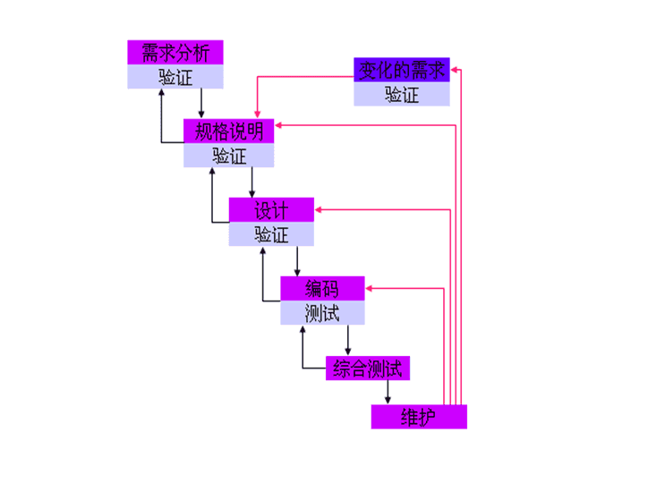
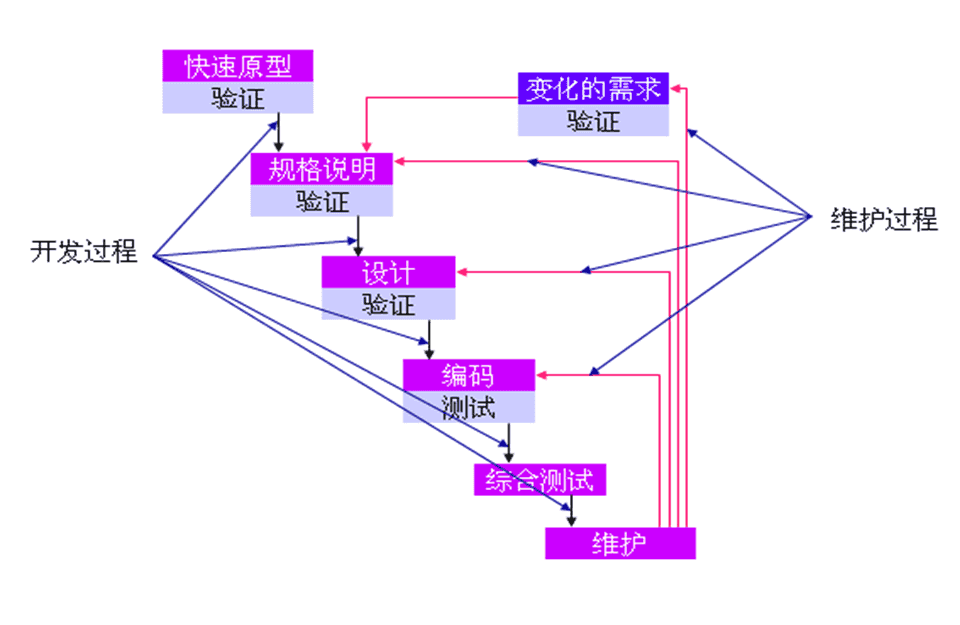
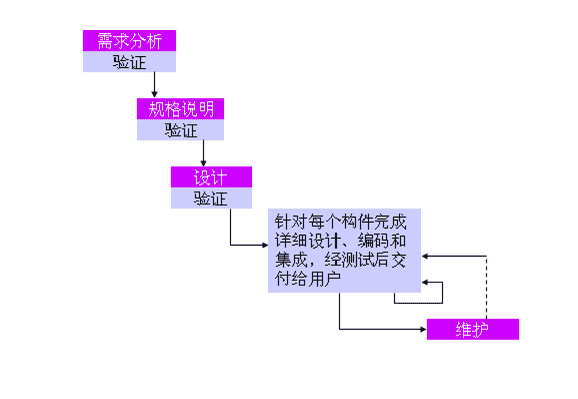
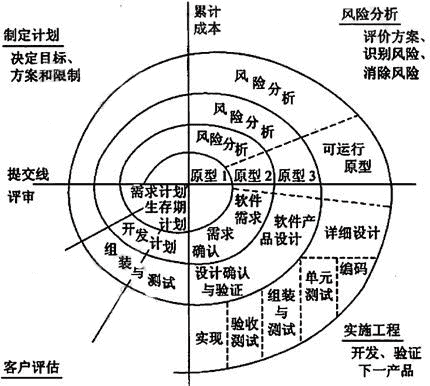
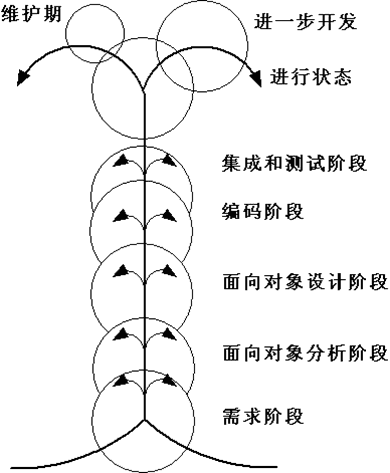
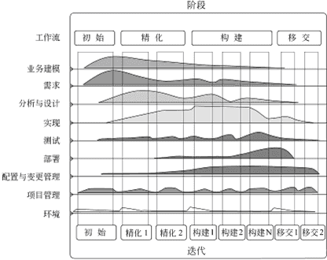
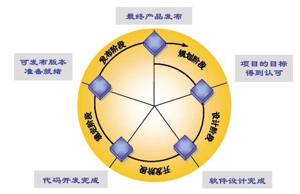
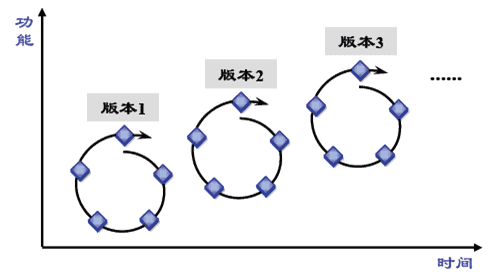

‍

## 0 软件

‍

### 软件

软件是计算机系统中与硬件相互依存的另一部分，它包括程序、数据及其相关文档的完整集合。(软件 = 程序 + 数据 + 文档)

* 程序:    是能够完成预定功能和性能的可执行指令序列
* 数据:    是使程序能够适当处理信息的数据结构
* 文档:    是开发、使用和维护过程程序所需要的图文资料

‍

### 软件的特点

(略)

‍

1.软件本身的复杂性

2.软件的成本高昂

3.软件开发未摆脱手工开发方式

4.软件维护与硬件有本质差，维护难度高

5.软件开发不是传统硬件制造过程

6.软件是一种逻辑实体，无磨损性

‍

## 1 软件危机

软件危机是 软件开发和维护过程中遇到的一系列严重问题

‍

### 软件发展阶段

|程序设计|程序系统|软件工程|第四阶段|
| :------: | :------: | :------: | :------: |
|**50年代中-60年代中**|**60年代中-70年代中**|**70年代中-80年代中**|**80年代中-现在**|

‍

|特点\\时期|基本软件期|程序设计方法时代|软件工程时期|
| ---------------| ----------------------------------| ------------------------------------------| ----------------------------------------------------------------------------------------------------|
|**软件所指**|程序|程序及说明书|程序、文档、数据|
|**主要程序设计语言**|汇编及机器语言|高级语言|软件语言|
|**软件工作范围**|程序编写|设计、编码和测试|软件周期|
|**软件使用者**|程序设计者本人|少数用户|市场用户|
|**软件开发组织**|个人|开发小组|开发小组及大中型软件开发机构|
|**软件规模**|小型|中小型|大中小型|
|**决定质量的因素**|个人编程技术|小组技术水平|技术水平及管理水平|
|**开发技术和手段**|子程序和程序库|结构化程序设计|数据库，开发工具，开发环境， 工程化开发方法，标准和规范， 网络及分布式开发面向对象技术及软件复用|
|**维护责任者**|程序设计者|开发小组|专职维护人员|
|**硬件特征**|价格高、存储容量小、工作可靠性差|速度、容量及工作可靠性有明显提高|向超高速，大容量，微型化及网络化方向发展|
|**软件特征**|完全不受重视|软件技术的发展不能清足需要，出现软件危机|开发技术有进步，但未获突破性进展，价格高未完全摆脱软件危机|

‍

‍

#### 程序设计阶段

- 软件生产个体化

  规模小，编写者和使用者同一个人
- 软件是设计者头脑中隐含过程

  除程序清单，无文档材料保存

‍

#### 程序系统阶段

- 产品软件

  由专门软件开发组织开发
- **软件作坊**

  软件开发组织，沿用早期个体化软件开发方法
- 软件危机

  软件维护工作耗费大量资源
- 软件工程

  1968年，北大西洋公约组织计算机科学家讨论软件危机，提出**软件工程**

‍

#### 软件工程阶段

- 软件危机得到缓解

  打破软件生产个体化特征

  工程化的设计原则、方法和标准
- 新的挑战

  微处理器和个人计算机

  分布式处理系统

  局域网、广域网

  宽带数字通讯

‍

#### 第四阶段

* 软件架构发生变化

  集中主机环境

  客户机/服务器（二层）

  客户机/服务器（三层）

  浏览器/服务器
* 新技术

  专家系统、人工智能、神经网络、并行计算、网络技术、高信度计算、云计算

‍

### 软件危机

在计算机软件开发和维护过程中遇到的一系列严重问题

‍

包含两个方面

* **如何开发**软件，以满足日益增长的软件需求
* **如何维护**数量不断膨胀的已有软件

‍

#### 表现

1. 开发成本和进度估不准​
2. 用户不满意
3. 质量靠不住
4. 可维护性差
5. 没有适当文档资料
6. 软件成本在计算机系统总成本中所占的比例逐年上升
7. 开发生产率低

‍

#### 原因

* 客观原因

  * ① 软件是计算机系统中的逻辑部件，缺乏“可见性”，因此管理和控制软件开发过程相当困难
  * ② 软件维护通常意味着改正或修改原来的设计，因此软件较难维护
  * ③ 软件规模庞大，而程序复杂性将随着程序规模的增加而呈指数上升
* 主观原因

  * ① 存在与软件开发和维护有关的许多错误认识和做法
  * ② 对用户要求没有完整准确的认识就匆忙着手编写程序
  * ③ 开发人员只重视程序而忽视软件配置的其余成分（文档和数据等）
  * ④ 软件开发人员轻视维护

‍

‍

#### 途径

* 应该对计算机软件有一个正确的认识，软件=程序+数据+相关文档；
* 应该充分认识到软件开发是一种组织良好、管理严密、各类人员协同配合、共同完成的工程项目。
* 应该推广使用在实践中总结出来的开发软件的成功的技术和方法， 并且研究探索更好更有效的技术和方法。
* 应该开发和使用更好的软件工具。

‍

## 2 软件工程

采用工程的概念、原理、技术和方法来开发与维护软件，把经过时间考验而证明正确的管理技术和当前能够得到的最好的技术方法结合起来， 以经济地开发出高质量的软件并有效地维护它

‍

‍

### 本质特征

‍

* 关注于大型程序的构造
* 中心课题是控制复杂性
* 软件经常变化
* 开发效率非常重要
* 和谐合作是关键
* 必须有效地支持用户
* 软件开发者替代其他领域人员创造产品

‍

‍

### 基本原理

‍

* 用分阶段的生命周期计划严格管理
* 坚持进行阶段评审
* 实行严格的产品控制
* 采用现代程序设计技术
* 结果应能清楚地审查
* 开发人员少而精
* 承认不断改进软件工程实践的必要性

‍

### 软件工程方法学

把在软件生命周期全过程中使用的一整套技术方法的集合称之为方法学，也称为泛型

‍

‍

#### 三要素

方法、工具、过程

‍

* **方法**：完成软件开发各项任务的技术方法，回答“**怎么做**”的问题
* **工具**：为运用方法提供的自动或半自动软件工程支撑环境
* **过程**：是为了获得高质量软件所需要完成的一系列任务框架，回答“**何时做**”的问题

‍

分类

---

#### **传统方法学（生命周期方法学）**

* 采用**结构化技术**完成软件开发各项任务
* 把软件生命周期的全过程依次划分为**若干阶段**
* 每个阶段开始和结束都有**严格标准**
* 每个阶段结束后要有**严格审查**

‍

‍

#### **面向对象方法学**

* 把对象作为融合了**数据及在数据上的操作行为**的统一的软件构件
* 把所有对象划分为**类**
* 按照父类与子类的关系，把若干类组成**层次结构**的系统
* 对象彼此间仅能通过发送**消息**互相联系

‍

‍

## 3 软件生命周期

软件生命周期由 软件定义、软件开发、软件维护组成

‍

* 定义
* 开发
* 维护

‍

### 定义

‍

#### 问题定义

弄清用户要解决什么问题

‍

#### 可行性研究

弄清用户要解决什么问题

‍

#### 需求分析

为解决这个问题，系统需要具备什么功能

‍

### 开发

前两个阶段又称为系统设计，后两个阶段又称为系统实现

‍

#### 总体设计

设计软件结构，确定程序由哪些模块组成以及模块间的关系

‍

#### 详细设计

争对每个模块，设计详细规格说明，确定算法和数据结构

‍

#### 编码和单元测试

将详细设计内容用语言实现，并测试每个模块

‍

#### 综合测试

通过各种类型测试使软件达到预定要求

‍

### 维护

‍

#### 软件维护

使软件在整个生命周期内保证满足用户需求

‍

‍

## 4 软件过程

‍

### 软件过程模型

软件过程：是为了获得高质量软件所需要完成的一系列任务框架，它规定了完成任务的工作步骤。通常用软件生命周期模型来描述软件过程。

‍

‍

### 常用软件过程模型

* 瀑布模型
* 快速原型模型
* 增量模型
* 螺旋模型
* 喷泉模型
* Rational统一过程
* *微软公司软件开发过程*
* 其他...

‍

‍

#### 瀑布模型

使用最早应用最广

‍

实际瀑布模型带**反馈环**

​​

​​

##### 特点

1. 阶段具有**顺序性**和**依赖性**

   前一阶段结束后一阶段开始，前一阶段输出文档，后一个阶段输入文档。
2. **推迟实现**观点

   瀑布模型在编码前设置系统分析、系统设计，推迟程序物理实现，保证前期工作扎实。
3. **质量保证**观点

   1. 每阶段都必须完成完整、准确的文档。该文档是软件开发时人员间通信、运行时维护的重要依据。
   2. 每阶段结束前对文档评审。

‍

‍

##### 评价

‍

**优点**

* **强迫开发人员使用规范的方法**
* **严格规定了每个阶段提交的文档**
* **要求每个阶段交出的所有产品都必须经过质量保证小组的仔细验证**
* **对文档的约束，使软件维护变得容易一些，且能降低软件预算**

‍

**缺点**

* **在软件开发的初期阶段就要求作出正确的、全面的、完整的需求分析对许多应用软件来说是极其困难的**
* **在需求分析阶段，当需求确定后，无法及时验证需求是否正确、完整**
* **作为整体开发的瀑布模型，由于不支持产品的演化，缺乏灵活性**

(可以使用改进的带反馈环的)

‍

##### 适用范围

* **用户的需求非常清楚全面，且在开发过程中没有或很少变化**
* **开发人员对软件的应用领域很熟悉**
* **用户的使用环境非常稳定**
* **开发工作对用户参与的要求很低**

‍

‍

#### 快速原型模型

快速原型是快速建立起来的可以在计算机上运行的程序，它所能完成的功能往往是最终产品能完成的功能的一个子集。

‍

​​

‍

##### 特点

快速原型模型是**不带反馈环**的，开发基本上是线性顺序进行的

‍

‍

##### 评价

‍

**优点**

* **开发的软件产品通常满足用户需求**
* **软件产品开发基本是线性过程**

‍

**缺点**

* **准确原型设计困难**
* **原型理解可能不同**
* **不利于开发人员创新**

‍

##### 适用范围

* **对所开发的领域比较熟悉而且有快速的原型开发工具**
* **项目招投标时，可以以原型模型作为软件的开发模型**
* **进行产品移植或升级时，或对已有产品原型进行客户化工作时**

‍

‍

#### 增量模型

也称为渐增模型

先完成一个系统子集的开发，再按同样的开发步骤增加功能，如此递增下去直至满足全部系统需求

‍

‍

‍

##### 特点

每个构件由多个相互作用的模块构成，并且能够完成特定的功能

> **区别于瀑布模型和快速原型模型：**
>
> 瀑布模型和快速原型模型是一次把满足所有需求产品提交给用户。
>
> 增量模型是==分批==向用户提交产品

第一个增量构件往往实现软件的基本需求，提供最核心的功能。把软件产品分解成增量构件时，应该使构件的规模适中。

分解时唯一必须遵守的约束条件是:当把新构件集成到现有软件中时，所形成的产品必须是可测试的

‍

‍

##### 评价

‍

**优点**

* **短时间内可提交完成部分功能**
* **逐渐增加产品功能，用户适应产品快**

‍

**缺点**

* **要求软件体系结构必须是开放的**
* **增量构件划分以及集成困难**
* **容易退化为边做边改模型**

‍

‍

##### 适用范围

* 进行已有产品升级或新版本开发
* 对完成期限严格要求的产品
* 对所开发的领域比较熟悉而且已有原型系统

‍

‍

#### 螺旋模型

把它看作在每个阶段之前都增加了**风险分析过程**的快速原型模型

‍

​​

‍

​​

‍

‍

笛卡尔坐标四象限表达四方面活动：

* 制定计划：确定目标、选定方案、设定约束条件。
* 风险分析：评估方案，识别和消除风险。
* 实施工程：软件开发。
* 客户评估：评价开发工作，计划下一阶段工作。

沿螺线自内向外每旋转一圈开发出更完善新版本。

​​

‍

‍

##### 特点

‍

‍

##### 评价

‍

**优点**

* **利于把软件质量作为软件的开发目标**
* **减少测试**
* **维护和开发不分开**

‍

**缺点**

* **风险估计困难**
* **过多的迭代次数会增加开发成本，延迟提交时间**

‍

##### 适用范围

适用于内部开发的大规模软件项目

‍

‍

#### 喷泉模型

‍

面向对象生命周期模型，体现迭代^（求精，系统某部分常被重复工作多次，相关功能在每次迭代中逐渐加入演进系统）^和无缝^（分析、设计、编码各阶段间不存在明显边界）^特性。

‍

‍

‍

‍

##### 特点

* 喷泉模型是一种以用户需求为动力，以对象为驱动的模型，主要用于描述面向对象的软件开发过程
* 体现了面向对象软件开发过程迭代和无缝的特性

‍

##### 评价

‍

**优点**

无缝，可同步开发，提高开发效率，节省开发时间，适应面向对象软件。

‍

**缺点**

可能随时加各种信息、需求与资料，需严格管理文档，审核的难度加大。

‍

‍

##### 适用范围

‍

#### RUP

Rational统一过程

由Rational软件公司推出的一种软件过程，该过程强调以迭代和渐增方式开发软件

RUP软件开发生命周期是一个二维的面向对象的生命周期模型

‍

##### 阶段

* 初始
* 精化
* 构建
* 移交

‍

​​

‍

‍

##### 特点

* 采用迭代和渐增的方式开发软件
* 具有多功能性和广泛适用性

‍

##### 评价

‍

**优点**

不断的版本发布成为一种团队日常工作的真正驱动力

将发现问题、制定方案和解决过程集成到下一代迭代

迭代开发，降低风险

更好地安排产品开发的辅助过程

‍

**缺点**

‍

##### 适用范围

‍

#### 敏捷过程

‍

‍

#### 极限编程

‍

‍

#### 微软过程

‍

微软过程把软件生命周期划分成五个阶段，图描绘了生命周期的阶段及每个阶段的主要里程碑

‍

‍

- 规划阶段

  开展市场调查研究，结合公司战略形成产品的远景目标。
- 设计阶段

  根据产品远景目标，完成软件功能规格说明和总体设计，确定产品开发的主要进度。
- 开发阶段

  完成产品中所有构件的开发工作。
- 稳定阶段

  实行全面的内部和外部测试，最终形成可发布的RTM版本
- 发布阶段

  确认产品质量符合发布标准后，发布产品及相关消息

‍

‍

微软过程的每一个生命周期发布一个递进的软件版本，各个生命周期持续、快速地迭代循环

‍

​​

​

‍

##### 特点

* 解决问题的及时性、不确定和变更因素可控性、缩短产品上市周期

  ‍

‍

‍

##### 评价

‍

‍

##### 适用范围

适用于商业环境下具有有限资源和有限开发时间约束的项目

‍
