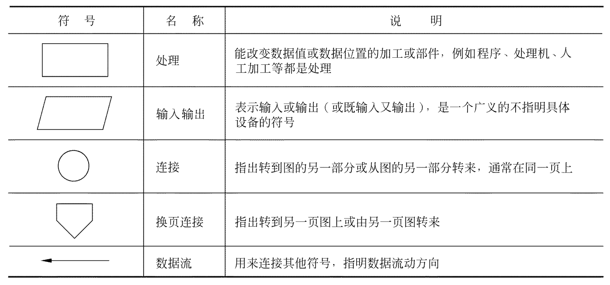
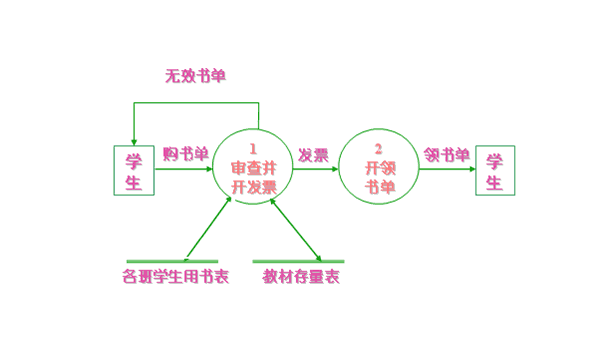
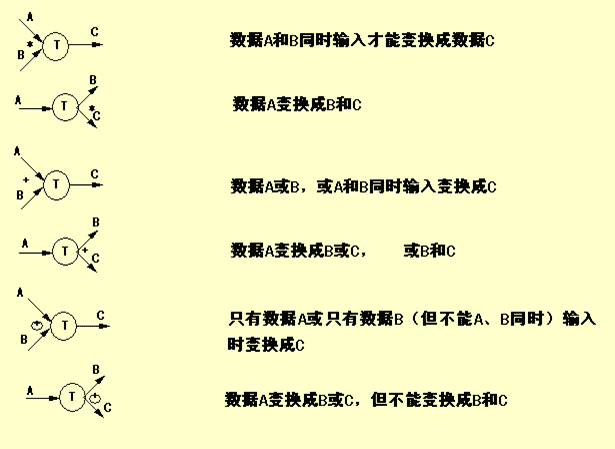
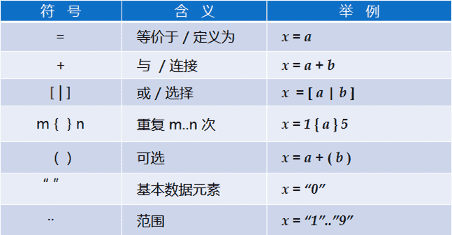

‍

## 1 可行性研究概念

可行性研究的目的不是解决问题，而是确定问题是否值得去解决

‍

### 目的

用最小的代价在最小的时间内确定问题是否可以被解决

‍

### 本质

系统分析和设计过程的大大**压缩和简化**，在**较高层次**上以较为抽象的方式进行系统的分析和设计过程

‍

‍

### 任务

‍

最根本任务：对以后的行动方针提出建议

‍

具体任务

‍

**1.分析和澄清问题的定义**

**2.导出系统的逻辑模型** (数据流图+数据字典)

**3.根据逻辑模型探索若干种可供选择的解法** (并判断可行性)

‍

#### 可行性

* **经济可行性**

  > ?效益>成本
  >
* **技术可行性**

  > 开发风险, 资源
  >
* **操作可行性**

  > 运行, 时间进度, 法律
  >

‍

‍

## 2 可行性研究过程

‍

1. 复查系统规模和目标
2. 研究目前正在使用的系统
3. 导出新系统的高层逻辑模型
4. 进一步定义问题
5. 导出和评价供选择的解法
6. 推荐行动方针
7. 草拟开发计划书
8. 写文档提交审查

‍

‍

## 3 系统流程图

系统流程图是概括地描绘物理系统的传统工具

> 系统流程图表达的是数据在系统各部件之间流动的情况，而**不是对数据进行加工处理的控制过程**，因此尽管系统流程图的某些符号和程序流程图的符号形式相同，但是它却是物理数据流图而不是程序流程图

‍

‍

符号

‍

​​

可以使用分层绘制的方法, 先给出大致的路径, 然后细化后绘制

‍

‍

## 4 数据流图

数据流图(DFD)描绘信息流和数据从输入移动到输出的过程中所经受的变换

没有任何具体物理部件，只是描绘数据在软件中流动和被处理的逻辑过程

‍

### 特点

* 数据流图中**没有具体的物理部件**，只是描绘数据在软件中流动和被处理的**逻辑过程**
* 数据流图是**系统逻辑功能的图形表示**，是分析员与用户之间极好的通信工具
* 设计时只需考虑系统**必须完成的基本逻辑功能**，不考虑怎样**具体地实现**这些功能

‍

‍

### 符号

‍

* 四种基本符号：

  * 正方形（或立方体）：表示数据的**源点或终点**

    ​​
  * 圆角矩形（或圆形）：代表**变换数据的处理**

    ​​
  * 开口矩形（两条平行横线）：代表**数据存储**

    ​​
  * 箭头：表示**数据流**、即**特定数据的流动方向**

    ​​

  ​​
* 附加符号

  ​​

‍

‍

‍

### 思路

需要绘制时候

1. **考虑数据的源点和终点**
2. 如何处理
3. 考虑数据流的方向, 从哪里送哪里
4. 数据存储到哪里

‍

基础模板

* 基本系统模型

  > 源点 -> 处理 -> 终点
  >
* 细化模型

  > 加入逻辑等
  >

‍

‍

#### 注意

* 在数据流图中应该描绘所有可能的数据流向，而不应该描绘出现某个数据流的条件
* 一个处理框可以代表一系列程序、单个程序或者程序的一个模块
* 一个数据存储可以表示一个文件、文件的一部分、数据库的元素或记录的一部分等
* 数据存储是处于静止状态的数据，数据流是处于运动中的数据
* 通常在数据流图中忽略出错处理
* 表示数据的源点和终点相同的方法是再重复画一个同样的符号表示数据的终点
* 代表同一事物的符号出现在n个地方，在这个符号的角上画(n-1) 条短斜线做标记
* (绘图)功能进一步分解涉及如何具体实现功能时，不应再分解

‍

#### 命名

1. 数据流（数据存储）命名

    1. 用名词，区别于控制流
    2. 代表整个数据流（数据存储）内容，不仅仅反映某些成分
    3. 不要用缺乏具体含义名字，如“数据”、“信息”
2. 处理命名

    1. 用动宾词组，避免使用“加工”，“处理”等
    2. 应反映整个处理的功能，不是一部分功能
    3. 通常仅包括一个动词，否则分解
3. 数据源点/终点

    不属于数据流图的核心内容

‍

‍

### 用途

1. 作为**交流信息**的工具
2. 作为**分析和设计**的工具

‍

### 其他

(个人补充)

**划分自动化边界**

当用数据流图辅助系统的设计时，以图中不同处理的定时要求为指南，能够在数据流图上画出许多组**自动化边界**，每组自动化边界可能意味着一个不同的物理系统，因此可以根据系统的逻辑模型考虑系统的物理实现。

> 例如有的部分需要监听, 有的需要使用观察者等等

‍

‍

## 5 数据字典

数据字典是关于数据的信息的集合，也就是对数据流图中包含的所有元素的定义的集合

‍

### 对象

‍

4类元素

* **数据流**
* **数据元素**
* **数据存储**
* **处理**

‍

‍

1. 数据流

    ```java
    数据流名:
        说明:简要介绍作用即它产生的原因和结果
        数据流来源:即该数据流来自何方
        数据流去向:去向何处
        数据流组成:数据结构
        每个数据量流通量:数据量、流通量
    ```

    ​​
2. 数据元素

    ```java
    数据元素名:

        类型: 数字（离散值、连续值), 文字（编码类型)
        长度:
        取值范围:
        相关的数据元素及数据结构:
    ```

    ​​
3. 数据存储

    ```java
    数据存储名:

        简述: 存放的是什么数据
        输入数据:
        输出数据:
        数据文件组成: 数据结构
        存储方式: 顺序，直接,关键码
        存取频率:
    ```

    ​​
4. 处理

    ```java
    处理名:
        处理编号:反映该处理的层次
        简要描述:加工逻辑及功能简述
        输入数据流:
        输出数据流:
        加工逻辑:简述加工程序、加工顺序
        ...
    ```

    ​​

‍

### 描述

典型的情况是，在数据字典中记录数据元素的下列信息：

1. **一般信息**，名字、别名、描述等等
2. **定义**，数据类型、长度、结构等等
3. **使用特点**，值的范围、使用频率、使用方式(输入、输出、本地)、条件值等等
4. **控制信息**，来源、用户、使用它的程序、改变权、使用权等等
5. **分组信息**，父结构、从属结构、物理位置记录、文件和数据库等等

‍

‍

### 组成

由数据元素组成数据的方式

‍

* **顺序**
* **选择**
* **重复**
* **可选**

‍

1. 顺序：以确定次序连接两个或多个数据元素；
2. 选择：从两个或多个可能元素中选一个；
3. 重复：把指定数据元素重复零次或多次；
4. 可选：一个数据元素可有可无。

‍

‍

### 符号

‍

|符号|含义|
| -----------| --------------------------------|
|=|等价于（或定义为）|
|+|顺序连接（确定次序连接）|
|[ \| ]|或（方括弧中的分量选一个）|
|{  }n|重复（重复花括弧中的分量）|
|（  ）|可选（圆括弧里的分量可有可无）|

‍

​​

‍

‍

#### 示例

> 北京某高校可用的电话号码有以下几类:校内电话号码由4位数字组成，第一位数字不是0。校外电话又分为本市电话和外地电话两类。拨校外电话需要先拨0，若是本市电话则接着拨8位数字(第一位不是0)，若是外地电话则拨3位区码后再拨8位电话号码(第一位不是0)

‍

* **电话号码**=[校内电话 | 校外电话]
* **校内电话**=非零数字+三位数字
* **非零数字**=[ 1 | 2 | 3 | 4 | 5 | 6 | 7 | 8 | 9 ]
* **三位数字**=3{数字}3
* **数字**=[ 0 | 1 | 2 | 3 | 4 | 5 | 6 | 7 | 8 | 9 ]
* **校外电话**=[本市电话 | 外地电话]
* **本市电话**=0 + 八位非零开头数字
* **八位非零开头数字**=非零数字+七位数字
* **七位数字**=7{数字}7
* **外地电话**=0 + 三位区码 + 八位非零开头数字
* **三位区码**=三位数字

‍

> 例如：  
> 学生成绩通知={ \{{学号+姓名+{ \{{课程名称+成绩} \}}+(补考课程名称+补考时间+补考地点)} \}}所有注册学生  
> 学生奖励通知={ \{{学号+姓名+[一等奖 | 二等奖 | 三等奖]} \}}所有获奖学生

‍

### 用途

(简单)

‍

**1.作为分析阶段的工具**

**2.数据字典中包含的数据元素的控制信息是很有价值的**

**3.数据字典是开发数据库的第一步，而且是很有价值的一步**

‍

‍

## 6 成本/效益分析

(简单)

‍

‍

### 成本估计

3种估算技术

‍

* 代码行技术
* 任务分解技术
* 自动估计成本技术

‍

### 考虑方面

‍

* 货币的时间价值
* 投资回收期
* 纯收入
* 投资回收率

‍
