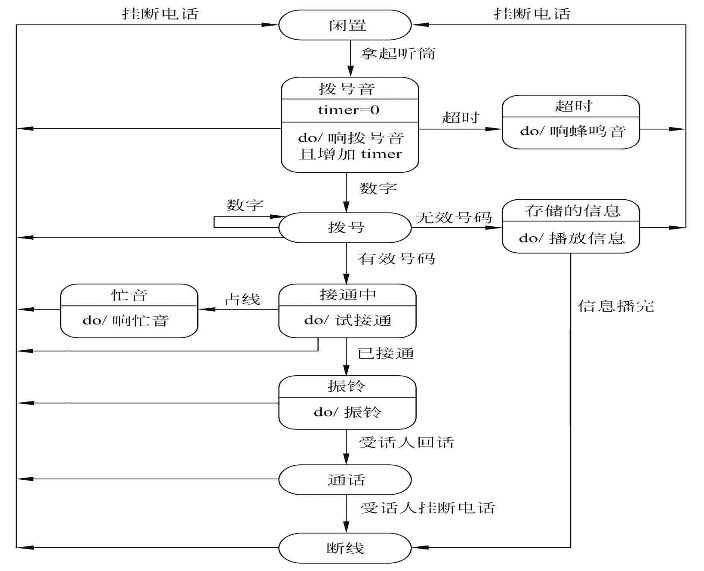

‍

‍

‍

## 1 需求分析的任务

‍

> 需求分析是软件定义时期的最后一个阶段,它的基本任务是准确地回答“系统必须做什么”这个问题，目标系统提出完整、准确、清晰、具体的要求。在需求分析阶段结束之前，系统分析员应该写出软件需求规明书，以书面形式准确地描述软件需求

‍

需求分析的任务

1. 建立分析模型
2. 编写需求说明

‍

需求分析的步骤

1. 问题分析
2. 需求描述
3. 需求评审

‍

‍

#### 需求分析准则

* 必须理解并描述问题的**信息域**，根据这条准则应该建立**数据模型**
* 必须定义软件**应完成的功能**，这条准则要求建立**功能模型**
* 必须描述作为**外部事件结果的软件行为**，这条准则要求建立**行为模型**
* 必须对描述**信息、功能和行为的模型**进行分解，用**层次的方式**展示细节

‍

下面是过程

---

### 1确定对系统的综合要求

‍

1. **功能要求**：系统必须提供的服务功能
2. **性能要求**：系统必须满足的约束条件（如响应速度、安全性等）
3. **可靠性和可用性需求**：可靠性定量、可用性量化 (量化了用户可以使用系统的程度)
4. **出错处理需求：**  错误响应机制，说明系统对环境错误应该如何响应(这类错误并不是由该应用系统本身造成)
5. **接口需求：**  用户, 硬件, 软件, 通信接口需求
6. **约束：**  用户或环境强加的限制条件（如工具、语言等）
7. **逆向需求：**  系统不应该做什么
8. **将来可能提出要求：**  未来进行扩充和修改

‍

‍

### 2分析系统的数据要求

软件需求分析的一个重要任务

‍

**常用的方法**

* 建立数据模型

**常用图形工具**

* 层次方框图
* warnier图

‍

### 3导出系统的逻辑模型

通常用**数据流图、实体联系图、状态转换图、数据字典**和主要的处理算法描述这个逻辑模型

‍

‍

### 4修正系统开发计划

准确地估计系统的成本和进度，修正以前制定的开发计划

‍

‍

## 2 与用户沟通获取需求的方法

(了解)

‍

### 1访谈

‍

#### A：基本形式

**正式会谈**：系统分析员将提出一些事先准备好的具体问题。

**非正式会谈**：分析员将提出一些用户可以自由回答的开放性问题，鼓励被访问人员说出自己的想法

‍

#### B：技术方法

**调查表技术**：当需要调查大量人员的意见时，向被调查人分发调查表是-一个十分有效的做法。经过仔细考虑写出的书面回答可能比被访者对问题的口头回答更准确。分析员仔细阅读收回的调查表，然后再有针对性地访问一些用户，以便向他们询问在分析调查表时发现的新问题

**情景分析技术**：是对用户将来使用目标系统解决某个具体问题的方法和结果进行分析。系统分析员利用情景分析技术，往往能够获知用户的具体需求。

‍

‍

### 2面向数据流自顶向下求精

> 面向数据流自顶向下逐步求精进行需求分析的方法。通过可行性研究已经得出了目标系统的高层数据流图，需求分析的目标之一就是把数据流和数据存储定义到元素级

‍

‍

### 3简易的应用规格说明技术

> 一种**面向团队的需求收集法**。这种方法提倡用户与开发者密切合作，共同标识问题，提出解决方案要素，商讨不同方案并指定基本需求。是信息系统领域使用的主流技术

‍

‍

#### 应用过程

(略)

* 进行初步的访谈并确定会议方案
* 进行会议准备
* 开会讨论
* 会后总结并起草规格说明书

‍

### 4快速建立软件原型

> 快速原型是快速建立起来的旨在**演示目标系统主要功能的可运行的程序**。构建原型的要点是，它**应该实现用户看得见的功能，省略目标系统的“隐含”功能**。快速建立软件原型是最**准确、最有效、最强大**的的需求分析技术

‍

特性

* 快速
* 容易修改

‍

使用工具

* 第四代技术
* 可重用的软件构件
* 形式化规格说明和原型环境

‍

‍

## 3 分析建模与规格说明

（了解）

‍

### 模型

是指为了理解事物而对事物做出的一种抽象，是对事物的一种无歧义的书面描述

‍

### 分类

* **数据模型（实体-联系图）** ：描绘数据对象及数据对象之间的关系
* **功能模型（数据流图）** ：描绘数据在系统中流动时被处理的逻辑过程，指明系统具有的变换数据的功能
* **行为模型（状态转换图）** ：描绘系统的各种行为模式在不同状态间转换的方式

‍

‍

### 软件需求规格说明

软件需求规格说明是需求分析阶段得出的最主要的文档

> 通常用自然语言完整、准确、具体地描述系统的数据要求、功能需求、性能需求、可靠性和可用性要求、出错处理需求、接口需求、约束、逆向需求以及将来可能提出的要求

> 不就是说明书嘛:)

‍

‍

## 4 实体联系图（E-R图）

‍

数据模型中包含3种相互关联的信息：数据对象、数据对象的属性及数据对象彼此间相互连接的关系

‍

‍

### 数据对象

对软件必须理解的复合信息^（复合信息是指具有一系列不同性质或属性的事物，仅有单个值的事物不是数据对象）^的抽象

> 可以由一组属性来定义的实体都可以被认为是数据对象

‍

#### 属性

属性定义了数据对象的性质。必须把一个或多个属性定义为“标识符”，即当希望找到数据对象的一个实例时，用标识符属性作为“关键字”(“键”)。应该根据对所要解决的问题的理解，来确定特定数据对象一组合适的属性

‍

#### 联系

数据对象彼此之间相互连接的方式称为联系，也称为关系。联系也可能有属性。联系可分为

* **一对一（1:1）**
* **一对多（1:N）**
* **多对多（M:N）**

‍

‍

### 实体联系图

矩形方框:实体  
菱形框:联系  
圆角矩形:属性

‍

> 见MySQL - 绘制ER

‍

评价

* **E-R模型比较接近人的思维习惯方式**
* **E-R模型使用简单的图形符号表达，便于用户理解**

‍

## 5 数据规范化

数据结构的规范化

范式定义消除数据冗余的程度

> 见MySQL - 范式

‍

‍

## 6 状态转换图

状态转换图(简称为状态图)通过描绘系统的状态及引起系统状态转换的事件，来表示系统的行为。此外，状态图还指明了作为特定事件的结果系统将做哪些动作

‍

‍

### 概念

‍

**状态** ：状态是任何可以被观察到的系统行为模式，一个状态代表系统的一种行为模式。

状态规定了系统对事件的响应方式。系统对事件的响应，既可以是做一个(或一系列)动作，也可以是仅仅改变系统本身的状态，还可以是既改变状态，又做动作

* 状态有初态、终态和中间状态
* 一张状态图只能有一个初态，而终态可以没有也可以有多个

‍

**事件**：事件是在某个特定时刻发生的事情，它是对引起系统做动作或(和)从一个状态转换到另一个状态的外界事件的抽象。简而言之，事件就是引起系统做动作或(和)转换状态的控制信息

‍

​​

‍

### 事件

3种标准事件：entry, exit和do

* entry事件指定进入该状态的动作
* exit事件指定退出该状态的动作
* do事件则指定在该状态下的动作

‍

‍

### 符号

箭头表示，箭头上标事件名。后跟[条件] 、表状态转换条件

状态图中两个状态之间带箭头的连线称为状态转换，箭头指明了转换方向。状态变迁通常是由事件触发的，在这种情况下应在表示状态转换的箭头线上标出触发转换的事件表达式；如果在箭头线上未标明事件，则表示在源状态的内部活动执行完之后自动触发转换

‍

​​

行为：进入某状态所作动作。状态框内do：行为名

‍

对于圆角矩形，可以将其分为上、中、下三部分：上部分是状态的名称；中部分是状态变量的名字和值；下部分是活动表

​​

‍

​​

‍

‍

## 7 其他图形工具

不要求

‍

‍

## 8 验证软件需求

(几方面即可)

验证正确性的四个方面

‍

* ==一致性==：所有需求必须是一致的，任何一条需求不能和其他需求互相矛盾
* ==完整性==：需求必须是完整的，规格说明书应该包括用户需要的每一个功能或性能
* ==现实性==：指定的需求应该能用现有的硬件和软件技术可以实现
* ==有效性==：必须证明需求是正确有效的，确实能解决用户面对的问题

‍

‍
