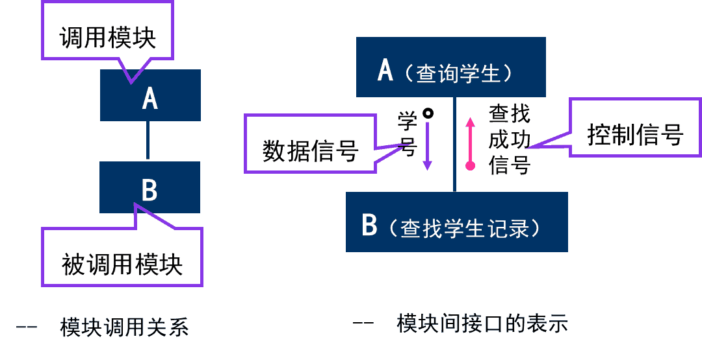
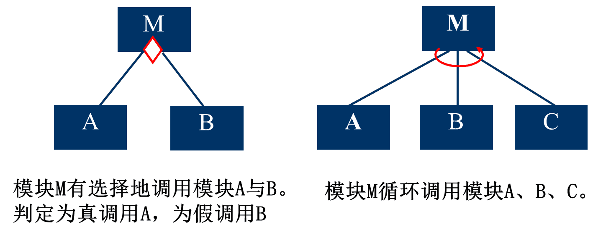
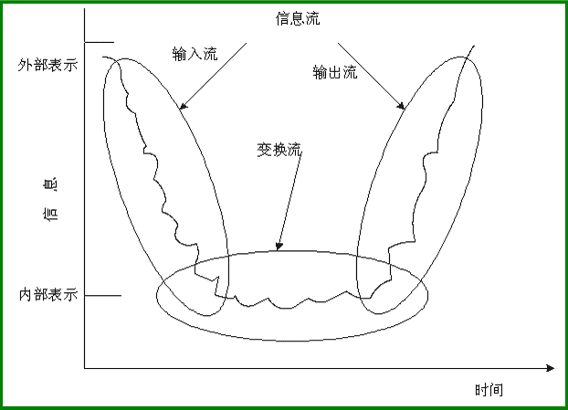
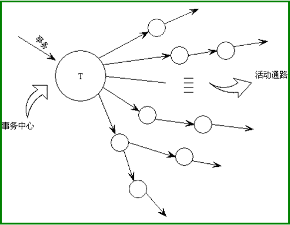
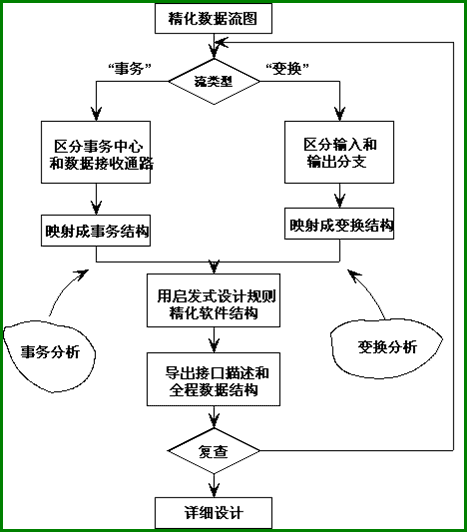

‍

* 基本目的就是回答“系统应该如何实现”这个问题, 又称为概要设计或初步设计
* 总体设计阶段主要由系统设计和结构设计两阶段组成
* 进行软件结构设计时应该遵循的最主要的原理是模块独立原理
* 层次图和结构图是描绘软件结构的常用工具

‍

‍

## 1 设计过程

包括**系统设计阶段**和**结构设计阶段**

‍

‍

### (1)系统设计阶段

‍

#### 1：设想供选择的方案

考虑各种可能的实现方案，并且力求从中选出**最佳方案**

‍

#### 2：选取合理的方案

选取若干个合理的方案, 通常至少选取**低成本、中等成本和高成本**的3种方案

对每个合理的方案分析员都应该准备下列4份资料：(1)系统流程图；(2)组成系统的物理元素清单；(3)成本/效益分析；(4)实现这个系统的进度计划

> 什么上策, 中策, 下策啊

‍

#### 3：推荐最佳方案

推荐一个最佳的方案，并且为推荐的方案制定详细的实现计划

‍

‍

### (2)结构设计阶段

‍

#### 4：功能分解

首先进行结构设计，然后进行过程设计。结构设计确定程序由哪些模块组成，以及这些模块之间的关系，属于总体设计阶段的任务；过程设计确定每个模块的处理过程，属于详细设计阶段的任务。

‍

#### 5：设计软件结构

通常程序中的一个模块完成一个适当的子功能，应该把模块组织成良好的层次系统，可以用层次图或结构图来描绘软件结构。如果数据流图已经细化到适当的层次，则可以直接从数据流图映射出软件结构，这就是面向数据流的设计方法。

‍

#### 6：设计数据库

需求分析阶段所确定的系统数据需求的基础上，进一步设计数据库

‍

#### 7：制定测试计划

‍

#### 8：书写文档

举例

* 系统说明
* 用户手册
* 测试计划
* 详细实现计划
* 数据库设计结果

‍

#### 9：审查和复查

技术审查通过后再由客户从管理角度进行复审

‍

‍

## 2 设计原理

‍

结构化设计的概念与原理

* 模块化
* 抽象
* 逐步求精
* 信息隐蔽和局部化
* 模块独立

‍

### 模块化

‍

#### 概念

‍

==模块==

由边界元素限定的相邻程序元素的序列,而且有一个总体标识符代表它。模块是构成程序的基本构件。过程、函数、子程序和宏等，都可作为模块。面向对象方法学中的对象是模块，对象内的方法也是模块

‍

==模块化==

把程序划分成独立命名且可独立访问的模块,每个模块完成一个子功能,把这些模块集成起来构成一个整体，可以完成指定的功能满足用户的需求

‍

‍

#### 作用

* 使软件结构清晰，不仅容易设计也容易阅读和理解
* 使软件容易测试和调试，有助于提高软件的可靠性
* 提高软件的可修改性
* 有助于软件开发工程的组织管理

‍

四个作用都有助于减少软件开发的工作量，进而降低软件开发成本

> 模块化对于减少工作量有着积极的作用
>
> 在长期实践的过程中，开发者们总结出了模块化和软件成本之间的关系
>
> ​​
>
> 每个程序都相应地有一个最适当的模块数目**M** ，使得系统的开发成本处于最小成本区间

‍

对于一个设计方法来说，可以从以下五个方面评价它的定义模块能力

1. 模块可分解性
2. 模块可组装性
3. 模块可理解性
4. 模块连续性
5. 模块保护性

‍

### 抽象

（了解）

抽出事物本质特性而暂时不考虑细节

‍

### 逐步求精

软件工程技术的基础

为了能集中精力解决主要问题而尽量推迟对问题细节的考虑

‍

‍

#### Miller法则

> 一个人能力的极限也只能把注意力集中在7±2个信息块

‍

‍

### 信息隐藏和局部化

‍

==信息隐藏==

指一个模块内包含的信息对于不需要这些信息的模块来说是不能访问的，主要是指模块的实现细节

‍

==局部化==

指把一些关系密切的软件元素物理地放得彼此接近，有助于实现信息隐藏

‍

信息隐藏和局部化意味着有效的模块化可以通过定义一组独立的模块而实现，这些独立的模块彼此间仅仅交换那些为了完成系统功能而必须交换的信息

‍

‍

### 模块独立

开发具有独立功能而且和其他模块之间没有过多的相互作用的模块，就可以做到模块独立。

使得每个模块完成一个相对独立的特定子功能，并且和其他模块之间的关系很简单。模块独立的概念是模块化、抽象、信息隐藏和局部化概念的直接结果。其质量标准是耦合和内聚

‍

**高内聚、低耦合是设计目标**

‍

‍

#### 独立的重要性

* 具有独立的模块的软件比较容易开发出来
* 独立的模块比较容易测试和维护

‍

#### 耦合

**耦合**：是对一个软件结构内不同模块间互连程序的度量。耦合强度取决于模块接口的复杂程度、通过接口的数据等。耦合度越高，模块独立性越弱

‍

耦合度从低到高

* 完全独立
* 数据耦合
* 特征耦合
* 控制耦合
* 外部耦合
* 公共耦合
* 内容耦合

‍

==设计原则==

* 力求做到**低耦合**
* 尽量使用**数据耦合**
* 少用**控制耦合**和**特征耦合**
* 限制**公共耦合**的范围
* 完全不用**内容耦合**

‍

---

##### 完全独立

(**非直接耦合)**

每一个都能独立地工作而不需要另一个模块的存在

​​

‍

##### 数据耦合

参数交换信息，而且交换的信息仅仅是数据

​​

‍

##### 特征耦合

整个数据结构作为参数传递而被调用的模块只需要使用其中一部分数据元素

被调用的模块可以使用的数据多于它确实需要的数据，这将导致对数据的访问失去控制，从而给计算机犯罪提供了机会

‍

##### 控制耦合

参数交换信息，并且传递的信息中包含控制信息(这种控制信息可以以数据的形式出现)，则称它们是控制耦合。控制耦合是中等程度的耦合，它增加了系统的复杂程度。控制耦合往往是多余的，可用数据耦合代替它

‍

​​

‍

##### 外部耦合

都访问同一全局简单变量，而且不通过参数表传递该全局变量的信息，则称之为外部耦合。外部耦合和公共耦合很像，区别就是一个是简单变量，一个是复杂数据结构

‍

##### 公共耦合

两个或多个模块通过一个公共数据环境相互作用,则称它们是公共环境耦合。公共环境耦合的复杂程度随耦合的模块个数增加而增加

‍

公共环境耦合有两种类型：

(1)一个模块往公共环境送数据，另一个模块从公共环境取数据。数据耦合的一种形式，是比较松散的耦合

(2)两个模块都既往公共环境送数据又从里面取数据，这种耦合比较紧密，介于数据耦合和控制耦合之间

‍

​​

‍

‍

##### 内容耦合

最高程度的耦合

‍

内容耦合情况:

* 一个模块直接访问另一模块的内容
* 一个模块不通过正常入口而转到另一个模块的内部
* 两个模块有一部分程序代码重叠(只可能出现在汇编程序中)
* 一个模块有多个入口(这意味着一个模块有几种功能)

​​

‍

‍

#### 内聚

‍

**内聚**：是用来度量一个模块内部各个元素彼此结合的紧密程度。内聚度越高，紧密程度越高

内聚和耦合是密切相关的，模块内的高内聚往往意味着模块间的松耦合。实践表明内聚更重要，应该把更多注意力集中到提高模块的内聚程度上

‍

内聚分为三大类低内聚、中内聚和高内聚 (了解)

内聚度从低到高

‍

* 偶然内聚
* 逻辑内聚
* 时间内聚
* 过程内聚
* 通信内聚
* 顺序内聚
* 功能内聚

‍

---

(低内聚)

‍

##### 偶然内聚

即使有关系，关系也是很松散的

> 程序的可理解性差，可维护性产生退化，模块也是不可重用的

‍

##### 逻辑内聚

逻辑上属于相同或相似的一类

> 逻辑内聚完成多个操作的代码互相纠缠在一起，即使局部功能的修改有时也会影响全局，导致严重的维护问题，难以重用。同时导致接口难以理解，造成整体上不易理解
>
> 解决代码纠缠的问题，可以进行**模块分解**

‍

##### 时间内聚

任务必须在同一段时间内执行

> 一定程度上反映了程序某些实质，所以时间内聚比逻辑内聚好一些；模块内操作之间的关系很弱，与其他模块的操作却有很强的关联，并且时间内聚的模块不太可能重用

‍

---

(中内聚)

##### 过程内聚

处理元素是相关的，而且必须以特定次序执行

> 过程内聚比时间内聚要好一些，至少操作之间是过程关联的，仍是弱连接，不太可能重用模块

‍

##### 通信内聚

元素都使用同一个输入数据和(或)产生同一个输出数据

> 即在同一个数据结构上操作。模块中各操作紧密相连，比过程内聚更好，但是它会导致模块不能重用。

‍

---

(高内聚)

##### 顺序内聚

处理元素和同一个功能密切相关，而且这些处理必须顺序执行

> 根据数据流图划分模块时，通常得到顺序内聚的模块，这种模块彼此间的连接往往比较简单

‍

##### 功能内聚

所有处理元素==属于一个整体==，完成一个单一的功能

> 最高程度的内聚。功能内聚可隔离错误，使得维护更容易，也更易扩展

‍

‍

## 3 启发规则

‍

**启发规则有**

* 改进软件结构提高模块独立性
* 模块规模应该适中
* 深度、宽度、扇入和扇出应适当
* 模块的作用域应该在控制域之内
* 力争降低模块接口的复杂程度
* 设计单入口单出口的模块
* 模块功能应该可以预测但要防止过分局限

‍

### （1）改进软件结构提高模块独立性

设计出软件的初步结构后，应该审查分析这个结构，通过模块分解或合并，力求降低耦合提高内聚

‍

主要从两个方面改进：

* 模块功能完善化。一个完整的模块包含：执行规定的功能的部分、出错处理的部分、返回一个“结束标志”
* 消除重复功能，改善软件结构，这里要区分完全相似和局部相似的功能

​​

‍

‍

### （2）模块规模应该适中

* 过大的模块往往是由于**分解不充分**，但是进一步分解必须符合问题结构，分解后不应该降低模块独立性
* 过小的模块**开销大于有效操作**，而且模块数目过多将使**系统接口复杂**。因此过小的模块有时不值得单独存在

‍

‍

### （3）深度、宽度、扇入和扇出应适当

**好的软件结构：顶层扇出较高，中层扇出较少，底层模块有高扇入**

‍

​​

‍

#### ==深度==

表示软件结构中控制的层数，能粗略地标志一个系统的大小和复杂程度

(一个系统下面有几层)

‍

#### ==宽度==

宽度是软件结构内同一个层次上的模块总数的最大值。宽度越大系统越复杂。对宽度影响最大的因素是模块的扇出​​

‍

#### ==扇出==

一模块直接控制（调用）模块数

‍

#### ==扇入==

有多少上级模块直接调用它

‍

‍

### （4）模块的作用域应该在控制域之内

> 长臂管辖不可取

* **作用域**：指受该模块内一个**判定影响**的所有模块的集合
* **控制域**：是这个模块本身以及所有直接或者间接从属于它的模块的集合(树下面的全部内容)

若模块作用域不再控制域内，会增大模块间控制耦合

‍

​​

‍

在一个设计得很好的系统中，**所有受判定影响的模块应该都从属于做出判定的那个模块**，最好局限于做出判定的那个模块**本身及它的直属下级模块**

‍

### （5）力争降低模块接口的复杂程度

‍

### （6）设计单入口单出口的模块

不要使模块间出现内容耦合

‍

### （7）模块功能应该可以预测但要防止过分局限

‍

## 4 描绘软件结构的图形工具

‍

* 层次图和结构图并不严格表示模块的调用次序，多数人习惯按调用次序从左到右画模块
* 也不指明何时调用下层模块，只表明一个模块调用那些模块，没有表示模块内还有没有其他成分
* 通常用层次图作为描绘软件结构的文档
* 由层次图导出结构图的过程，可以作为检查设计正确性和评价模块独立性的好方法

‍

### 层次图和HIPO图

层次图用来描绘软件的层次结构。数据结构的层次方框图相同，但是表现的内容却完全不同。层次图很适于在自顶向下设计软件的过程中使用

**一个矩形框代表一个模块，方框间的连线表示调用关系而不像层次方框图那样表示组成关系**

‍

HIPO图本质就是层次图加编号

‍

​​

‍

层次图和层次方框图的区别：

||层次图|层次方框图|
| --------| --------------| --------------|
|作用|描绘软件结构|描绘数据结构|
|矩形框|模块|数据元素|
|连线|调用关系|组成关系|

‍

‍

### 结构图

结构图不仅描述调用关系，还描述**传递的信息和调用方式**

‍

​​

#### 基本符号

* 方框代表模块、框内注明模块的名字或主要功能
* 箭头或直线表示调用关系
* 尾部是空心圆表示传递的是数据；若是实心圆则表示传递的是控制信息

‍

​​

‍

‍

#### 特殊符号

‍

​​

‍

‍

‍

## 5 面向数据流的设计方法

面向数据流的设计方法把信息流映射成软件结构，信息流的类型决定了映射的方法

‍

‍

### 信息流类型

‍

1. **变换流**

    信息沿输入通路进入系统，由外部形式变换成内部形式，通过变换中心加工处理后再沿输出通路变换成外部形式离开软件系统。

    ‍

    ​

    ​
2. **事务流**

    信息沿输入通路到处理，由处理根据输入信息类型在若干动作序列中选一个执行。

    ‍

    处理T称**事务中心**，完成任务：

    1. 接收输入信息（又称事务）
    2. 分析每个事务确定类型
    3. 根据事务类型选取一活动通路

    ‍

    ​​

‍

### 面向数据设计过程

‍

​​

‍

‍

### 变换分析

(略)

‍

变换分析是一系列设计步骤的总称，经过这些步骤把具有变换流特点的数据流图按预先确定的模式映射成软件结构

‍
