‍

‍

* 结构程序设计技术是进行详细设计的逻辑基础
* 过程设计是详细设计阶段完成的主要工作

‍

**详细设计目的**

确定怎样具体地实现所要求的系统。得出对目标的精确描述

‍

**详细设计任务**

* 过程设计:即设计软件体系结构中所包含的每个模块的实现算法。
* 数据设计:设计软件数据结构。
* 接口设计:设计软件内部各模块之间的接口

‍

‍

## 1 结构程序设计

‍

经典定义：如果一个程序的代码块仅仅通过**顺序、选择和循环**这3种基本控制结构进行连接，并且每个代码块只有**一个入口和一个出口**，则称这个程序是结构化的。

‍

更全面的定义：结构程序设计是尽可能少用GO TO语句的程序设计方法。最好仅在检测出错误时才使用GO TO语句，而且应该总是使用前向GO TO语句

‍

为了实际使用方便起见，常常还允许使用DO-UNTIL和DO-CASE两种控制结构

‍

​​

‍

### 类型

* 只允许使用顺序、IF-THEN-ELSE型分支和DO-WHILE型循环这3种基本控制结构，则称为 **经典的结构程序设计**
* 还允许使用DO-CASE型多分支结构和DO-UNTIL型循环结构，则称为 **扩展的结构程序设计**
* 再允许使用LEAVE(或BREAK)结构，则称为 **修正的结构程序设计**

‍

## 2 人机界面设计

‍

> 三条黄金规则(略)
>
> 1. 界面要置用户于控制之下
> 2. 界面内容要减少用户记忆负担
> 3. 各个保持界面一致

‍

### 设计遇到问题

‍

#### 系统响应时间

‍

要素

* **长度**
* **易变性**

  响应时间相对平均响应时间偏差，越低越好

‍

#### 用户帮助措施

略

‍

#### 出错信息处理

略

‍

#### 命令交互

略

‍

‍

### 设计过程    

‍

> 用户界面设计是一个迭代的过程，通常先创建设计模型，再用原型实现这个设计模型，并由用户试用和评估，然后根据用户意见进行修改

略

‍

‍

‍

## 3 过程设计的工具

‍

* 程序流程图
* 盒图（N-S图）
* PAD图
* 判定表
* 判定树
* 过程设计语言（PDL）

‍

‍

### 程序流程图

又称为程序框图，是历史最悠久，使用最广泛的描述过程设计的方法，然而它也是用得最混乱的一种方法

‍

程序设计流图标准化图符

‍

​​

* a：**选择**
* b：注释
* c：预先定义的处理
* d：多分支
* e：**开始或停止**
* f：准备
* g：循环上界限
* h：循环下界限
* i：虚线
* j：省略符
* k：并行方式
* l：**处理**
* m：**输入输出**
* n：连接
* o：换页连接
* p：**控制流**

‍

​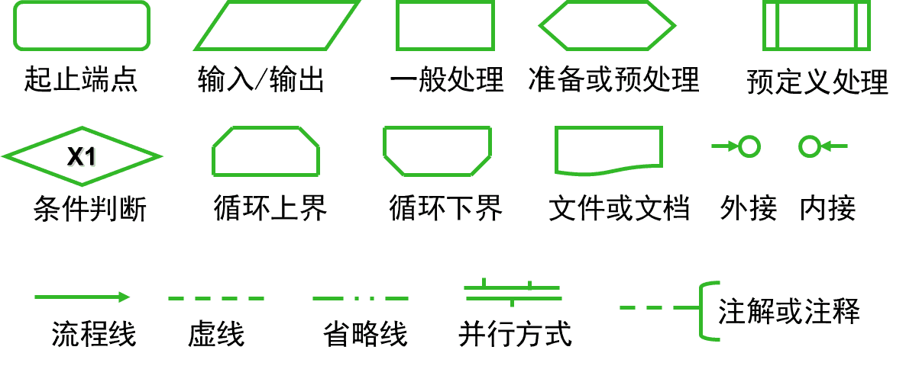​

‍

‍

#### 评价

‍

优点：

对控制流程描绘直观，便于初学者掌握

‍

缺点：

1. 不是逐步求精的好工具，过早考虑控制流程，非整体结构
2. 用箭头代表控制流，程序员随意转移控制
3. 不易表示数据结构和调用关系

‍

‍

### 盒图（N-S）

出于要有一种不允许违背**结构程序设计精神**的图形工具的考虑，提出了盒图，又称为N-S图

‍

子程序大概不画

​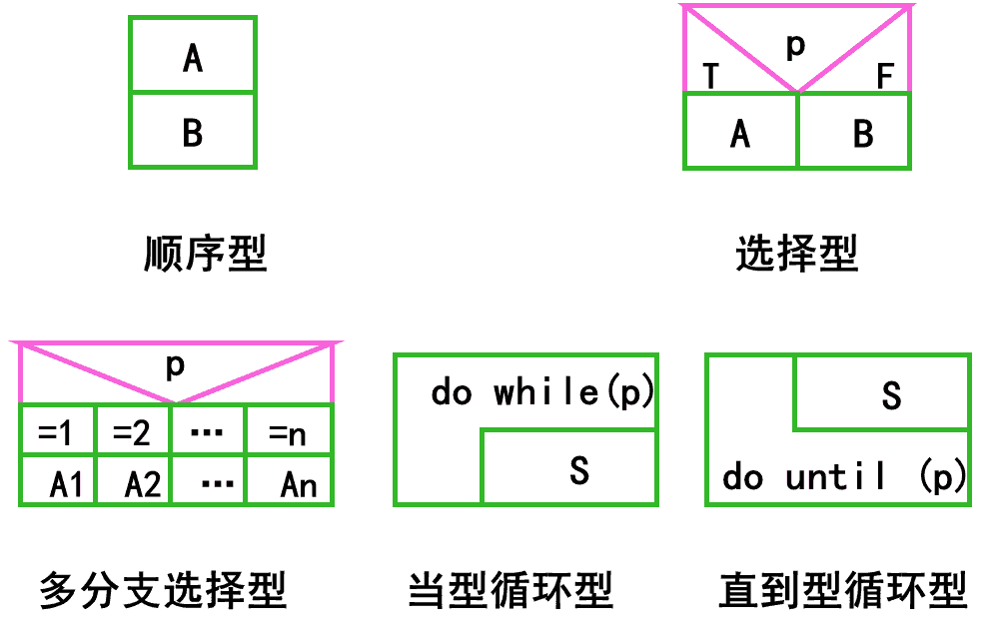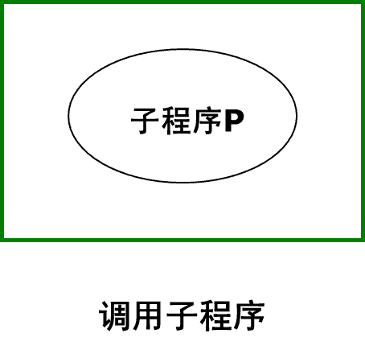​

‍

示例

​​

‍

#### 特点

1. 功能域（特定控制结构的作用域）明确
2. 不可能任意转移控制
3. 容易确定局部和全程数据的作用域
4. 容易表现嵌套关系，也可表示模块的层次结构

‍

‍

### PAD图

问题分析图（problem analysis is diagram）的英文缩写，是使用二维树形结构的图来表示程序的控制流，这种图翻译为程序代码比较容易

‍

​​

‍

* a：顺序
* b：选择（`IF C THEN P1 ELSE P2`​）
* c：`CASE`​型多分支
* d：`WHILE`​型循环（`WHILE C DO P`​）
* e：`UNTIL`​型循环（`REPEAT P UNTIL C`​）
* f：语句符号
* g：定义

‍

‍

​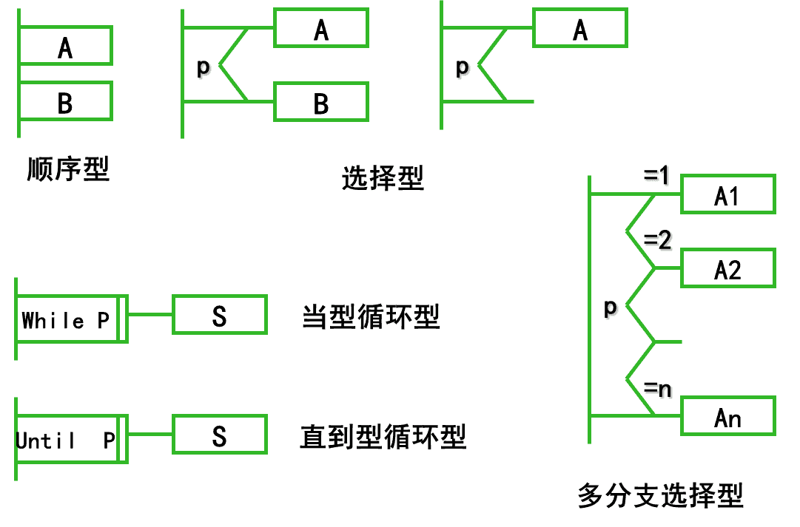​

​​

示例

​​

‍

‍

#### 评价

‍

优点

1. 使用PAD图设计的程序必然是结构化程序
2. PAD图描绘的程序结构十分清晰

    > 最左面的竖线是**程序的主线**，即**第一层结构**。随着程序层次的增加，PAD图逐渐**向右延伸**，每增加一个层次，图形向右扩展一条竖线。PAD图中竖线的总条数就是**程序的层次数**
    >
3. 用PAD图表现程序逻辑，易读、易懂、易记

    > PAD图是二维树形结构的图形，程序从图中最左竖线上端的结点开始执行 ，**自上而下，从左向右**顺序执行，遍历所有结点
    >
4. 容易将PAD图转换成高级语言源程序
5. 既可用于表示程序逻辑，也可用于描绘数据结构
6. 支持自顶向下逐步求精

    > 开始时设计者可以定义一个抽象的程序，随着设计工作的深入而使用`def`​符号逐步增加细节，直至完成详细设计
    >

    ​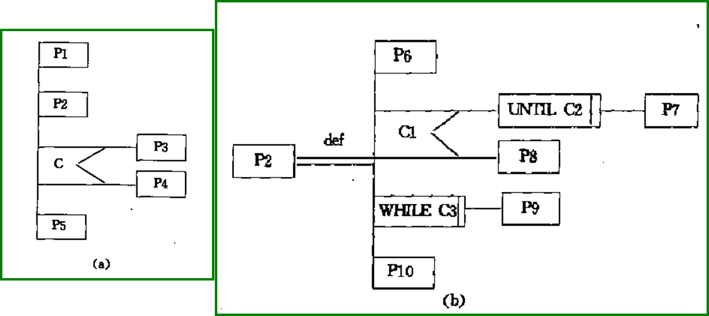​

‍

‍

### 判定表

当算法中包含**多重嵌套的条件选择**时，用程序流程图、盒图、PAD图或后面即将介绍的过程设计语言(PDL)都不易清楚地描述

能清晰表示复杂的条件组合与应做动作间对应关系

‍

‍

四部分：

* 左上部列出所有条件；
* 左下部所有可能做的动作；
* 右上部表示各种条件组合的矩阵；
* 右下部是和每种条件组合相对应的动作。

‍

​​

‍

判定表右半部的每一列实质上是一条规则，规定了与特定的条件组合相对应的动作

右上部分中**T表示它左边那个条件成立，F表示条件不成立，空白表示这个条件成立与否并不影响对动作的选择**。判定表右下部分中**画X表示做它左边的那项动作，空白表示不做这项动作**

‍

​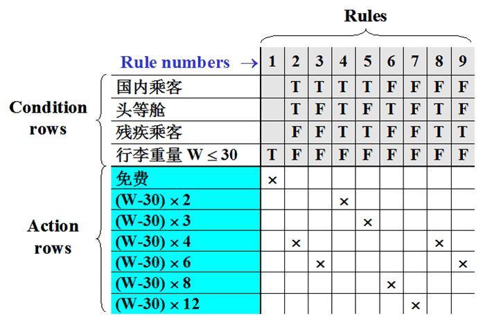​

‍

‍

#### 评价

‍

**优点**

* 判定表能够简洁而又无歧义地描述处理**规则**
* 判定表和布尔代数或卡诺图结合起来使用，可以更加直观、简洁、清晰的描述规则

‍

**缺点**

* 不能同时清晰地表示出问题的**顺序性**和**重复性**
* 初次接触这种工具的人理解它需要有一个学习过程
* 数据元素增多时，判定表的简洁程度大幅下降，此时建议使用判定树

‍

‍

### 判定树

判定表变种，表示复杂条件组合与应做动作间对应关系

​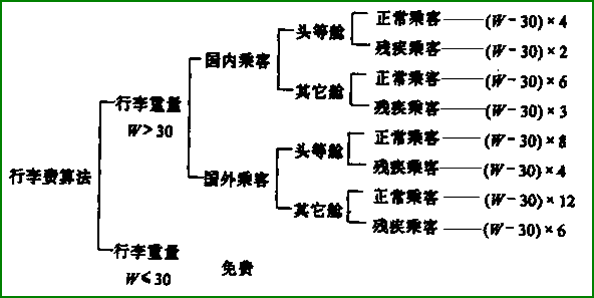​

‍

‍

#### 评价

‍

优点：形式简单，易看出含义，易于掌握和使用。

‍

缺点：简洁性不如判定表，相同数据元素重复写多遍，越接近叶端重复次数越多。

‍

‍

### 过程设计语言（PDL）伪码

伪码

（了解）

伪码，用正文形式表示数据和处理过程设计工具

PDL具有严格关键字外部语法，定义控制结构和数据结构

PDL表示实际操作和条件的内部语法灵活自由。适应各种工程项目需要

‍

#### 评价

‍

优点

* 可以作为注释直接插在源程序中间。
* 可以使用普通的正文编辑程序或文字处理系统，很方便地完成PDL的书写和编辑工作。
* 已经有自动处理PDL的程序存在，而且可以自动由PDL生成程序代码。

‍

缺点

* 不如图形工具形象直观，描述复杂的条件组合与动作间的对应关系时，不如判定表清晰简单。

‍

## 4 面向数据结构的设计方法

两种：**Jacksom**和**Warnier**方法

‍

### Jackson图

‍

描述数据结构：顺序、选择、重复

​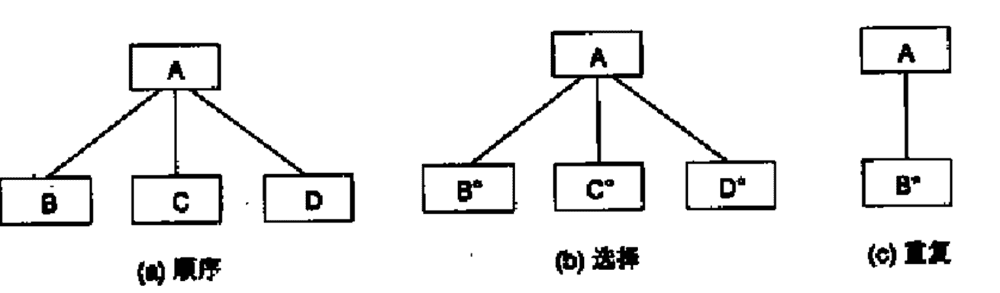​

‍

* 顺序结构

  > A由B、C、D 3个元素顺序组成(每个元素只出现一次，出现的次序依次是B、C和D)
  >
* 选择结构

  > 根据条件A是B或C或D中的某一个(注意，在B、C和D的右上角有小圆圈做标记)
  >
* 重复结构

  > A由B出现N次(N≥0)组成(注意，在B的右上角有星号标记)
  >

‍

#### 改进的Jackson图

‍

​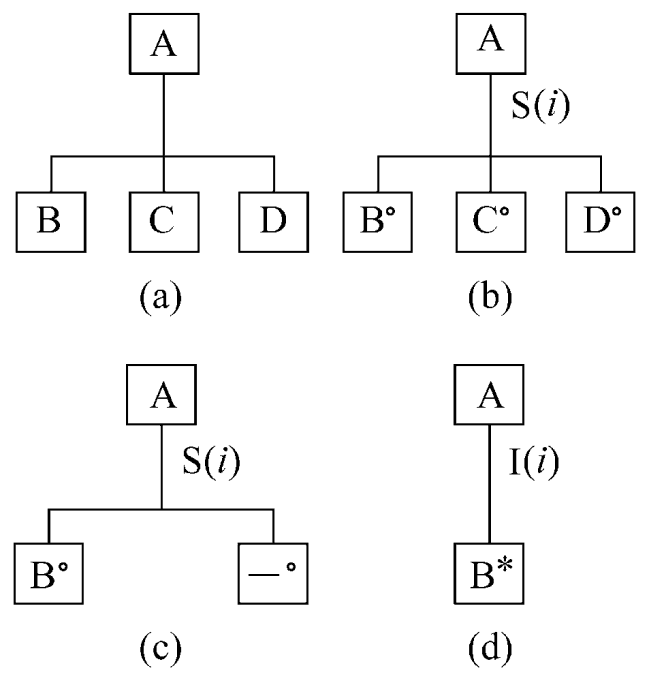​

‍

* 顺序结构，B、C、D中任一个都不能是选择出现或重复出现的数据元素(即不能是右上角有小圆圈或星号标记的元素)
* 选择结构，S右面括号中的数字i是分支条件的编号
* 可选结构，A或者是元素B或者不出现
* 重复结构，循环结束条件的编号为i

‍

### Jackson法

面向数据结构的设计方法

Jackson方法是在软件开发过程中常用的方法，使用Jackson方法时可以实现从数据结构导出程序结构

‍

Jackson结构程序设计方法步骤

‍

‍

1. 确定输入数据和输出数据逻辑结构，用Jackson图表达
2. 确定输入结构和输出结构中有对应关系（因果）的单元
3. 描绘数据结构的Jackson图导出描绘程序结构Jackson图
4. 列出所有操作和条件，分配到Jackson图中
5. 用伪码表示

‍

‍

## 5 程序复杂程度的定量度量

‍

### 价值

（了解）

* 把程序的复杂程度乘以适当数可**估算出软件中错误的数量以及开发需要的工作量**
* 定量度量的结果可以**用来比较两个不同的设计或两个不同算法的优劣**
* 程序的定量的复杂程度可以作为**模块规模的精确限度**

‍

### McCabe方法

McCabe方法根据程序控制流的复杂程度定量度量程序的复杂程度，这样度量出的结果称为程序的环形复杂度

‍

1. 根据过程设计结果画出相应流图
2. 计算流图的环形复杂度

‍

#### 流图

  
流图实质上是“退化了的”程序流程图，描绘程序的控制流程，不表现对数据的具体操作以及分支或循环的具体条件

‍

流图描述程序控制流，基本图形符号如下

​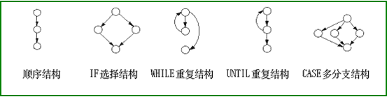​

‍

**绘制方法**

* 结点：一个圆代表一条或多条语句, 一个顺序结构可以合并一个结点
* 边：流图中的箭头线称为边，代表控制流, 流图中一条边必须终止于一个结点
* 区域：由边和结点围成的面积称为区域，包括图外部未被围起来的区域

‍

1. **对于顺序结构，一个顺序处理和下一个选择可以映射为一个结点**

    ​​
2. **对于选择语句，开始/结束语句映射为一个结点，两条分支至少各映射成一个结点**

    ​
3. **开始语句和结束语句各映射成一个结点**

    ​​

‍

包含复合条件时，应该把复合条件分解为若干个简单条件，每个简单条件对应流图中一个结点。所谓复合条件，就是在条件中包含了一个或多个布尔运算符(逻辑OR，AND，NAND，NOR)

> 这里就是 a 和 b 条件都要独立判定一次了, 之后要保留指向对应结果不同情况对象

​​

‍

##### 翻译

‍

​​

* 流图中用**圆表示结点**，**一个圆代表一条或多条语句（比如4、5）** 。程序流程图中的**一个顺序的处理框序列和一个菱形判定框，可以映射成流图中的一个结点（比如2,3）**
* 流图中的箭头线称为**边**，代表**控制流**。**流图中一条边必须终止于一个结点（比如9必须为一个结点）** ，即使这个结点并不代表任何语句
* 由边和结点围成的面积称为**区域**，计算区域数时应**包括图外部未被围起来的区域**

‍

‍

示例: 由PDL翻译成的流图

‍

​​

‍

‍

#### 环形复杂度

环形复杂度定量度量程序的逻辑复杂度, 是对测试难度的一种定量度量，也能对软件最终的可靠性给出某种预测

V(G)小于等于10比较科学

‍

* 流图中的区域数等于环形复杂度

  > 区域就想象是PS的填充桶工具, 必须要是封闭的区域
  >
* E-N+2, E是流图中边的条数，N是结点数
* P+1，P是流图中判定结点(分支选择的节点)的数目

‍

​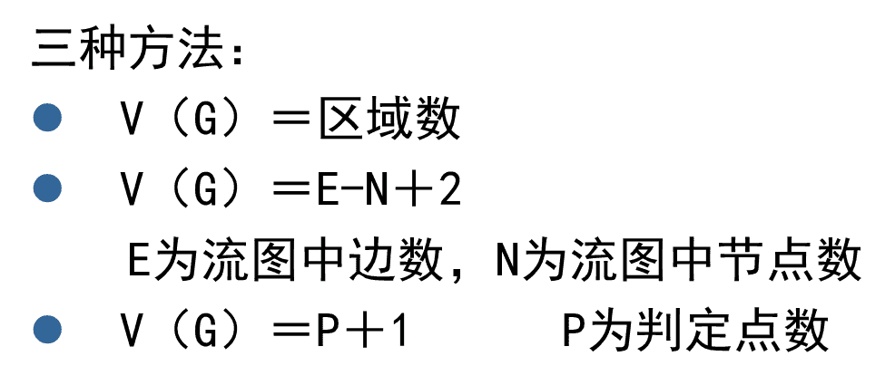​

‍

示例

​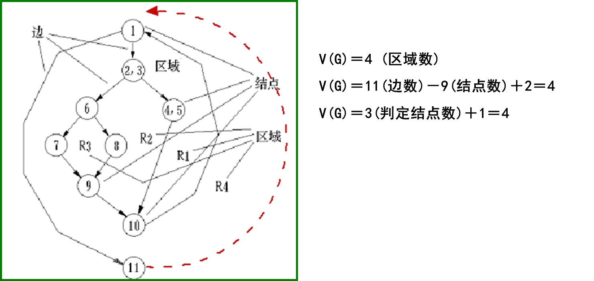​

‍

‍

### Halstead方法

（了解）

根据程序中**运算符**和**操作数**的总数来度量程序的复杂程度

‍

* **程序长度N定义**

  令N1为程序中运算符出现的总次数，N2为操作数出现的总次数

  ‍

  N = N1 + N2

  ‍
* **预测程序长度**

  程序中使用的不同运算符(包括关键字)的个数n1，以及不同操作数(变量和常数)的个数n2.

  ‍

  H = n1 * log~2~(n1) + n2 * log~2~(n2)

  ‍
* **预测程序中包含错误的个数**

  ‍

  E= N * log2 (n1+n2) / 3000

  ‍

‍

‍

‍

‍

‍

‍

‍

‍

‍

‍
