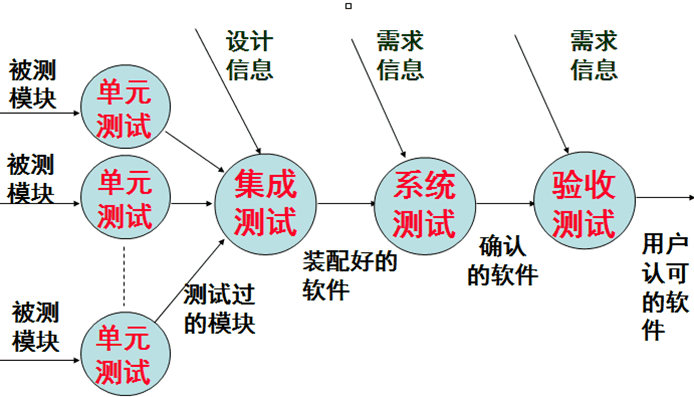
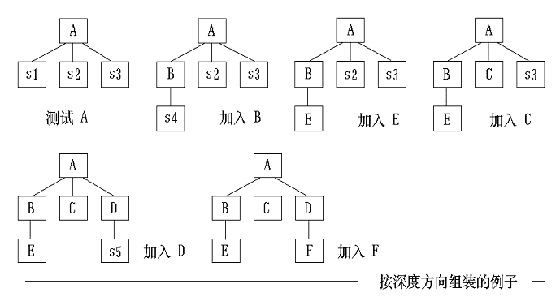
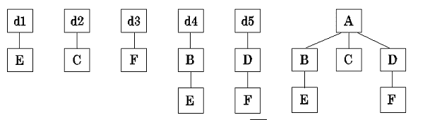
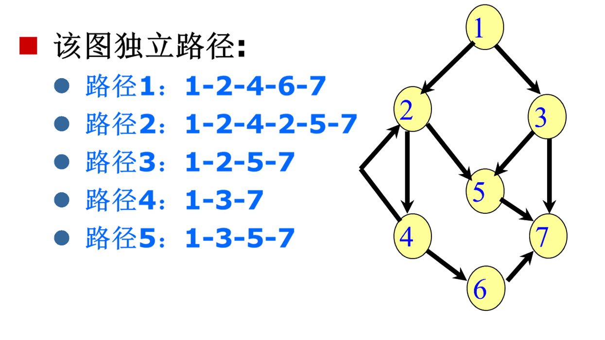

‍

* 实现包括编码和测试两个阶段
* 通常软件测试至少分为单元测试、集成测试和验收测试3个基本阶段
* 软件测试不仅仅指利用计算机进行的测试，还包括人工进行的测试

‍

10大测试

(了解)

1. **接口测试**
2. **路径测试**
3. **功能测试**
4. **健壮性测试**
5. **性能测试**
6. **用户界面测试**
7. **信息安全测试**
8. **压力测试**
9. **可靠性测试**
10. **安装/反安装测试**

‍

## 1 编码

‍

### 程序设计语言的选择

‍

**适宜的程序语言的优点**

* 能使根据设计去完成编码时**困难最少**
* 可以减少需要的**程序测试量**
* 可以得出**更容易阅读和更容易维护的程序**

‍

**选择标准**

‍

A：理想标准

* 选用**高级语言**编写程序
* 选用的高级语言应该有**理想的模块化机制**，以及**可读性好的控制结构和数据结构**
* 选用语言特点应该使编译程序能够尽可能多地发现**程序中的错误**
* 选用的高级语言应该有良好的**独立编译机制**

‍

B：实际标准

* 系统用户的要求：如果所开发的系统由用户负责维护，用户通常要求用他们熟系的语言编写
* 可以使用的编译程序：运行目标系统的环境中可以提供的编译程序往往限制了可以选用的语言的范围
* 可以得到的软件工具：如果某种语言有支持程序开发的软件工具可以利用，则目标系统的实现和验证都变得比较容易
* 工程规模：如果工程规模很庞大，现有的语言又不完全适用，那么设计并实现一种供这个工程项目专用的程序设计语言，可能是一个正确的选择
* 程序员的知识：虽然对于有经验的程序员来说，学习一种新语言并不困难，但是要完全掌握一种新语言却需要实践。如果和其他标准不矛盾，那么应该选择一种已经为程序员所熟悉的语言
* 软件可移植性要求：如果目标系统将在几台不同的计算机上运行，或者预期的使用寿命很长，那么选择一种标准化程度高、程序可移植性好的语言就是很重要的
* 软件的应用领域：所谓的通用程序设计语言实际上并不是对所有应用领域都同样适用。

‍

‍

### 编码风格

逻辑简明清晰、易读易懂是重要标准

‍

可遵循一下五方面规则

1. 程序内部的文档
2. 数据说明
3. 语句构造
4. 输入输出
5. 效率

‍

‍

## 2 软件测试基础

‍

### 概念

‍

**目标**

1. 测试是为了**发现程序中的错误**而执行程序的过程；
2. 好的测试方案是极有可能发现迄今尚未**发现的尽可能多的错误**的测试；
3. 成功的测试是发现了迄今**尚未发现的错误**的测试。

‍

**测试准则**

1. 所有测试应能追溯到用户需求
2. 应尽早地和不断地进行软件测试
3. 充分注意测试中群集现象(二八法则) **80%的错误是由20%的模块造成的**
4. 测试应从小规模开始，逐步进行大规模测试
5. 不能做到穷举测试，**测试只能证明程序有错误，而不能证明程序没有错误**
6. 第三方测试原则

‍

### 测试方法

‍

静态测试方法和动态测试方法

* 静态测试

  * 不在机器上进行测试，而是采用人工检测和计算机辅助静态分析手段对程序进行检测

    * 人工测试 人工审查和评审软件
    * 计算机辅助静态分析
* 动态测试

  * 跑起来发现错误
  * 黑盒测试和白盒测试

    * 黑盒测试：如果知道产品应具有**功能**，可通过测试来检验是否每个功能都能正常使
    * 白盒测试：如果知道产品**内部工作过程**可通过测试来检验产品内部动作是否按照规格说明书的规定正常进行

‍

‍

‍

### 测试步骤

测试过程也必须分步骤进行，后一个步骤在逻辑上是前一个步骤的继续

‍

大型软件系统通常由若干个子系统组成，每个子系统又由许多模块组成，因此，大型软件系统的测试过程基本上由 模块测试、子系统测试、系统测试、验收测试和平行运行等 五个步骤组成

‍

测试步骤示意

​​

‍

|测试阶段|主要依据|测试人员|测试方法|测试内容|
| :----------: | :----------------------: | :------------: | :------------------: | :---------------------------------------------------------------------------------------------: |
|单元测试|系统设计文档|开发小组|白盒测试|接口测试<br />路径测试|
|子系统测试|系统设计文档<br />需求文档|独立测试小组|白盒测试<br />黑盒测试|接口测试<br />路径测试<br />功能测试<br />性能测试|
|系统测试|需求文档|独立测试小组|黑盒测试|功能测试、健壮性测试<br />性能测试、用户界面测试<br />安全性测试、压力测试<br />可靠性测试、安装/卸载测试|
|验收测试|需求文档|用户|黑盒测试|功能测试、健壮性测试<br />性能测试、用户界面测试<br />安全性测试、压力测试<br />可靠性测试、安装/卸载测试|

‍

‍

#### 模块测试

又称为单元测试

把每个模块作为一个单独的实体来测试, 保证每个模块作为一个单元能够正确运行, 发现的是**编译和详细设计**的错误

‍

---

#### 子系统测试

模块相互间协调和通信是此测试的主要问题，也即子系统测试着重测试模块的接口

‍

#### 系统测试

把经过测试的子系统装配成一个完整的系统来测试。在这个过程中不仅应该发现设计和编码的错误，还应该验证系统确实能够提供需求说明书中指定的功能，而且系统动态特性也符合预定要求

‍

子系统测试和系统测试都兼有==检测和组装==两重含义, 总称为为**集成测试**

‍

---

#### 验收测试

（确认测试）

把软件系统作为单一的实体进行测试，它是在**用户积极参与**下进行的，而且主要使用实际数据进行测试，验收测试的目的是验证系统确实能够满足用户的需要

验收测试发现的是系统需求说明书中的错误

‍

#### 平行运行

同时运行**新开发出来的系统和将被它取代的旧系统**，以便比较新旧两个系统的处理结果

‍

‍

### 测试阶段的信息流

略

‍

‍

## 3 单元测试

单元测试集中检测软件设计的最小单元一模块，它和编码属于软件过程的同一个阶段。在编写出源程序代码并通过了编译程序的语法检查之后，就可以用详细设计描述作指南，对重要的执行通路进行测试，以便发现模块内部的错误。单元测试主要使用白盒测试技术，而且对多个模块的测试可以并行地进行，包括人工测试和计算机测试两种

‍

* **测试依据**：详细设计文档
* **测试技术**：白盒测试技术
* **测试方法**：人工测试和计算机测试

‍

‍

### 测试重点

（了解）

‍

#### （1）模块结构

* **模块接口的数据流**是否能正常进出
* **参数的数目、次序、属性或单位系统与变元**是否一致
* 是否修改了**只作输入用的变元**
* **全局变量的定义和用法在各个模块**中是否一致

‍

#### （2）局部数据结构

对于模块来说，**局部数据结构是常见的错误来源**。应该仔细设计测试方案，以便发现局部数据说明、初始化、默认值等方面的错误。

‍

‍

#### （3）重要的执行通路

* 选择**最有代表性、最可能发现错误**的执行通路进行测试
* 设计测试方案来发现由于**错误计算、不正确的比较或不适当的控制流**而造成的错误

‍

‍

#### （4）出错处理通路

（了解）

‍

‍

#### （5）边界条件

**边界测试是单元测试中最重要的任务**

使用**刚好小于、刚好等于和刚好大于最大值或最小值**的数据结构、控制量和数据值的测试方案，非常可能发现软件中的错误。

‍

‍

### 测试方法

‍

‍

#### 代码审查

人工测试源程序可以由**程序的编写者**本人非正式地进行，也可以由审查小组正式进行。后者称为代码审查是一种非常有效的程序验证技术。

代码检查是指由审查小组正式对源程序进行人工测试。它是一种非常有效的程序验证技术，对于典型的程序来说，可以查出30%～70%的逻辑设计错误和编码错误。审查小组最好由下述4人组成

‍

* (1) 组长，应该是一个很有能力的程序员，而且没有直接参与这项工程
* (2) 程序的设计者；
* (3) 程序的编写者；
* (4) 程序的测试者

‍

##### 流程

* 组建审查小组
* 审查会议

‍

##### 优点

（了解）

* 一次审查会上可以发现许多错误
* 不需要每次发现一个错误就进行验证，减少了系统验证的总工作量

‍

‍

#### 计算机测试

（了解）

模块并不是一个独立的程序，因此必须要为每个单元测试开发驱动软件和(或)存根软件

‍

* **驱动程序**：接收测试数据，把这些数据传送给被测试的模块，并且印出有关的结果
* **存根程序**：代替被测试的模块所调用的模块,它使用被它代替的模块的接口，做最少量的数据操作，印出对入口的检验或操作结果，并且把控制归还给调用它的模块

‍

‍

## 4 集成测试

测试和组装软件的系统化技术

‍

‍

### 概念

‍

‍

不同集成测试策略的比较与回归测试

|集成测试策略|优点|缺点|
| :------------: | :--------------------------------------------------------------: | :--------------------------------------------------------------------------------------: |
|**非渐增式**|无|没有错误隔离手段<br />主要设计错误发现迟<br />潜在可重用代码测试不充分<br />需要驱动程序和存根程序|
|**渐增测试**自顶向下|具有错误隔离手段<br />主要设计错误发现早<br />不需要驱动程序|潜在可重用代码测试不充分<br />需要存根程序|
|**渐增测试**自底向上|具有错误隔离手段<br />潜在可重用代码能充分测试<br />不需要存根程序|主要设计错误发现迟<br />需要驱动程序|
|**渐增测试**混合|具有错误隔离手段<br />主要设计错误发现早<br />潜在可重用代码能充分测试|较少|

‍

---

由模块组装成程序时有两种方法：

‍

### **非渐增式测试策略**

先分别测试每个模块，再把所有模块按设计要求放在一起结合成所要的程序

> 像啊, 很像啊 (指平时自己写代码, 每个模块都work well, 啪一下合并起来就down了)

* 把所有模块放在一起，测试者面对的情况十分复杂
* 在庞大的程序中诊断定位一个错误非常困难
* 一旦改正一个错误之后，又会遇到新的错误，没有穷尽

‍

### 渐增式测试策略

使用渐增方式把模块结合到程序中去时的集成策略

‍

‍

将模块逐步组装成较大系统

1. 自顶向下集成

    ​​
2. 自底向上集成

    ​​
3. 混合策略

    * 改进的自顶向下测试方法

      基本用自顶向下方法，早期用自底向上测试关键模块
    * 混合法

      软件结构上层模块用自顶向下，下层用自底向上。

‍

#### 优点（了解）

* 把程序划分成小段来构造和测试，比较容易定位和改正错误
* 对**接口**可以进行更彻底的测试
* 可以使用系统化的测试方法

‍

#### 自顶向下集成

从主控制模块开始，沿着程序的控制层次向下移动，逐渐把各个模块结合起来。在把附属于主控制模块的模块组装到程序结构中时，使用深度优先的策略或宽度优先的策略

‍

##### 步骤

* 对主控制模块进行测试，测试时用**存根程序**代替所有直接附属于主控制模块的模块
* 根据选的结合策略(深度优先或宽度优先)，每次用一个**实际模块**代换一个存根程序
* 在结合进一个模块的同时进行测试
* 为了保证加入模块没有引进新的错误，可能需要进行**回归测试**

‍

‍

##### 结合策略

深度优先先组装在**软件结构的一条主控制通路上的所有模块**

宽度优先**沿软件结构水平地移动,把处于同一个控制层次上的所有模块组装起来**

‍

‍

​​

‍

##### 优缺点

‍

**优点**

* 不需要测试**驱动程序**
* 能够在**测试阶段的早期**实现并验证系统的主要功能
* 能在早期发现**上层模块的接口错误**

‍

**缺点**

* 需要**存根程序**，可能遇到与此相联系的测试困难
* **低层关键模块中**的错误发现较晚
* 在早期不能**充分展开人力**

‍

‍

#### 自底向上集成

自底向上测试从软件结构最低层的模块开始组装和测试。因为是从底部向上结合模块，总能得到所需的下层模块处理功能，所以不需要存根程序

‍

‍

##### 步骤

* 把低层模块组合成实现某个特定的软件子功能的**族**
* 写一个用于测试的控制程序，协调测试数据的输入和输出
* 对由模块组成的子功能族进行测试
* 去掉驱动程序，沿软件结构自下向上移动，把子功能族组合起来形成大的子功能族

​​

‍

##### 优缺点

‍

**优点**

* 不需要**存根程序**，不会遇到与此相联系的测试困难
* 能较早发现**低层关键模块中**的错误
* 在早期能**充分展开人力**

**缺点**

* 需要测试**驱动程序**
* 不能够在**测试阶段的早期**实现并验证系统的主要功能
* 不能在早期发现**上层模块的接口错误**

‍

‍

‍

#### 混合

‍

混合集成测试策略，主要有两种

1. **改进的自顶向下测试方法**  
    基本上使用自顶向下的测试方法，但是在早期使用自底向上的方法测试软件中的少数关键模块。该策略能在测试的早期发现关键模块中的错误；测试关键模块时需要驱动程序。
2. **混合法**  
    对软件结构中较上层使用的自顶向下方法与对软件结构中较下层使用的自底向上方法相结合，该策略兼有两种方法的优缺点，当被测试的软件中关键模块比较多时，这种混合法可能是最好的折衷方法。

‍

‍

### 回归测试

回归测试是指**重新执行已经做过的测试的某个子集，以保证上述这些变化没有带来非预期的副作用**。它可以用于保证由于调试或其他原因引起的变化，不会导致非预期的软件行为或额外错误的测试活动

每一轮集成测试后都要尽可能的进行回归测试，用于保证由于调试或其他原因引起的变化，不会导致非预期的软件行为或额外错误的测试活动，可以通过重新执行全部测试用例的一个子集人工地进行，也可以使用自动化的捕获回放工具自动进行

‍

##### 方法

* 通过**重新执行全部测试用例**的一个子集人工地进行
* 利用**捕获回放工具**，捕获测试用例和实际运行结果，然后回放，并比较运行结果

‍

‍

##### 回归测试集

回归测试集(已执行过的测试用例的子集)包括下述3类不同的测试用例:

* 检测软件全部功能的代表性测试用例
* 专门针对可能受修改影响的软件功能的附加测试
* 针对被修改过的软件成分的测试

‍

‍

## 5 确认测试

也称为验收测试，它的目标是验证软件的有效性

确认测试必须有用户积极参与，或者以用户为主进行，使用用户界面输入测试数据并且分析评价测试的输出结果，在验收之前通常要由开发单位对用户进行培训，一般来说确认测试分为Alpha和Beta测试

‍

通常使用黑盒测试法

* **验证：**  为了保证软件正确的实现某个特定要求而进行的一系列活动
* **确认**：为了保证软件确实满足了用户需求而进行的一系列活动
* **软件有效性**：如果软件的功能和性能如同用户所合理期待的那样，软件就是有效的

‍

‍

### 确认测试的范围

* 确认测试必须有用户积极参与，或以用户为主进行
* 通常使用黑盒测试法
* 保证软件能满足所有功能要求

‍

‍

### 软件配置复查

确认测试的一个重要内容。复查的目的是保证软件配置的所有成分都齐全，质量符合要求，文档与程序完全一致，具有完成软件维护所必须的细节，而且已经编好目录。

‍

* 在确认测试过程中应该严格遵循用户指南及其他操作程序
* 必须仔细记录发现的遗漏或错误，并且适当地补充和改正

‍

### Alpha测试 和 Beta测试

‍

#### Alpha测试

Alpha测试由用户在开发者的场所进行，并且在开发者对用户的“指导”下进行测试，且开发者负责记录发现的错误和遇到的问题。即Alpha测试是在受控的环境中进行的

(内部实机演示)

‍

#### Beta测试

Beta测试由软件的最终用户们在一个或多个客户场所进行。开发者通常不在Beta测试的现场，即Beta测试是软件在开发者不能控制的环境中的“真实”应用

(上线内测)

‍

‍

## 6 白盒测试技术

通常把测试数据和预期的输出结果称为测试用例

‍

‍

### 逻辑覆盖

逻辑覆盖是对一系列测试过程的总称，这组测试过程逐渐进行越来越完整的通路测试

下面是分类

‍

包含关系:

​​

‍

‍

---

#### 语句覆盖

选择足够多的测试数据，被测试程序中的每条语句至少执行一次

很弱

‍

#### 点覆盖

连通图G的子图G'是连通的，而且包含G的所有结点，则称G'是G的点覆盖。

满足点覆盖标准要求选取足够多的测试数据，使得程序执行路径至少经过流图的每个结点一次，也即**点覆盖标准和语句覆盖标准是相同的**

‍

---

#### 判定覆盖

又叫分支覆盖

不仅每个语句至少执行一次，而且**每个判定**的每种可能的结果都应该至少执行一次

> 强调整个表达式的结果, 分支往哪里走

比语句覆盖强，但是对程序逻辑的覆盖程度仍然不高

‍

#### 边覆盖

连通图G的子图G''是连通的，而且包含G的所有边，则称G''是G的边覆盖。为满足边覆盖的测试标准，要求选取足够多的测试数据，使程序执行路径至少经过流图每条边一次，也即**边覆盖与判定覆盖是相同的**

‍

---

#### 条件覆盖

不仅每个语句至少执行一次，而且使判定表达式中的**每个条件**都取到各种可能的结果

> 强调每个表达式的细节组成条件, 不一定比判定覆盖强; 这里的细节要联动数学中的取反的情况, 全真的反应该是部分假和全假!

条件覆盖通常比判定覆盖强，因为它使每个条件都取到了两个不同的结果，判定覆盖却只关心整个判定表达式的值

判定覆盖不一定包含条件覆盖，条件覆盖也不一定包含判定覆盖

‍

---

#### 判定/条件覆盖

选择足够多的测试数据，使 判定表达式中的**每个条件**都取到各种可能的结果，而且**每个判定表达式**也都取到各种可能的结果。

> 表达式的走向和每个表达式内部的条件都被考虑到了, 但是没有组合起来

同时满足==判断覆盖==和==条件覆盖==

‍

‍

---

#### 条件组合覆盖

选取足够多的测试数据，使得每个**判定表达式**中**条件**的各种**可能组合**都至少出现一次。

> 次强的, 不一定使每条路径都执行一次

满足条件组合覆盖，也一定满足==判断覆盖==、==条件覆盖==和==判断/条件覆盖==

‍

‍

#### 路径覆盖

选取足够多的测试数据，使程序的每条可能路径都至少执行一次，如果程序图中有环，则要求每个环至少经过一次

‍

‍

### 控制结构测试

‍

‍

#### 基本路径测试

‍

Tom McCabe提出的一种白盒测试技术

使用这种技术设计测试用例时，首先计算程序的**环形复杂度**，**并用该复杂度为指南，定义执行路径的基本集合, 从该基本集合导出的测试用例可以保证程序中的每条语句至少执行一次，而且每个条件在执行时都将分别取真、假两种值**

‍

‍

##### 步骤

‍

* 根据过程设计结果画出相应的**流图**
* 计算流图的**环形复杂度**
* 确定**线性独立路径**(至少包含一条在定义该路径之前不曾用过的边)的基本集合
* 设计可**强制执行基本集合中每条路径**的测试用例

‍

1. 根据过程设计结果画出相应流图
2. 计算流图的环形复杂度​​

    > 见之前
    >
3. 确定线性独立路径的基本集合

    * 独立路径：至少包含一条在定义改路径之前不曾用过的边。

      ​​
    * 环形复杂度为独立路径基本集的上界

      > 程序的环形复杂度为6，因此共有6条独立路径
      >
4. 设计测试用例覆盖基本集合的路径的测试用例

‍

‍

#### 条件测试

‍

##### 关系表达式

一个简单条件是一个布尔变量或一个关系表达式，在布尔变量或关系表达式之前还可能有一个NOT(¬)运算符，关系表达式的形式如下：

```java
E1<关系算符>E2
```

E1和E2是算术表达式，而<关系算符>是下列算符之一：<，≤，=，≠，>或≥

布尔算符有OR(|)，AND(&)和NOT( ┐)

不包含关系表达式的条件称为布尔表达式

‍

##### 条件错误的类型

* 布尔算符错;
* 布尔变量错;
* 布尔括弧错;
* 关系算符错;
* 算术表达式错

‍

##### 评价

* 容易度量条件的测试覆盖率
* 程序内条件的测试覆盖率可指导附加测试的设计

‍

‍

### 循环测试

循环测试是一种白盒测试技术，它专注于测试循环结构的有效性。在结构化的程序中通常只有3种循环，即简单循环、串接循环和嵌套循环

(了解)

​​

‍

（1）简单循环

应该使用下列测试集来测试简单循环，其中n是允许通过循环的最大次数：  
跳过循环、只通过循环一次、通过循环两次、通过循环m次，其中m<n-1、通过循环n-1，n，n+1次。

（2）嵌套循环

从最内层循环开始测试，其他循环都设置为最小值。对最内层循环使用简单循环测试方法，而使外层循环的迭代参数取最小值，并为越界值或非法值增加一些额外的测试。由内向外，对下一个循环进行测试，但保持所有其他外层循环为最小值，其他嵌套循环为“典型”值。然后继续进行下去，直到测试完所有循环。

（3）串接循环

如果串接循环的各个循环都彼此独立，则可以使用测试简单循环的方法来测试串接循环。如果两个循环串接，而且第一个循环的循环计数器值是第二个循环的初始值，则这两个循环并不是独立的。当循环不独立时，建议使用测试嵌套循环的方法来测试串接循环。

‍

‍

## 7 黑盒测试技术

‍

### 概念

黑盒着重**软件功能**

黑盒测试并不能取代白盒测试，它是与白盒测试互补的测试方法，它很可能发现白盒测试不易发现的其他类型的错误

通常设计测试方案时总是联合使用等价划分和边界值分析两种技术

公认标准主要有两个：（1）测试用例尽可能少；（2）一个测试用例能指出一类错误

‍

‍

#### 目的

发现错误:

1. 功能不正确或遗漏
2. 界面错误
3. 数据结构或外部数据库访问错误
4. 性能错误
5. 初始化或终止错误

‍

#### 适用性

白盒测试在测试过程的早期阶段进行，黑盒测试主要用于测试过程的后期

‍

#### 用例标准

* 能够减少为达到合理测试所需要设计的测试用例的**总数**
* 能够告诉人们，是否**存在某些类型的错误**，而不是仅仅指出与特定测试相关的错误是否存在

‍

‍

### 等价划分

**把程序的输入域划分成若干数据类**，从每一数据类选取少数有代表性数据做为测试用例

等价划分法力图设计出能发现**若干类**程序错误的测试用例，从而减少必须设计的测试用例的数目

‍

‍

1. 划分等价类

    1. 有效等价类：合理，有意义输入数据构成集合。
    2. 无效等价类：不合理，无意义输入数据构成的集合。
2. 确定测试用例

    建立等价类表，列出所有划分出等价类​​

    1. 为每一等价类规定一唯一编号；
    2. 设计一新测试用例，尽可能多覆盖尚未被覆盖有效等价类，重复，直到所有有效等价类被覆盖。
    3. 设计一新测试用例，仅覆盖一尚未被覆盖无效等价类，重复，直到所有无效等价类被覆盖

‍

‍

#### 划分数据的等价类

‍

* 第一，需要研究**程序的功能说明**，从而确定输入数据的**有效等价类**和**无效等价类**
* 第二，在确定输入数据的等价类时常常还需要**分析输出数据的等价类**
* 第三，在划分等价类时还应考虑**编译程序的检错功能**

‍

#### 根据等价类设计测试方案

* 第一，设计一个新的测试方案以尽可能多地覆盖**尚未被覆盖的有效等价类**，重复这一步骤直到**所有有效等价类都被覆盖为止**
* 第二，设计一个新的测试方案，使它**覆盖一个而且只覆盖一个尚未被覆盖的无效等价类**，重复这一步骤直到**所有无效等价类都被覆盖为止**

‍

### 边界值分析

使用边界值分析方法设计测试方案首先应该确定边界情况，选取的数据应该**刚好等于**、**稍小于**和**稍大于**等价类边界值，即应该选取刚好等于、稍小于和稍大于等价类边界值的数据作为测试数据，而不是选取每个等价类内的典型值或任意值作为测试数据

‍

‍

‍

### 错误推测

靠经验和直觉推测程序可能存在错误，有针对性编写检查这些错误的测试用例

‍

‍

## 8 调试

(略)

‍

软件调试是在进行了成功的测试之后才开始的工作。它与软件测试不同，调试的任务是**进一步诊断和改正程序中潜在的错误**。

调试活动：

1. 确定程序错误的性质和位置。
2. 修改程序，排除错误。

‍

### 调试途径

‍

#### 蛮干法

蛮干法可能是寻找软件错误原因的最低效的方法。其他方法都失败时才使用这种方法，这种方法印出内存的内容，激活对运行过程的跟踪，在程序中到处都写上WRITE（输出）语句

```java
e.printStackTrace()
```

‍

#### 回溯法

从发现症状的地方开始，人工沿程序的控制流往回追踪分析源程序代码，直到找出错误原因为止

随着程序规模扩大，应该回溯的路径数目也变得越来越大，以至彻底回溯大程序变成完全不可能了

‍

#### 原因排错法

对分查找法、归纳法和演绎法

‍

（1）对分查找法

如果已经知道每个变量在程序内若干个关键点的正确值，则可以用赋值语句或输入语句在程序中点附近“注入”这些变量的正确值，然后运行程序并检查所得到的输出，如果输出结果是正确的，则错误原因在程序前半部分；反之，错误原因在程序后半部分，对错误原因所在的那部分重复使用这个方法，直到把出错范围缩小到容易诊断的程度为止

‍

（2）归纳法

归纳法是从个别现象推断出一般性结论的思维方法。首先把和错误有关的数据组织起来进行分析，以便发现可能的错误原因，然后导出对错误原因的一个或多个假设，并利用已有的数据来证明或排除这些假设

‍

（3）演绎法

演绎法从一般原理或前提出发，经过排除和精化的过程推导出结论。首先设想出所有可能的出错原因，然后试图用测试来排除每一个假设的原因

‍

‍

## 9 软件可靠性

(了解)

‍

### 概念

‍

#### 软件可靠性

程序在给定的==时间间隔==内，成功运行的概率

‍

#### 软件可用性

程序在给定的==时间点==，成功运行的概率

‍
