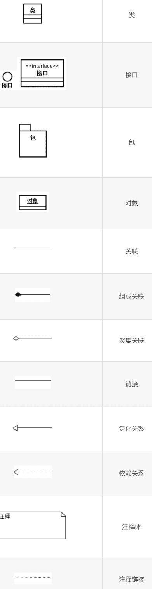

‍

* 用面向对象观点建立系统的模型，分别是描述系统静态结构的对象模型、描述系统控制结构的动态模型以及描述系统计算结构的功能模型。其中，对象模型是最基本、最核心、最重要的
* 统一建模语言UML是国际对象管理组织OMG批准的基于面向对象技术的标准建模语言。使用UML的类图来建立对象模型，使用UML的状态图来建立动态模型，使用数据流图或UML的用例图来建立功能模型。在UML中把用用例图建立起来的系统模型称为用例模型

‍

‍

## 1 面向对象方法学概述

‍

‍

### 概念

面向对象方法学的出发点和基本原则，**是尽可能模拟人类习惯的思维方式**，使开发软件的方法与过程尽可能**接近人类认识世界解决问题的方法与过程**，使描述问题的问题空间(问题域)与实现解法的解空间(求解域)在结构上尽可能一致

‍

传统软件工程方法学适用于中小型软件产品开发；

面向对象软件工程方法学适用于大型软件产品开发。

‍

‍

### 定义

‍

面向对象方法学方程式

‍

	OO = 对象 + 类 + 继承 + 传递消息实现通信

‍

‍

### 要点

‍

#### **对象**

**面向对象的软件系统是由对象组成的**，软件中的**任何元素都是对象**，复杂的软件对象由比较简单的对象组合而成。**用对象分解取代了传统方法的功能分解**，对象是从客观世界中的实体抽象而来的，是不固定的

‍

#### **类**

把所有对象都划分成**各种对象类,** 每个对象类都定义了**一组数据和一组方法**。数据用于表示对象的**静态属性**,是对象的状态信息。类中定义的方法，是允许施加于该类对象上的操作，是该类所有对象共享的，**并不需要为每个对象都复制操作的代码**

‍

#### **继承性**

按子类与父类的关系，**把若干个对象类组成一个层次结构的系统**。**子类自动具有和上层的父类相同的数据和方法**，而且低层的特性将**屏蔽**高层的同名特性

‍

#### 封装性

对象彼此之间仅能通过传递消息互相联系。对象是进行处理的主体，必须发消息请求它执行它的某个操作，处理它的私有数据，而不能从外界直接对它的私有数据进行操作。一切局部于该对象的私有信息，都被封装在该对象类的定义中，就好像装在一个不透明的黑盒子中一样，在外界是看不见的，更不能直接使用

‍

‍

### 优点

‍

1. **与人类习惯思维方法一致**

    对象是对现实世界正确抽象，问题空间和解空间结构一致。
2. **稳定性好**

    面向对象方法基于构造问题领域的对象模型，以对象为中心构造软件系统。它的基本作法是用对象模拟问题领域中的实体，以对象间的联系刻画实体间的联系。因为面向对象的软件系统的结构是根据问题领域的模型建立起来的，而不是基于对系统应完成的功能的分解，当对系统的功能需求变化时不会引起软件结构的整体变化，仅需要作一些局部性的修改
3. **可重用性好**

    对象是比较理想的模块和可重用的软件成分
4. **易开发大型软件产品**

    封装性好，易于分解，易于合作开发
5. **可维护性好**

    稳定性好、容易修改、容易理解、易于测试和调试

‍

‍

## 2 面向对象的概念

‍

**一览**

1. 对象：具有相同状态的一组操作的集合，对状态和操作的封装。
2. 类

    对具有相同状态和相同操作的一组相似对象的定义。

    类是一个抽象数据类型。
3. 实例

    实例是由某个特定类所描述的一个具体对象。
4. 消息

    要求某对象执行某个操作的规格说明。

    三部分：

    * 接受消息的对象
    * 消息名
    * 0或多个变元
5. 方法和属性

    * 方法：对象执行的操作，即类中定义的服务。
    * 属性：类中所定义数据，对客观世界实体具体性质的抽象。
6. 继承

    子类自动共享基类中定义的属性和方法的机制。
7. 多态性

    在类等级不同层次可共享一个方法名，不同层次每个类按各自需要实现这个方法。

    * 优点：

      * 提高程序可复用性（接口设计的复用，不是代码实现的复用）
      * 派生类的功能可被基类指针引用，提高程序可扩充性和可维护性。
8. 重载

    1. 函数重载

        在同一作用域内，参数特征不同的函数可使用相同的名字。

        * 优点

          调用者不需记住功能雷同函数名，方便用户；

          程序易于阅读和理解。
    2. 运算符重载

        同一运算符可施加于不同类型操作数上面。

‍

‍

### 概念

‍

#### 对象

‍

##### 定义

‍

* **按照面向对象程序设计的角度**：对象是具有**相同状态**的一组**操作的集合**。 在应用领域中有意义的、与所要解决的问题有关系的任何事物都可以作为对象，它既**可以是具体的物理实体的抽象，也可以是人为的概念，或者是任何有明确边界和意义的东西**
* **按照结构化角度**：**对象是封装了数据结构及可以施加在这些数据结构上的操作的封装体,这个封装体有可以唯一地标识它的名字，而且向外界提供一组服务**。对象中的数据表示对象的状态，一个对象的状态只能由该对象的操作来改变。**每当需要改变对象的状态时，只能由其他对象向该对象发送消息**。对象响应消息时，按照消息模式找出与之匹配的方法，并执行该方法
* **按照动态（对象的实现机制）角度**：对象是一台**自动机**，具有内部状态S

  ​​

‍

‍

##### 特点

‍

###### **1.以数据为中心**

操作围绕对其数据所需要做的处理来设置，不设置与这些数据无关的操作，而且操作的结果往往与当时所处的状态有关

‍

###### **2.对象是主动的**

对象进行处理的主体。不能从外部直接加工它的私有数据，而是**必须通过它的公有接口向对象发消息**，请求它执行它的某个操作，处理它的私有数据

‍

###### **3.实现了数据封装**

私有的数据完全被封装在内部，**对外是隐藏的、不可见的**，对私有数据的访问或处理只能通过公有的操作进行。为了使用对象内部的私有数据，只需知道数据的取值范围和可以对该数据施加的操作。**一个对象类型也可以看作是一种抽象数据类型**。

‍

###### **4.具有并行性**

对象是描述其内部状态的数据及可以对这些数据施加的全部操作的集合。**不同对象各自独立地处理自身的数据，彼此通过发消息传递信息完成通信**。因此，本质上具有并行工作的属性。

‍

###### **5.模块独立性好**

对象是由数据及可以对这些数据施加的操作所组成的统一体，而且**对象是以数据为中心的**，操作围绕对其数据所需做的处理来设置，没有无关的操作。**因此，对象内部各种元素彼此结合得很紧密，内聚性相当强。它与外界的联系比较少，对象之间的耦合比较松**

‍

#### 类

“类”是对具有**相同数据和相同操作**的一组相似对象的定义,即类**是对具有相同属性和行为的一个或多个对象的描述**，包括对怎样创建该类的新对象的说明。**类是支持继承的抽象数据类型，而对象就是类的实例**

‍

#### 实例

由某个特定的类所描述的**一个具体的对象**。类是对具有相同属性和行为的一组相似的对象的抽象，**类在现实世界中并不能真正存在**。实际上**类是建立对象时使用的“样板”** ，按照这个样板所建立的一个个具体的对象，就是类的实际例子，通常称为实例

‍

#### 消息

要求某个对象**执行在定义它的那个类中所定义的某个操作的规格说明**。一个消息由接收消息的对象、消息选择符、零个或多个变元组成。

‍

#### 方法

方法就是**对象所能执行的操作**，也就是类中所定义的服务。方法描述了对象执行操作的算法，响应消息的方法

‍

#### 属性

属性就是**类中所定义的数据**，它是对客观世界实体所具有的性质的抽象。类的每个实例都有自己特有的属性值

‍

#### 封装

封装是把数据和实现操作的代码集中起来放在对象内部。封装也就是**信息隐藏**，通过封装对外界**隐藏了对象的实现细节**

‍

##### 特点

* **有一个清晰的边界**
* **有确定的接口**
* **受保护的内部实现**

‍

‍

#### 继承

广义地说，继承是指能够**直接获得已有的性质和特征**，而不必重复定义它们。在面向对象的软件技术中，继承是**子类自动地共享父类中定义的数据和方法的机制**

‍

##### 特点

* 继承具有**传递性**
* 子类将会**屏蔽**父类的同名性质

‍

‍

#### 多态

多态性是指子类对象可以像父类对象那样使用，同样的消息既可以发送给父类对象也可以发送给子类对象。即在类等级的不同层次中可以共享一个方法的名字， **不同层次中的每个类各自按自己的需要来实现这个行为**

‍

##### 优点

* 增加了面向对象软件系统的**灵活性**，进一步减少信息冗余
* 提高了**可重用性**和**可扩充性**

‍

#### 重载

‍

##### 函数重载

在同一作用域，若干个参数特征不同的函数可以使用相同的函数名

‍

##### 运算符重载

同一个运算符可以施加于不同类型的操作数上面

‍

‍

### 基本原则

> 见设计模式等, 这里是一些列举

* 单一职责原则
* 开闭原则
* 里氏替换原则
* 依赖倒置原则
* 接口隔离原则
* 控制反转
* 依赖注入
* 面向切面编程

‍

‍

## 3 面向对象建模

所谓模型，就是为了理解事物而对事物作出的一种抽象，是对事物的一种无歧义的书面描述

‍

用面向对象方法开发软件，通常需要建立3种形式的模型，它们分别是描述系统数据结构的对象模型，描述系统控制结构的动态模型和描述系统功能的功能模型

‍

‍

## 4 对象模型 UML

对象模型表示静态的、结构化的系统的“数据”性质。它是对模拟客观世界实体的对象以及对象彼此间的关系的映射，描述了系统的静态结构。

通常，使用UML提供的类图来建立对象模型

---

UML全称为Unified Modeling Language，目前最流行的面向对象建模语言

> UML全称为Unified Modeling Language
>
> UML是图示化、说明、构造一个软件系统并生成其文档的标准语言。
>
> UML独立于开发过程，可与大多数面向对象开发过程配合使用

‍

‍

### 四种主要关系

1. 关联关系(Association)
2. 依赖关系(Dependency)
3. 泛化(一般化)关系(Generalization)  
    泛化指的是类之间的继承关系
4. 聚集关系(Aggregation)  
    聚集指的是整体与部分之间的关系，在实体域对象之间很常见

‍

### UML中的两类九种图

‍

**静态模型图**：描述系统的结构

1. ==类图==
2. 对象图
3. 组件图
4. 部署图

‍

**动态模型图**：描述系统的行为

1. 用例图
2. 活动图
3. 时序图
4. 协作图
5. 状态图

‍

‍

### 类图的基本符号

​​

​​

‍

‍

‍

#### 定义类

UML中类的图形符号为**长方形**，用两条横线把长方形分**上、中、下**3个区域，3个区域分别放类**的名字、属性和服务**

‍

##### 命名规则

类名应该是**富于描述的、简洁的而且无二义性的**

* 使用**标准术语**，不要随意创造名字
* 使用具有**确切含义**的名词，不要使用空洞或含义模糊的词作名字
* 必要时可用**名词短语**作名字，有时也可以加入形容词

‍

#### 定义属性

‍

可见性属性名： 类型名 = 初值 {性质串}

‍

* **可见性**：有公有的（+）、私有的（-）和保护的（#）

  > 注意，没有默认的可见性
  >
* **类型名**：表示该属性的数据类型

  > 属性名和类型名之间用冒号(:)分隔
  >
* **赋值**：在创建类的实例时应给其他属性赋值，如果给某个属性定义了初值，则该初值可作为创建实例时这个属性的默认值

  > 类型名和初值之间用等号（=）隔开
  >
* **性质串**：明确地列出该属性所有可能取值，用逗号隔开

‍

|符号|表示|
| ------| -----------------------------|
|+|public|
|-|private|
|#|protected|
|~|package(可以理解为静态类型)|

‍

#### 定义服务

‍

可见性操作名（参数表）： 返回值类型{性质串}

‍

* **可见性**：有公有的（+）、私有的（-）和保护的（#）
* **参数表**：用逗号隔开不同参数，每个参数语法为 “`参数名:类型名=默认值`​”

‍

‍

‍

### 表示关系的符号

类与类之间通常具有以下四种关系

‍

#### 关联

关联表示两个类的对象之间存在某种**语义上的联系**

关联使用实线 + 简单箭头

‍

**关联的角色**

在任何关联中都会涉及**参与此关联的对象所扮演的角色**，在某些情况下显式标明角色名有助于别人理解类

如果没有显式标出角色名，则意味着用类名作为角色名

‍

‍

##### (1) 普通关联

普通关联是最常见的关联关系，**只要在类与类之间存在连接关系就可以用普通关联表示**

‍

表示

* 普通关联的图示符号是**连接两个类之间的直线**
* 关联是**双向**的，可为关联起一个名字。在名字前面(或后面)加一个**表示关联方向的黑三角**
* 在表示关联的直线两端可以写上**重数**，它表示该类有多少个对象与对方的一个对象连接。**未明确标出关联的重数，则默认重数是1**

|重数|表示|
| --------------| -------------|
|0··1|0到1个对象|
|0·· *或 *|0到多个对象|
|1 +或1·· *|1到多个对象|
|1··15|1到15个对象|
|3|3个对象|

‍

‍

##### (2) 限定关联

限定关联通常用在一对多或多对多的关联关系中，可以把模型中的重数从一对多变成一对一， 或从多对多简化成多对一

‍

##### (3) 关联类

为了说明关联的性质，可能需要一些**附加信息**。关联类可以用来**记录相关信息**

关联类通过一条**虚线**与关联连接

‍

* 关联类与一般的类一样，也有属性、操作和关联
* 关联中的每个连接与关联类的一个对象相联系

‍

#### 聚集

也称为聚合, 是关联的特例

‍

聚集表示类与类之间的关系是整体与部分的关系。使用的“包含”、“组成”、“分为……部分”等字句，意味着存在聚集关系。有共享聚集和组合聚集两种特殊的聚集关系

‍

##### (1) 一般聚集

部分==可以脱离整体==存在, 一般聚集和共享聚集的图示符号，都是在表示关联关系的直线末端紧挨着整体类的地方画一个**空心菱形**

‍

##### (2) 共享聚集

如果在聚集关系中处于部分方的对象可==同时参与多个==处于整体方对象的构成，则该聚集称为**共享聚集**

‍

##### (3) 组合聚集

如果部分类==完全隶属于==整体类, 部分与整体共存, 整体不存在了部分也会随之消失, 则该聚集称为组合聚集(组成)

组成关系用**实心菱形**示例

‍

‍

‍

#### 泛化(继承)

‍

泛化关系就是继承关系，**它是通用元素和具体元素之间的一种分类关系**。具体元素完全拥有通用元素的信息，并且还可以附加一些其他信息。在UML中，用**一端为空心三角形的实线连线表示泛化关系，三角形的顶角紧挨着通用元素**

泛化关系指出在类与类之间存在“一般--特殊”关系。泛化可进一步划分成普通泛化和受限泛化

---

‍

##### (1) 普通泛化

‍

①：抽象类

**没有具体对象的类称为抽象类**。抽象类通常都有抽象操作，来指定该类的所有子类应具有哪些行为

表示抽象类是在类名下方附加一个标记值{abstract}，表示抽象操作是在操作标记后面跟随一个性质串{abstract}

‍

②：具体类

**具体类有自己的对象，并且该类的操作都有具体的实现方法**

‍

‍

##### (2) 受限泛化

给泛化关系附加约束条件，以进一步说明该泛化关系的使用方法或扩充方法，这样的泛化关系称为受限泛化。

‍

预定义的约束有4种（都是语义约束）

* **多重**：一个子类可以同时多次继承同一个上层基类
* **不相交**：一个子类不能多次继承同一个基类。-般的继承都是不相交继承
* **完全**：父类的所有子类都已在类图中穷举出来了
* **不完全**：父类的子类并没有都穷举出来，随着对问题理解的深入，可不断补充和维护。是默认的继承关系

‍

##### 实现

实现关系用来表示**类与接口**之间的实现关系，用一条**虛线空心箭头**由子类指向父类

(实现是虚线, 继承是实线)

‍

#### 依赖和细化

‍

##### 依赖关系

依赖关系描述两个模型元素之间的**语义连接关系**:

其中**一个模型元素是独立的，另一个模型元素不是独立的**，它依赖于独立的模型元素，**如果独立的模型元素改变了，将影响依赖于它的模型元素**

* 在UML类图中用**带简单箭头的虚线**连接有依赖关系的两个类，箭头指向独立的类。在虚线上可以带一个**版类标签**，具体说明依赖的种类

‍

##### 细化关系

**对同一个事物在不同抽象层次上描述时**，这些描述之间具有细化关系

* 细化的图示符号为由元素B指向元素A的一端为**空心三角形的虚线**

‍

‍

## 5 动态模型

动态模型表示**瞬时的**、**行为化的**系统的控制性质，它规定了对象模型中的对象的**合法变化序列**

‍

用UML提供的**状态图**来描绘对象的状态、触发状态转换的事件以及对象的行为。每个类的动态行为用一张状态图来描绘，各个类的状态图通过共享事件合并起来，从而构成系统的动态模型，即动态模型是**基于事件共享而互相关联的一组状态图的集合**

‍

‍

## 6 功能模型

功能模型表示**变化的系统的功能性质，它指明了系统应该做什么，因此更直接地反映了用户对目标系统的需求**

‍

功能模型由一组**数据流图**组成

‍

### 用例图

UML提供的用例图是进行需求分析和建立功能模型的强有力工具。在UML中把用用例图建立起来的系统模型称为用例模型

用例模型描述的是**外部行为者所理解的系统功能**。用例模型的建立是**系统开发者和用户反复讨论的结果**，它描述了开发者和用户对需求规格所达成的共识。

‍

#### 元素

‍

##### 系统

系统被看作是一个**提供用例的黑盒子**

用**方框**表示，其边线表示**系统的边界**，用于**划定系统的功能范围**，定义了系统所具有的功能。描述该系统功能的**用例**置于方框内，代表外部实体的**行为者**置于方框外

‍

##### 用例

一个用例是可以**被行为者感受到的**、系统的一个完整的功能。在UML中把用例定义成**系统完成的一系列动作**

**椭圆**代表用例。用例通过关联与行为者连接，关联指出一个用例与哪些行为者交互，这种交互是**双向**的

‍

特征

* 用例代表**某些用户可见的功能**，实现一个具体的用户目标
* 用例总是被**行为者**启动的，并向行为者提供可识别的值
* 用例必须是**完整的**

> 通常把用例的实例称为脚本。脚本是系统的一次具体执行过程

‍

##### 行为者

**与系统交互的人或其他系统**，它代表**外部实体**。使用用例并且与系统交互的任何人或物都是行为者。行为者代表**一种角色**，而不是某个具体的人或物

‍

**线条人**代表行为者。在用例图中用**直线**连接行为者和用例，表示两者之间交换信息，称为**通信联系**。行为者**触发用例**，并与用例交换信息。

单个行为者可与多个用例联系，一个用例也可与多个行为者联系

可以把行为者分成主行为者和副行为者，还可分成主动行为者和被动行为者

‍

##### 用例间关系

‍

**扩展关系**：    **向一个用例中添加一些动作后构成了另一个用例**，这两个用例之间的关系就是扩展关系，后者继承前者的一些行为，通常把后者称为**扩展用例**

‍

**使用关系**：    **一个用例使用另一个用例时**，这两个用例之间就构成了使用关系

‍

‍

**两种关系的异同**

* 都是从几个用例中抽取那些公共的行为并放入一个单独的用例中,而这个用例被其他用例使用或扩展
* 使用和扩展的目的是不同的。在描述一般行为的变化时采用**扩展关系**
* 在两个或多个用例中出现重复描述又想避免这种重复时，采用**使用关系**

‍

‍

#### 用例建模

一个用例模型由若干幅用例图组成。创建用例模型的工作包括：定义系统，寻找行为者和用例，描述用例，定义用例之间的关系，确认模型。其中，寻找行为者和用例是关键。

‍

##### 寻找行为者

请系统的用户回答一些问题来发现行为者

```java
谁将使用系统的主要功能（主行为者）？
谁需要借助系统的支持来完成日常工作？
谁来维护和管理系统（副行为者）？
系统控制哪些硬件设备？
```

‍

##### 寻找用例

一旦找到了行为者，就可以通过请每个行为者回答下述问题来获取用例

```java
行为者需要系统提供哪些功能？行为者自身需要做什么？
行为者是否需要读取、创建、删除、修改或存储系统中的某类信息？

```

一个用例必须至少与一个行为者相关联

‍

## 7 3种模型之间的关系

‍

**功能模型**指明了系统应该“做什么”；**动态模型**明确规定了什么时候(即在何种状态下接受了什么事件的触发)做；**对象模型**则定义了做事情的实体。

在面向对象方法学中，对象模型是最基本最重要的，它为其他两种模型奠定了基础，人们依靠对象模型完成3种模型的集成

‍

* 针对每个类建立的动态模型，描述了类实例的**生命周期或运行周期**
* 状态转换驱使行为发生，这些行为在数据流图中被映射成**处理**，在用例图中被映射成**用例**，它们同时与类图中的**服务**相对应
* 功能模型中的处理对应于对象模型中的**类所提供的服务**
* 数据流图中的数据存储，以及数据的源点/终点，通常是对象模型中的**对象**
* 数据流图中的数据流，往往是对象模型中对象的**属性值**，也可能是整个对象
* 用例图中的行为者，可能是对象模型中的**对象**
* 功能模型中的处理可能产生动态模型中的**事件**
* 对象模型描述了数据流图中的数据流、数据存储以及数据源点/终点的结构

‍
