‍

# 1软工概述

‍

## 0 软件

‍

### 软件

软件 = 程序 + 数据 + 文档

‍

* 程序:    是能够完成预定功能和性能的可执行指令序列
* 数据:    是使程序能够适当处理信息的数据结构
* 文档:    是开发、使用和维护过程程序所需要的图文资料

‍

‍

## 1 软件危机

软件危机是 软件开发和维护过程中遇到的一系列严重问题

‍

两个方面

* **如何开发**软件，以满足日益增长的软件需求
* **如何维护**数量不断膨胀的已有软件

‍

‍

#### 表现

1. 开发成本和进度估不准
2. 用户不满意
3. 质量靠不住
4. 可维护性差
5. 没有适当文档资料
6. 软件成本在计算机系统总成本中所占的比例逐年上升
7. 开发生产率低

‍

‍

#### 原因

* 客观原因

  * ① 软件是计算机系统中的逻辑部件，缺乏“可见性”，因此管理和控制软件开发过程相当困难
  * ② 软件维护通常意味着改正或修改原来的设计，因此软件较难维护
  * ③ 软件规模庞大，而程序复杂性将随着程序规模的增加而呈指数上升
* 主观原因

  * ① 存在与软件开发和维护有关的许多错误认识和做法
  * ② 对用户要求没有完整准确的认识就匆忙着手编写程序
  * ③ 开发人员只重视程序而忽视软件配置的其余成分（文档和数据等）
  * ④ 软件开发人员轻视维护

‍

‍

## 2 软件工程

采用工程的概念、原理、技术和方法来开发与维护软件，把经过时间考验而证明正确的管理技术和当前能够得到的最好的技术方法结合起来， 以经济地开发出高质量的软件并有效地维护它

‍

### 基本原理

‍

* 用分阶段的生命周期计划严格管理
* 坚持进行阶段评审
* 实行严格的产品控制
* 采用现代程序设计技术
* 结果应能清楚地审查
* 开发人员少而精
* 承认不断改进软件工程实践的必要性

‍

‍

### 软件工程方法学

‍

#### 三要素

方法、工具、过程

‍

‍

#### **传统方法学（生命周期方法学）**

* 采用**结构化技术**完成软件开发各项任务
* 把软件生命周期的全过程依次划分为**若干阶段**
* 每个阶段开始和结束都有**严格标准**
* 每个阶段结束后要有**严格审查**

‍

‍

#### **面向对象方法学**

* 把对象作为融合了**数据及在数据上的操作行为**的统一的软件构件
* 把所有对象划分为**类**
* 按照父类与子类的关系，把若干类组成**层次结构**的系统
* 对象彼此间仅能通过发送**消息**互相联系

‍

‍

## 3 软件生命周期

软件生命周期由 软件定义、软件开发、软件维护组成

‍

* 定义
* 开发
* 维护

‍

‍

### 定义

#### 问题定义

#### 可行性研究

#### 需求分析

‍

---

### 开发

#### 总体设计

#### 详细设计

#### 编码和单元测试

#### 综合测试

‍

---

### 维护

#### 软件维护

‍

‍

## 4 软件过程

是为了获得高质量软件所需要完成的一系列任务框架，它规定了完成任务的工作步骤。通常用软件生命周期模型来描述软件过程。

‍

‍

### 常用软件过程模型

* 瀑布模型
* 快速原型模型
* 增量模型
* 螺旋模型
* 喷泉模型
* Rational统一过程

‍

‍

#### 瀑布模型

使用最早应用最广

‍

实际瀑布模型带**反馈环**

​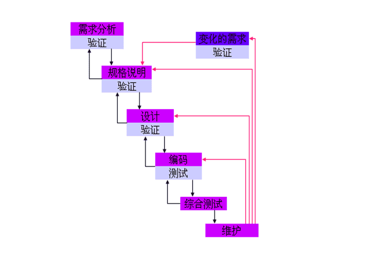​

‍

##### 特点

1. 阶段具有**顺序性**和**依赖性**

    前一阶段结束后一阶段开始，前一阶段输出文档，后一个阶段输入文档。
2. **推迟实现**观点

    瀑布模型在编码前设置系统分析、系统设计，推迟程序物理实现，保证前期工作扎实。
3. **质量保证**观点

    1. 每阶段都必须完成完整、准确的文档。该文档是软件开发时人员间通信、运行时维护的重要依据。
    2. 每阶段结束前对文档评审。

‍

‍

##### 评价

‍

**优点**

* **强迫开发人员使用规范的方法**
* **严格规定了每个阶段提交的文档**
* **要求每个阶段交出的所有产品都必须经过质量保证小组的仔细验证**
* **对文档的约束，使软件维护变得容易一些，且能降低软件预算**

‍

**缺点**

* **在软件开发的初期阶段就要求作出正确的、全面的、完整的需求分析对许多应用软件来说是极其困难的**
* **在需求分析阶段，当需求确定后，无法及时验证需求是否正确、完整**
* **作为整体开发的瀑布模型，由于不支持产品的演化，缺乏灵活性**

(可以使用改进的带反馈环的)

‍

‍

##### 适用范围

* **用户的需求非常清楚全面，且在开发过程中没有或很少变化**
* **开发人员对软件的应用领域很熟悉**
* **用户的使用环境非常稳定**
* **开发工作对用户参与的要求很低**

‍

‍

‍

#### 快速原型模型

快速原型是快速建立起来的可以在计算机上运行的程序，它所能完成的功能往往是最终产品能完成的功能的一个子集。

‍

​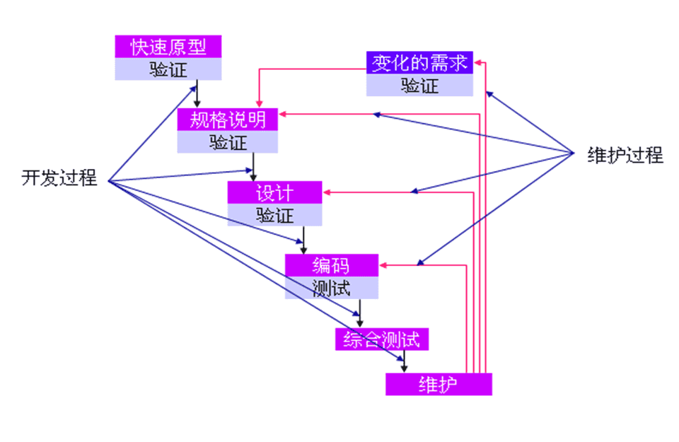​

‍

##### 特点

快速原型模型是**不带反馈环**的，开发基本上是线性顺序进行的

‍

‍

##### 评价

‍

**优点**

* **开发的软件产品通常满足用户需求**
* **软件产品开发基本是线性过程**

‍

**缺点**

* **准确原型设计困难**
* **原型理解可能不同**
* **不利于开发人员创新**

‍

##### 适用范围

* **对所开发的领域比较熟悉而且有快速的原型开发工具**
* **项目招投标时，可以以原型模型作为软件的开发模型**
* **进行产品移植或升级时，或对已有产品原型进行客户化工作时**

‍

‍

#### 增量模型

也称为渐增模型

先完成一个系统子集的开发，再按同样的开发步骤增加功能，如此递增下去直至满足全部系统需求

‍

‍

​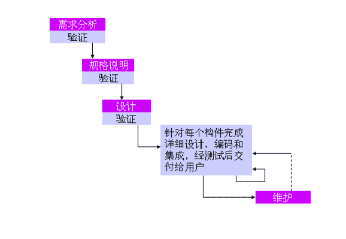​

‍

‍

##### 特点

每个构件由多个相互作用的模块构成，并且能够完成特定的功能

> **区别于瀑布模型和快速原型模型：**
>
> 瀑布模型和快速原型模型是一次把满足所有需求产品提交给用户。
>
> 增量模型是==分批==向用户提交产品

第一个增量构件往往实现软件的基本需求，提供最核心的功能。把软件产品分解成增量构件时，应该使构件的规模适中。

分解时唯一必须遵守的约束条件是:当把新构件集成到现有软件中时，所形成的产品必须是可测试的

‍

‍

##### 评价

‍

**优点**

* **短时间内可提交完成部分功能**
* **逐渐增加产品功能，用户适应产品快**

‍

**缺点**

* **要求软件体系结构必须是开放的**
* **增量构件划分以及集成困难**
* **容易退化为边做边改模型**

‍

‍

##### 适用范围

* 进行已有产品升级或新版本开发
* 对完成期限严格要求的产品
* 对所开发的领域比较熟悉而且已有原型系统

‍

‍

#### 螺旋模型

把它看作在每个阶段之前都增加了**风险分析过程**的快速原型模型

‍

​​

‍

​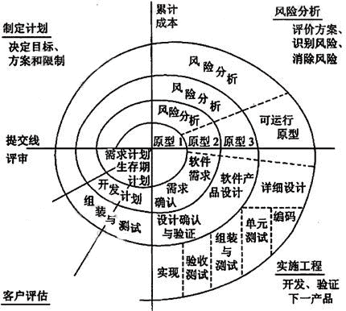​

‍

‍

笛卡尔坐标四象限表达四方面活动：

* 制定计划：确定目标、选定方案、设定约束条件。
* 风险分析：评估方案，识别和消除风险。
* 实施工程：软件开发。
* 客户评估：评价开发工作，计划下一阶段工作。

沿螺线自内向外每旋转一圈开发出更完善新版本。

‍

‍

‍

##### 评价

‍

**优点**

* **利于把软件质量作为软件的开发目标**
* **减少测试**
* **维护和开发不分开**

‍

**缺点**

* **风险估计困难**
* **过多的迭代次数会增加开发成本，延迟提交时间**

‍

##### 适用范围

适用于内部开发的大规模软件项目

‍

‍

#### 喷泉模型

‍

面向对象生命周期模型，体现迭代^（求精，系统某部分常被重复工作多次，相关功能在每次迭代中逐渐加入演进系统）^和无缝^（分析、设计、编码各阶段间不存在明显边界）^特性。

‍

‍

​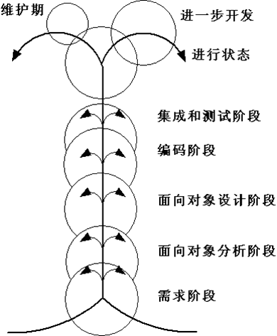​

‍

‍

##### 特点

* 喷泉模型是一种以用户需求为动力，以对象为驱动的模型，主要用于描述面向对象的软件开发过程
* 体现了面向对象软件开发过程迭代和无缝的特性

‍

##### 评价

‍

**优点**

无缝，可同步开发，提高开发效率，节省开发时间，适应面向对象软件。

‍

**缺点**

可能随时加各种信息、需求与资料，需严格管理文档，审核的难度加大。

‍

‍

##### 适用范围

‍

#### RUP

Rational统一过程

由Rational软件公司推出的一种软件过程，该过程强调以迭代和渐增方式开发软件

RUP软件开发生命周期是一个二维的面向对象的生命周期模型

‍

‍

##### 阶段

* 初始
* 精化
* 构建
* 移交

‍

​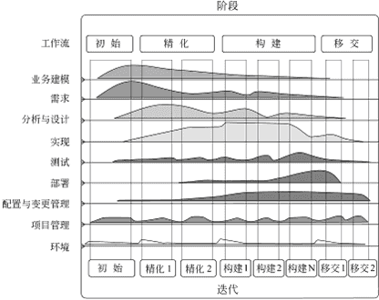​

‍

‍

##### 特点

* 采用迭代和渐增的方式开发软件
* 具有多功能性和广泛适用性

‍

##### 评价

‍

**优点**

不断的版本发布成为一种团队日常工作的真正驱动力

将发现问题、制定方案和解决过程集成到下一代迭代

迭代开发，降低风险

更好地安排产品开发的辅助过程

‍

‍

‍

# 2可行性研究

‍

## 1 可行性研究概念

可行性研究的目的不是解决问题，而是确定问题是否值得去解决

‍

‍

具体任务

‍

**1.分析和澄清问题的定义**

**2.导出系统的逻辑模型** (数据流图+数据字典)

**3.根据逻辑模型探索若干种可供选择的解法** (并判断可行性)

‍

‍

#### 可行性

* **经济可行性**

  > ?效益>成本
  >
* **技术可行性**

  > 开发风险, 资源
  >
* **操作可行性**

  > 运行, 时间进度, 法律
  >

‍

‍

‍

## 2 可行性研究过程

‍

1. 复查系统规模和目标
2. 研究目前正在使用的系统
3. 导出新系统的高层逻辑模型
4. 进一步定义问题
5. 导出和评价供选择的解法
6. 推荐行动方针
7. 草拟开发计划书
8. 写文档提交审查

‍

‍

## 3 系统流程图

系统流程图是概括地描绘物理系统的传统工具

> 系统流程图表达的是数据在系统各部件之间流动的情况，而**不是对数据进行加工处理的控制过程**，因此尽管系统流程图的某些符号和程序流程图的符号形式相同，但是它却是物理数据流图而不是程序流程图

‍

‍

符号

‍

​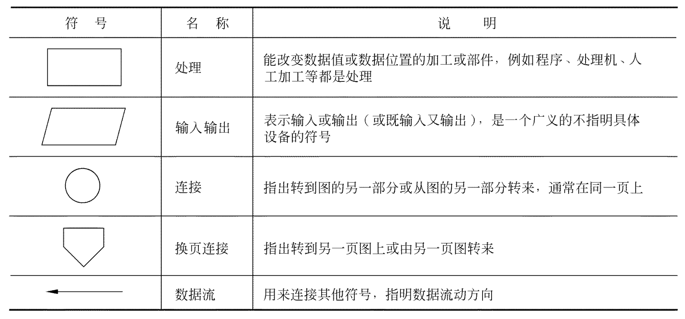​

可以使用分层绘制的方法, 先给出大致的路径, 然后细化后绘制

‍

‍

## 4 数据流图

数据流图(DFD)描绘信息流和数据从输入移动到输出的过程中所经受的变换

没有任何具体物理部件，只是描绘数据在软件中流动和被处理的逻辑过程

‍

### 特点

* 数据流图中**没有具体的物理部件**，只是描绘数据在软件中流动和被处理的**逻辑过程**
* 数据流图是**系统逻辑功能的图形表示**，是分析员与用户之间极好的通信工具
* 设计时只需考虑系统**必须完成的基本逻辑功能**，不考虑怎样**具体地实现**这些功能

‍

‍

### 符号

‍

* 四种基本符号：

  * 正方形（或立方体）：表示数据的**源点或终点**

    ​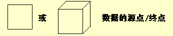​
  * 圆角矩形（或圆形）：代表**变换数据的处理**

    ​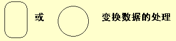​
  * 开口矩形（两条平行横线）：代表**数据存储**

    ​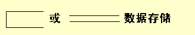​
  * 箭头：表示**数据流**、即**特定数据的流动方向**

    ​​

  ​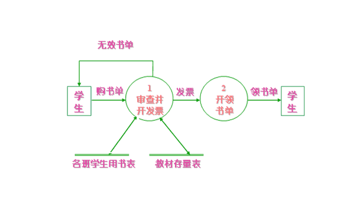​
* 附加符号

  ​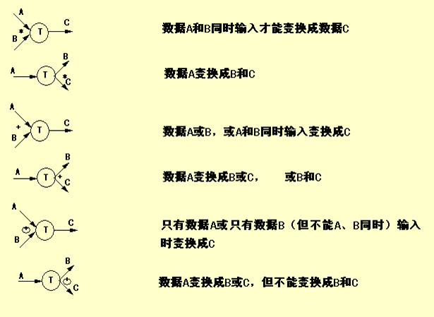​

‍

‍

‍

### 思路

需要绘制时候

1. **考虑数据的源点和终点**
2. 如何处理
3. 考虑数据流的方向, 从哪里送哪里
4. 数据存储到哪里

‍

基础模板

* 基本系统模型

  > 源点 -> 处理 -> 终点
  >
* 细化模型

  > 加入逻辑等
  >

‍

‍

#### 注意

* 在数据流图中应该描绘所有可能的数据流向，而不应该描绘出现某个数据流的条件
* 一个处理框可以代表一系列程序、单个程序或者程序的一个模块
* 一个数据存储可以表示一个文件、文件的一部分、数据库的元素或记录的一部分等
* 数据存储是处于静止状态的数据，数据流是处于运动中的数据
* 通常在数据流图中忽略出错处理
* 表示数据的源点和终点相同的方法是再重复画一个同样的符号表示数据的终点
* 代表同一事物的符号出现在n个地方，在这个符号的角上画(n-1) 条短斜线做标记
* (绘图)功能进一步分解涉及如何具体实现功能时，不应再分解

‍

#### 命名

1. 数据流（数据存储）命名

    1. 用名词，区别于控制流
    2. 代表整个数据流（数据存储）内容，不仅仅反映某些成分
    3. 不要用缺乏具体含义名字，如“数据”、“信息”
2. 处理命名

    1. 用动宾词组，避免使用“加工”，“处理”等
    2. 应反映整个处理的功能，不是一部分功能
    3. 通常仅包括一个动词，否则分解
3. 数据源点/终点

    不属于数据流图的核心内容

‍

‍

‍

‍

## 5 数据字典

数据字典是关于数据的信息的集合，也就是对数据流图中包含的所有元素的定义的集合

‍

‍

### 对象

‍

4类元素

* **数据流**
* **数据元素**
* **数据存储**
* **处理**

‍

‍

1. 数据流

    ```java
    数据流名:
        说明:简要介绍作用即它产生的原因和结果
        数据流来源:即该数据流来自何方
        数据流去向:去向何处
        数据流组成:数据结构
        每个数据量流通量:数据量、流通量
    ```

    ‍
2. 数据元素

    ```java
    数据元素名:

        类型: 数字（离散值、连续值), 文字（编码类型)
        长度:
        取值范围:
        相关的数据元素及数据结构:
    ```

    ‍
3. 数据存储

    ```java
    数据存储名:

        简述: 存放的是什么数据
        输入数据:
        输出数据:
        数据文件组成: 数据结构
        存储方式: 顺序，直接,关键码
        存取频率:
    ```

    ‍
4. 处理

    ```java
    处理名:
        处理编号:反映该处理的层次
        简要描述:加工逻辑及功能简述
        输入数据流:
        输出数据流:
        加工逻辑:简述加工程序、加工顺序
        ...
    ```

    ‍

‍

‍

### 描述

典型的情况是，在数据字典中记录数据元素的下列信息：

1. **一般信息**，名字、别名、描述等等
2. **定义**，数据类型、长度、结构等等
3. **使用特点**，值的范围、使用频率、使用方式(输入、输出、本地)、条件值等等
4. **控制信息**，来源、用户、使用它的程序、改变权、使用权等等
5. **分组信息**，父结构、从属结构、物理位置记录、文件和数据库等等

‍

‍

‍

### 组成

由数据元素组成数据的方式

‍

* **顺序**
* **选择**
* **重复**
* **可选**

‍

‍

‍

### 符号

‍

|符号|含义|
| -----------| --------------------------------|
|=|等价于（或定义为）|
|+|顺序连接（确定次序连接）|
|[ \| ]|或（方括弧中的分量选一个）|
|{  }n|重复（重复花括弧中的分量）|
|（  ）|可选（圆括弧里的分量可有可无）|

‍

​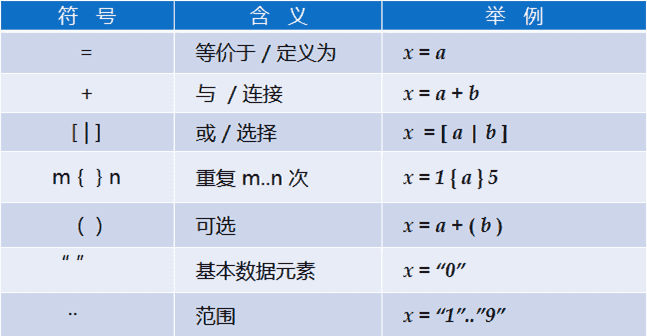​

‍

‍

#### 示例

> 北京某高校可用的电话号码有以下几类:校内电话号码由4位数字组成，第一位数字不是0。校外电话又分为本市电话和外地电话两类。拨校外电话需要先拨0，若是本市电话则接着拨8位数字(第一位不是0)，若是外地电话则拨3位区码后再拨8位电话号码(第一位不是0)

‍

* **电话号码**=[校内电话 | 校外电话]
* **校内电话**=非零数字+三位数字
* **非零数字**=[ 1 | 2 | 3 | 4 | 5 | 6 | 7 | 8 | 9 ]
* **三位数字**=3{数字}3
* **数字**=[ 0 | 1 | 2 | 3 | 4 | 5 | 6 | 7 | 8 | 9 ]
* **校外电话**=[本市电话 | 外地电话]
* **本市电话**=0 + 八位非零开头数字
* **八位非零开头数字**=非零数字+七位数字
* **七位数字**=7{数字}7
* **外地电话**=0 + 三位区码 + 八位非零开头数字
* **三位区码**=三位数字

‍

> 例如：  
> 学生成绩通知={ \{{学号+姓名+{ \{{课程名称+成绩} \}}+(补考课程名称+补考时间+补考地点)} \}}所有注册学生  
> 学生奖励通知={ \{{学号+姓名+[一等奖 | 二等奖 | 三等奖]} \}}所有获奖学生

‍

‍

### 用途

(简单)

‍

**1.作为分析阶段的工具**

**2.数据字典中包含的数据元素的控制信息是很有价值的**

**3.数据字典是开发数据库的第一步，而且是很有价值的一步**

‍

‍

# 3需求分析

‍

‍

## 1 需求分析的任务

1. 建立分析模型
2. 编写需求说明

‍

‍

‍

## 4 实体联系图（E-R图）

‍

数据模型中包含3种相互关联的信息：数据对象、数据对象的属性及数据对象彼此间相互连接的关系

‍

### 数据对象

对软件必须理解的复合信息^（复合信息是指具有一系列不同性质或属性的事物，仅有单个值的事物不是数据对象）^的抽象

> 可以由一组属性来定义的实体都可以被认为是数据对象

‍

‍

‍

### 实体联系图

矩形方框:实体  
菱形框:联系  
圆角矩形:属性

‍

> 见MySQL - 绘制ER

‍

评价

* **E-R模型比较接近人的思维习惯方式**
* **E-R模型使用简单的图形符号表达，便于用户理解**

‍

‍

## 6 状态转换图

状态转换图(简称为状态图)通过描绘系统的状态及引起系统状态转换的事件，来表示系统的行为。此外，状态图还指明了作为特定事件的结果系统将做哪些动作

‍

‍

### 概念

‍

**状态** ：状态是任何可以被观察到的系统行为模式，一个状态代表系统的一种行为模式。

状态规定了系统对事件的响应方式。系统对事件的响应，既可以是做一个(或一系列)动作，也可以是仅仅改变系统本身的状态，还可以是既改变状态，又做动作

* 状态有初态、终态和中间状态
* 一张状态图只能有一个初态，而终态可以没有也可以有多个

‍

**事件**：事件是在某个特定时刻发生的事情，它是对引起系统做动作或(和)从一个状态转换到另一个状态的外界事件的抽象。简而言之，事件就是引起系统做动作或(和)转换状态的控制信息

‍

‍

‍

### 事件

3种标准事件：entry, exit和do

* entry事件指定进入该状态的动作
* exit事件指定退出该状态的动作
* do事件则指定在该状态下的动作

‍

‍

### 符号

箭头表示，箭头上标事件名。后跟[条件] 、表状态转换条件

状态图中两个状态之间带箭头的连线称为状态转换，箭头指明了转换方向。状态变迁通常是由事件触发的，在这种情况下应在表示状态转换的箭头线上标出触发转换的事件表达式；如果在箭头线上未标明事件，则表示在源状态的内部活动执行完之后自动触发转换

‍

‍

行为：进入某状态所作动作。状态框内do：行为名

‍

对于圆角矩形，可以将其分为上、中、下三部分：上部分是状态的名称；中部分是状态变量的名字和值；下部分是活动表

​​

‍

​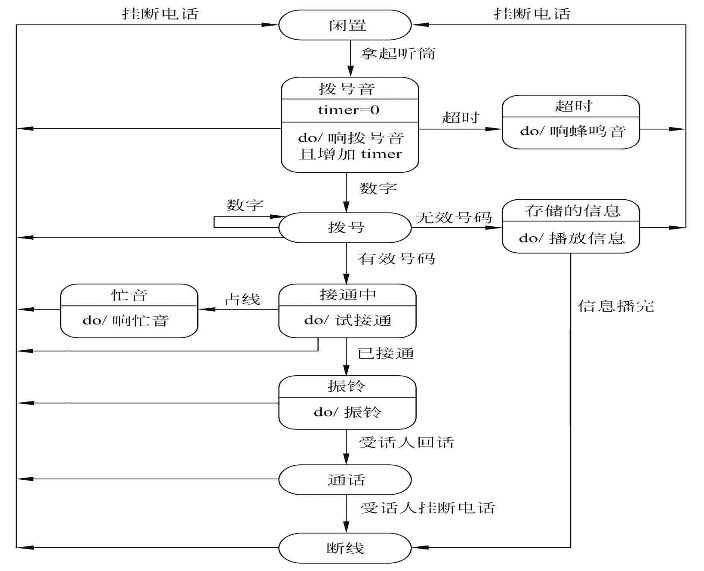​

‍

‍

## 8 验证软件需求

‍

一致性、完整性、现实性和有效性

‍

‍
