> 4 已经全部略过

‍

‍

‍

# 4总体设计

‍

‍

## 1 设计过程

‍

### (1)系统设计阶段

‍

#### 1：设想供选择的方案

#### 2：选取合理的方案

#### 3：推荐最佳方案

‍

‍

### (2)结构设计阶段

‍

#### 4：功能分解

#### 5：设计软件结构

#### 6：设计数据库

#### 7：制定测试计划

#### 8：书写文档

#### 9：审查和复查

‍

‍

## 2 设计原理

‍

结构化设计的概念与原理

* 模块化
* 抽象
* 逐步求精
* 信息隐蔽和局部化
* 模块独立

‍

‍

### 模块独立

‍

**高内聚、低耦合是设计目标**

‍

‍

#### 耦合

对一个软件结构内不同模块间互连程序的度量。耦合强度取决于模块接口的复杂程度、通过接口的数据等。耦合度越高，模块独立性越弱

‍

耦合度从低到高

* 完全独立
* 数据耦合
* 特征耦合
* 控制耦合
* 外部耦合
* 公共耦合
* 内容耦合

‍

‍

##### 完全独立

(**非直接耦合)**

每一个都能独立地工作而不需要另一个模块的存在

​​

‍

‍

##### 数据耦合

参数交换信息，而且交换的信息仅仅是数据

​​

‍

##### 特征耦合

整个数据结构作为参数传递而被调用的模块只需要使用其中一部分数据元素

被调用的模块可以使用的数据多于它确实需要的数据，这将导致对数据的访问失去控制，从而给计算机犯罪提供了机会

‍

##### 控制耦合

参数交换信息，并且传递的信息中包含控制信息(这种控制信息可以以数据的形式出现)，则称它们是控制耦合。控制耦合是中等程度的耦合，它增加了系统的复杂程度。控制耦合往往是多余的，可用数据耦合代替它

‍

​​

‍

##### 外部耦合

都访问同一全局简单变量，而且不通过参数表传递该全局变量的信息，则称之为外部耦合。外部耦合和公共耦合很像，区别就是一个是简单变量，一个是复杂数据结构

‍

##### 公共耦合

两个或多个模块通过一个公共数据环境相互作用,则称它们是公共环境耦合。公共环境耦合的复杂程度随耦合的模块个数增加而增加

‍

公共环境耦合有两种类型：

(1)一个模块往公共环境送数据，另一个模块从公共环境取数据。数据耦合的一种形式，是比较松散的耦合

(2)两个模块都既往公共环境送数据又从里面取数据，这种耦合比较紧密，介于数据耦合和控制耦合之间

‍

​​

‍

‍

##### 内容耦合

最高程度的耦合

‍

内容耦合情况:

* 一个模块直接访问另一模块的内容
* 一个模块不通过正常入口而转到另一个模块的内部
* 两个模块有一部分程序代码重叠(只可能出现在汇编程序中)
* 一个模块有多个入口(这意味着一个模块有几种功能)

​​

‍

‍

‍

#### 内聚

‍

用来度量一个模块内部各个元素彼此结合的紧密程度。内聚度越高，紧密程度越高

内聚和耦合是密切相关的，模块内的高内聚往往意味着模块间的松耦合。实践表明内聚更重要，应该把更多注意力集中到提高模块的内聚程度上

‍

内聚分为三大类低内聚、中内聚和高内聚 (了解)

内聚度从低到高

‍

* 偶然内聚
* 逻辑内聚
* 时间内聚
* 过程内聚
* 通信内聚
* 顺序内聚
* 功能内聚

‍

---

(低内聚)

‍

##### 偶然内聚

即使有关系，关系也是很松散的

‍

‍

##### 逻辑内聚

逻辑上属于相同或相似的一类

‍

‍

##### 时间内聚

任务必须在同一段时间内执行

‍

---

(中内聚)

##### 过程内聚

处理元素是相关的，而且必须以特定次序执行

‍

‍

##### 通信内聚

元素都使用同一个输入数据和(或)产生同一个输出数据

‍

---

(高内聚)

##### 顺序内聚

处理元素和同一个功能密切相关，而且这些处理必须顺序执行

‍

‍

##### 功能内聚

所有处理元素==属于一个整体==，完成一个单一的功能

‍

‍

‍

## 3 启发规则

‍

**启发规则有**

* 改进软件结构提高模块独立性
* 模块规模应该适中
* 深度、宽度、扇入和扇出应适当
* 模块的作用域应该在控制域之内
* 力争降低模块接口的复杂程度
* 设计单入口单出口的模块
* 模块功能应该可以预测但要防止过分局限

‍

‍

## 4 描绘软件结构的图形工具

‍

‍

### 层次图和HIPO图

**一个矩形框代表一个模块，方框间的连线表示调用关系而不像层次方框图那样表示组成关系**

‍

HIPO图本质就是层次图加编号

​​

‍

‍

‍

### 结构图

结构图不仅描述调用关系，还描述**传递的信息和调用方式**

‍

‍

#### 基本符号

* 方框代表模块、框内注明模块的名字或主要功能
* 箭头或直线表示调用关系
* 尾部是空心圆表示传递的是数据；若是实心圆则表示传递的是控制信息

‍

​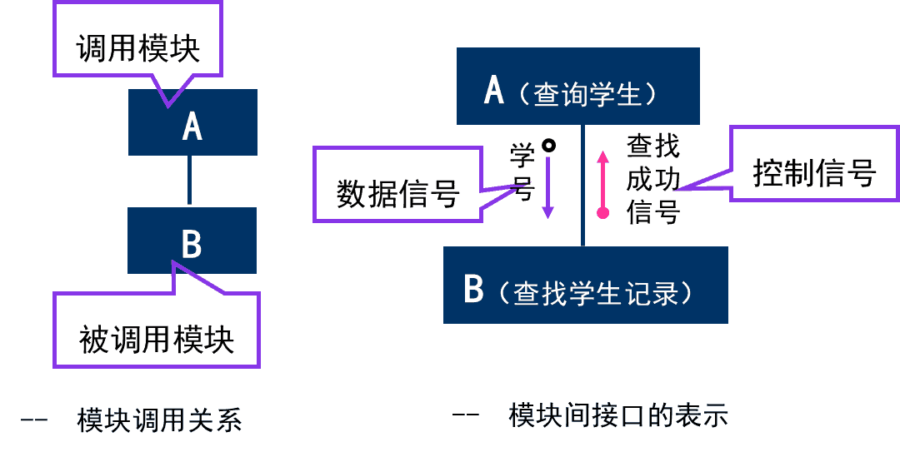​

‍

‍

‍

#### 特殊符号

‍

​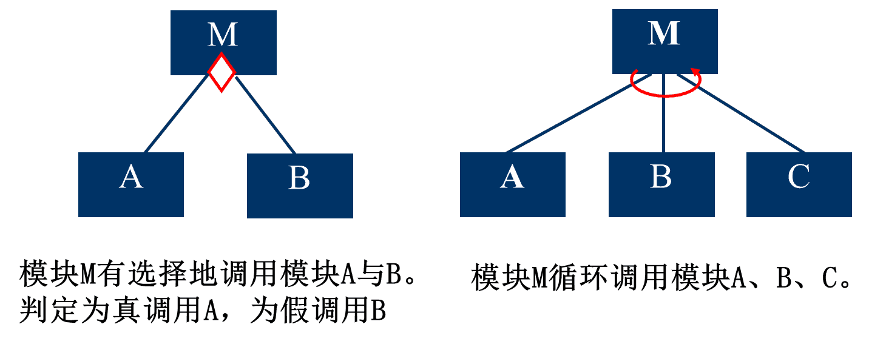​

‍

‍

‍

‍

# 5详细设计

‍

‍

## 1 结构程序设计

如果一个程序的代码块仅仅通过**顺序、选择和循环**这3种基本控制结构进行连接，并且每个代码块只有**一个入口和一个出口**，则称这个程序是结构化的。

‍

‍

### 类型

* 只允许使用顺序、IF-THEN-ELSE型分支和DO-WHILE型循环这3种基本控制结构，则称为 **经典的结构程序设计**
* 还允许使用DO-CASE型多分支结构和DO-UNTIL型循环结构，则称为 **扩展的结构程序设计**
* 再允许使用LEAVE(或BREAK)结构，则称为 **修正的结构程序设计**

‍

‍

‍

## 3 过程设计的工具

‍

* 程序流程图
* 盒图（N-S图）
* PAD图
* 判定表
* 判定树
* 过程设计语言（PDL）

‍

‍

### 程序流程图

又称为程序框图，是历史最悠久，使用最广泛的描述过程设计的方法，然而它也是用得最混乱的一种方法

‍

程序设计流图标准化图符

‍

​​

* a：**选择**
* b：注释
* c：预先定义的处理
* d：多分支
* e：**开始或停止**
* f：准备
* g：循环上界限
* h：循环下界限
* i：虚线
* j：省略符
* k：并行方式
* l：**处理**
* m：**输入输出**
* n：连接
* o：换页连接
* p：**控制流**

‍

​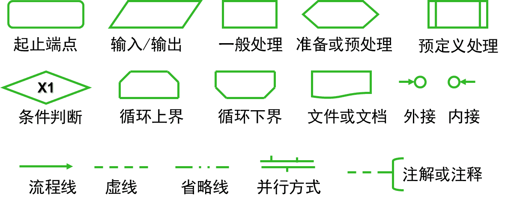​

‍

‍

#### 评价

‍

优点：

对控制流程描绘直观，便于初学者掌握

‍

缺点：

1. 不是逐步求精的好工具，过早考虑控制流程，非整体结构
2. 用箭头代表控制流，程序员随意转移控制
3. 不易表示数据结构和调用关系

‍

‍

### 盒图（N-S）

出于要有一种不允许违背**结构程序设计精神**的图形工具的考虑，提出了盒图，又称为N-S图

‍

子程序大概不画

​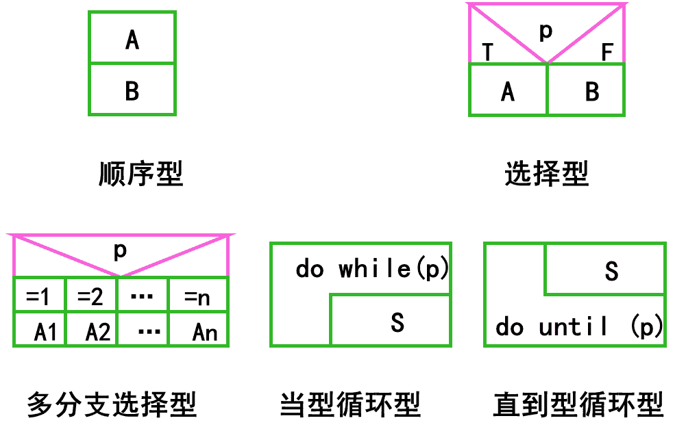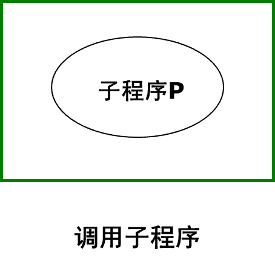​

‍

示例

​​

‍

‍

#### 特点

1. 功能域（特定控制结构的作用域）明确
2. 不可能任意转移控制
3. 容易确定局部和全程数据的作用域
4. 容易表现嵌套关系，也可表示模块的层次结构

‍

‍

### PAD图

问题分析图（problem analysis is diagram）的英文缩写，是使用二维树形结构的图来表示程序的控制流，这种图翻译为程序代码比较容易

‍

​​

‍

* a：顺序
* b：选择（`IF C THEN P1 ELSE P2`​）
* c：`CASE`​型多分支
* d：`WHILE`​型循环（`WHILE C DO P`​）
* e：`UNTIL`​型循环（`REPEAT P UNTIL C`​）
* f：语句符号
* g：定义

‍

‍

​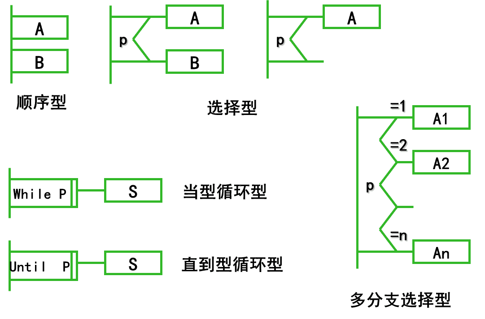​

‍

‍

示例

​​

‍

‍

#### 评价

‍

优点

1. 使用PAD图设计的程序必然是结构化程序
2. PAD图描绘的程序结构十分清晰

    > 最左面的竖线是**程序的主线**，即**第一层结构**。随着程序层次的增加，PAD图逐渐**向右延伸**，每增加一个层次，图形向右扩展一条竖线。PAD图中竖线的总条数就是**程序的层次数**
    >
3. 用PAD图表现程序逻辑，易读、易懂、易记

    > PAD图是二维树形结构的图形，程序从图中最左竖线上端的结点开始执行 ，**自上而下，从左向右**顺序执行，遍历所有结点
    >
4. 容易将PAD图转换成高级语言源程序
5. 既可用于表示程序逻辑，也可用于描绘数据结构
6. 支持自顶向下逐步求精

    > 开始时设计者可以定义一个抽象的程序，随着设计工作的深入而使用`def`​符号逐步增加细节，直至完成详细设计
    >

    ​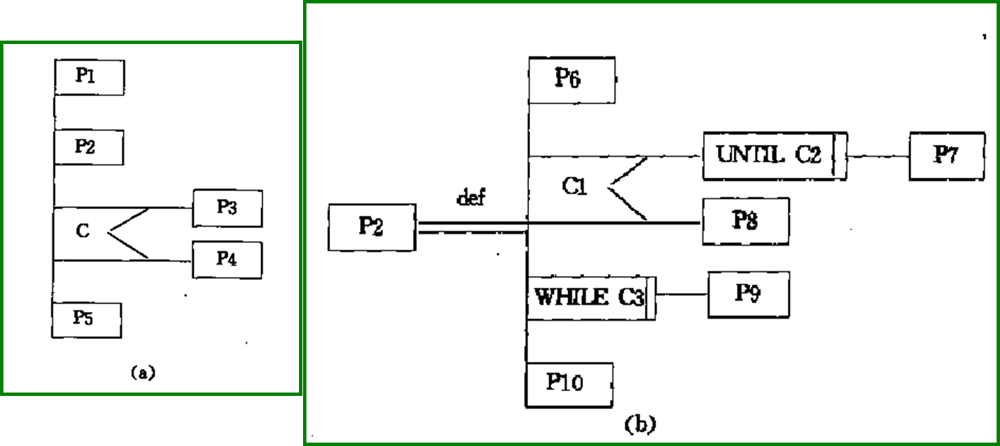​

‍

‍

### 判定表

当算法中包含**多重嵌套的条件选择**时，用程序流程图、盒图、PAD图或后面即将介绍的过程设计语言(PDL)都不易清楚地描述

能清晰表示复杂的条件组合与应做动作间对应关系

‍

‍

四部分：

* 左上部列出所有条件；
* 左下部所有可能做的动作；
* 右上部表示各种条件组合的矩阵；
* 右下部是和每种条件组合相对应的动作。

‍

​​

‍

判定表右半部的每一列实质上是一条规则，规定了与特定的条件组合相对应的动作

右上部分中**T表示它左边那个条件成立，F表示条件不成立，空白表示这个条件成立与否并不影响对动作的选择**。判定表右下部分中**画X表示做它左边的那项动作，空白表示不做这项动作**

‍

​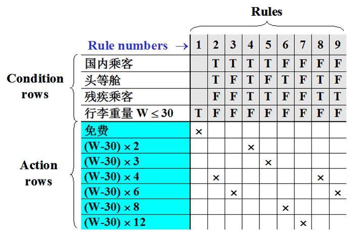​

‍

‍

#### 评价

‍

**优点**

* 判定表能够简洁而又无歧义地描述处理**规则**
* 判定表和布尔代数或卡诺图结合起来使用，可以更加直观、简洁、清晰的描述规则

‍

**缺点**

* 不能同时清晰地表示出问题的**顺序性**和**重复性**
* 初次接触这种工具的人理解它需要有一个学习过程
* 数据元素增多时，判定表的简洁程度大幅下降，此时建议使用判定树

‍

‍

### 判定树

判定表变种，表示复杂条件组合与应做动作间对应关系

​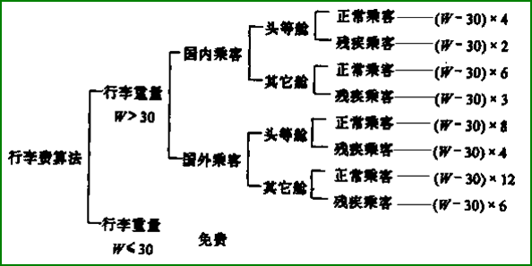​

‍

‍

#### 评价

‍

优点：形式简单，易看出含义，易于掌握和使用。

‍

缺点：简洁性不如判定表，相同数据元素重复写多遍，越接近叶端重复次数越多。

‍

‍

‍

## 4 面向数据结构的设计方法

‍

### Jackson法

面向数据结构的设计方法

Jackson方法是在软件开发过程中常用的方法，使用Jackson方法时可以实现从数据结构导出程序结构

‍

‍

## 5 程序复杂程度的定量度量

‍

‍

### McCabe方法

McCabe方法根据程序控制流的复杂程度定量度量程序的复杂程度，这样度量出的结果称为程序的环形复杂度

‍

1. 根据过程设计结果画出相应流图
2. 计算流图的环形复杂度

‍

‍

#### 流图

流图实质上是“退化了的”程序流程图，描绘程序的控制流程，不表现对数据的具体操作以及分支或循环的具体条件

‍

流图描述程序控制流，基本图形符号如下

​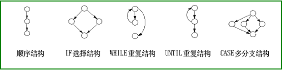​

‍

‍

**绘制方法**

* 结点：一个圆代表一条或多条语句, 一个顺序结构可以合并一个结点
* 边：流图中的箭头线称为边，代表控制流, 流图中一条边必须终止于一个结点
* 区域：由边和结点围成的面积称为区域，包括图外部未被围起来的区域

‍

1. **对于顺序结构，一个顺序处理和下一个选择可以映射为一个结点**

    ​​
2. **对于选择语句，开始/结束语句映射为一个结点，两条分支至少各映射成一个结点**

    ​​
3. **开始语句和结束语句各映射成一个结点**

    ​​

‍

包含复合条件时，应该把复合条件分解为若干个简单条件，每个简单条件对应流图中一个结点。所谓复合条件，就是在条件中包含了一个或多个布尔运算符(逻辑OR，AND，NAND，NOR)

> 这里就是 a 和 b 条件都要独立判定一次了, 之后要保留指向对应结果不同情况对象

​​

‍

‍

##### 翻译

‍

​​

* 流图中用**圆表示结点**，**一个圆代表一条或多条语句（比如4、5）** 。程序流程图中的**一个顺序的处理框序列和一个菱形判定框，可以映射成流图中的一个结点（比如2,3）**
* 流图中的箭头线称为**边**，代表**控制流**。**流图中一条边必须终止于一个结点（比如9必须为一个结点）** ，即使这个结点并不代表任何语句
* 由边和结点围成的面积称为**区域**，计算区域数时应**包括图外部未被围起来的区域**

‍

‍

示例: 由PDL翻译成的流图

‍

​​

‍

‍

‍

#### 环形复杂度

环形复杂度定量度量程序的逻辑复杂度, 是对测试难度的一种定量度量，也能对软件最终的可靠性给出某种预测

**V(G)小于等于10比较科学**

‍

* 流图中的区域数等于环形复杂度

  > 区域就想象是PS的填充桶工具, 必须要是封闭的区域
  >
* E-N+2, E是流图中边的条数，N是结点数
* P+1，P是流图中判定结点(分支选择的节点)的数目

‍

​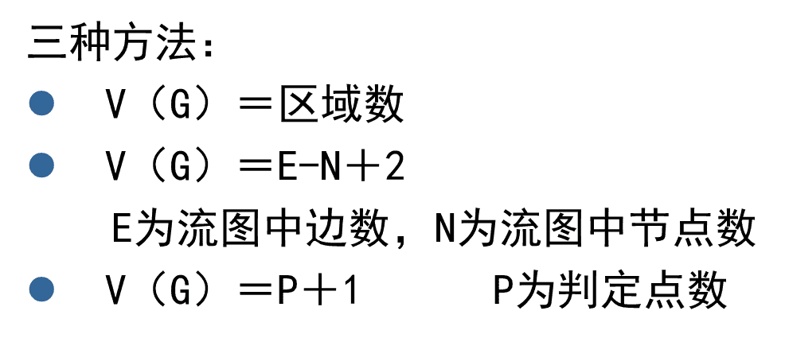​

‍

示例

​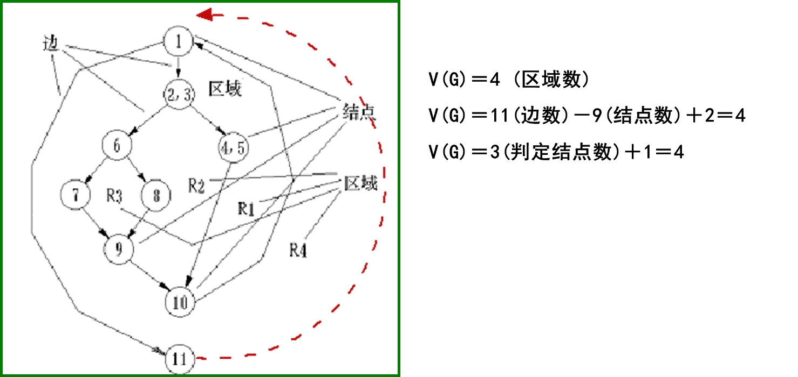​

‍

‍

‍

# 6实现

‍

‍

## 2 软件测试基础

‍

1. 测试是为了**发现程序中的错误**而执行程序的过程；
2. 好的测试方案是极有可能发现迄今尚未**发现的尽可能多的错误**的测试；
3. 成功的测试是发现了迄今**尚未发现的错误**的测试。

‍

**测试准则**

1. 所有测试应能追溯到用户需求
2. 应尽早地和不断地进行软件测试
3. 充分注意测试中群集现象(二八法则) **80%的错误是由20%的模块造成的**
4. 测试应从小规模开始，逐步进行大规模测试
5. 不能做到穷举测试，**测试只能证明程序有错误，而不能证明程序没有错误**
6. 第三方测试原则

‍

‍

### 测试方法

‍

静态测试方法和动态测试方法

* 静态测试

  * 不在机器上进行测试，而是采用人工检测和计算机辅助静态分析手段对程序进行检测

    * 人工测试 人工审查和评审软件
    * 计算机辅助静态分析
* 动态测试

  * 跑起来发现错误
  * 黑盒测试和白盒测试

    * 黑盒测试：如果知道产品应具有**功能**，可通过测试来检验是否每个功能都能正常使
    * 白盒测试：如果知道产品**内部工作过程**可通过测试来检验产品内部动作是否按照规格说明书的规定正常进行

‍

‍

### 测试步骤

测试过程也必须分步骤进行，后一个步骤在逻辑上是前一个步骤的继续

‍

大型软件系统通常由若干个子系统组成，每个子系统又由许多模块组成，因此，大型软件系统的测试过程基本上由 模块测试、子系统测试、系统测试、验收测试和平行运行等 五个步骤组成

‍

测试步骤示意

​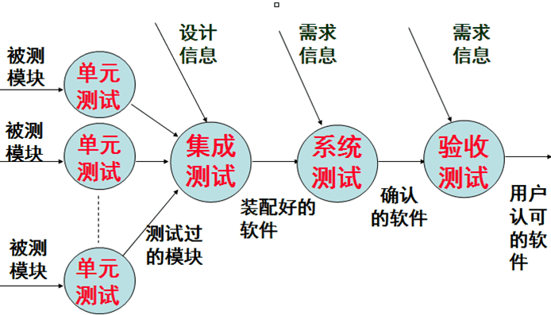​

‍

|测试阶段|主要依据|测试人员|测试方法|测试内容|
| :----------: | :----------------------: | :------------: | :------------------: | :---------------------------------------------------------------------------------------------: |
|单元测试|系统设计文档|开发小组|白盒测试|接口测试<br />路径测试|
|子系统测试|系统设计文档<br />需求文档|独立测试小组|白盒测试<br />黑盒测试|接口测试<br />路径测试<br />功能测试<br />性能测试|
|系统测试|需求文档|独立测试小组|黑盒测试|功能测试、健壮性测试<br />性能测试、用户界面测试<br />安全性测试、压力测试<br />可靠性测试、安装/卸载测试|
|验收测试|需求文档|用户|黑盒测试|功能测试、健壮性测试<br />性能测试、用户界面测试<br />安全性测试、压力测试<br />可靠性测试、安装/卸载测试|

‍

‍

‍

## 3 单元测试

单元测试集中检测软件设计的最小单元一模块，它和编码属于软件过程的同一个阶段。在编写出源程序代码并通过了编译程序的语法检查之后，就可以用详细设计描述作指南，对重要的执行通路进行测试，以便发现模块内部的错误。单元测试主要使用白盒测试技术，而且对多个模块的测试可以并行地进行，包括人工测试和计算机测试两种

‍

* **测试依据**：详细设计文档
* **测试技术**：白盒测试技术
* **测试方法**：人工测试和计算机测试

‍

‍

‍

## 4 集成测试

测试和组装软件的系统化技术

‍

### 概念

‍

不同集成测试策略的比较与回归测试

|集成测试策略|优点|缺点|
| :------------: | :--------------------------------------------------------------: | :--------------------------------------------------------------------------------------: |
|**非渐增式**|无|没有错误隔离手段<br />主要设计错误发现迟<br />潜在可重用代码测试不充分<br />需要驱动程序和存根程序|
|**渐增测试**自顶向下|具有错误隔离手段<br />主要设计错误发现早<br />不需要驱动程序|潜在可重用代码测试不充分<br />需要存根程序|
|**渐增测试**自底向上|具有错误隔离手段<br />潜在可重用代码能充分测试<br />不需要存根程序|主要设计错误发现迟<br />需要驱动程序|
|**渐增测试**混合|具有错误隔离手段<br />主要设计错误发现早<br />潜在可重用代码能充分测试|较少|

‍

‍

---

由模块组装成程序时有两种方法：

‍

### **非渐增式测试策略**

先分别测试每个模块，再把所有模块按设计要求放在一起结合成所要的程序

> 像啊, 很像啊 (指平时自己写代码, 每个模块都work well, 啪一下合并起来就down了)

* 把所有模块放在一起，测试者面对的情况十分复杂
* 在庞大的程序中诊断定位一个错误非常困难
* 一旦改正一个错误之后，又会遇到新的错误，没有穷尽

‍

‍

### 渐增式测试策略

使用渐增方式把模块结合到程序中去时的集成策略

‍

‍

将模块逐步组装成较大系统

1. ==自顶向下集成==

    ​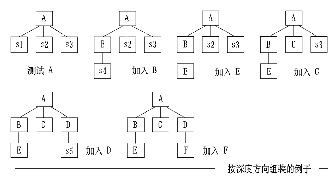​
2. ==自底向上集成==

    ​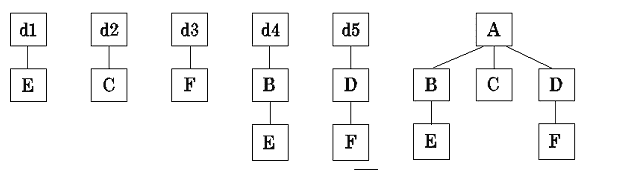​
3. ==混合策略==

    * 改进的自顶向下测试方法

      基本用自顶向下方法，早期用自底向上测试关键模块
    * 混合法

      软件结构上层模块用自顶向下，下层用自底向上。

‍

‍

#### 自顶向下集成

从主控制模块开始，沿着程序的控制层次向下移动，逐渐把各个模块结合起来。在把附属于主控制模块的模块组装到程序结构中时，使用深度优先的策略或宽度优先的策略

‍

##### 步骤

* 对主控制模块进行测试，测试时用**存根程序**代替所有直接附属于主控制模块的模块
* 根据选的结合策略(深度优先或宽度优先)，每次用一个**实际模块**代换一个存根程序
* 在结合进一个模块的同时进行测试
* 为了保证加入模块没有引进新的错误，可能需要进行**回归测试**

‍

‍

##### 结合策略

深度优先先组装在**软件结构的一条主控制通路上的所有模块**

宽度优先**沿软件结构水平地移动,把处于同一个控制层次上的所有模块组装起来**

‍

‍

​​

‍

‍

‍

‍

#### 自底向上集成

自底向上测试从软件结构最低层的模块开始组装和测试。因为是从底部向上结合模块，总能得到所需的下层模块处理功能，所以不需要存根程序

‍

‍

##### 步骤

* 把低层模块组合成实现某个特定的软件子功能的**族**
* 写一个用于测试的控制程序，协调测试数据的输入和输出
* 对由模块组成的子功能族进行测试
* 去掉驱动程序，沿软件结构自下向上移动，把子功能族组合起来形成大的子功能族

​​

‍

‍

‍

‍

#### 混合

‍

混合集成测试策略，主要有两种

1. **改进的自顶向下测试方法**  
    基本上使用自顶向下的测试方法，但是在早期使用自底向上的方法测试软件中的少数关键模块。该策略能在测试的早期发现关键模块中的错误；测试关键模块时需要驱动程序。
2. **混合法**  
    对软件结构中较上层使用的自顶向下方法与对软件结构中较下层使用的自底向上方法相结合，该策略兼有两种方法的优缺点，当被测试的软件中关键模块比较多时，这种混合法可能是最好的折衷方法。

‍

‍

### 回归测试

回归测试是指**重新执行已经做过的测试的某个子集，以保证上述这些变化没有带来非预期的副作用**。它可以用于保证由于调试或其他原因引起的变化，不会导致非预期的软件行为或额外错误的测试活动

‍

‍

‍

## 5 确认测试

也称为验收测试，它的目标是验证软件的有效性

确认测试必须有用户积极参与，或者以用户为主进行，使用用户界面输入测试数据并且分析评价测试的输出结果，在验收之前通常要由开发单位对用户进行培训，一般来说确认测试分为Alpha和Beta测试

‍

‍

### Alpha测试 和 Beta测试

‍

#### Alpha测试

Alpha测试由用户在开发者的场所进行，并且在开发者对用户的“指导”下进行测试，且开发者负责记录发现的错误和遇到的问题。即Alpha测试是在受控的环境中进行的

(内部实机演示)

‍

#### Beta测试

Beta测试由软件的最终用户们在一个或多个客户场所进行。开发者通常不在Beta测试的现场，即Beta测试是软件在开发者不能控制的环境中的“真实”应用

(上线内测)

‍

‍

## 6 白盒测试技术

通常把测试数据和预期的输出结果称为测试用例

‍

‍

### 逻辑覆盖

逻辑覆盖是对一系列测试过程的总称，这组测试过程逐渐进行越来越完整的通路测试

下面是分类

‍

包含关系:

​​

‍

‍

---

#### 语句覆盖

选择足够多的测试数据，被测试程序中的每条语句至少执行一次

很弱

‍

#### 点覆盖

连通图G的子图G'是连通的，而且包含G的所有结点，则称G'是G的点覆盖。

满足点覆盖标准要求选取足够多的测试数据，使得程序执行路径至少经过流图的每个结点一次，也即**点覆盖标准和语句覆盖标准是相同的**

‍

---

#### 判定覆盖

又叫分支覆盖

不仅每个语句至少执行一次，而且**每个判定**的每种可能的结果都应该至少执行一次

> 强调整个表达式的结果, 分支往哪里走

比语句覆盖强，但是对程序逻辑的覆盖程度仍然不高

‍

#### 边覆盖

连通图G的子图G''是连通的，而且包含G的所有边，则称G''是G的边覆盖。为满足边覆盖的测试标准，要求选取足够多的测试数据，使程序执行路径至少经过流图每条边一次，也即**边覆盖与判定覆盖是相同的**

‍

---

#### 条件覆盖

不仅每个语句至少执行一次，而且使判定表达式中的**每个条件**都取到各种可能的结果

> 强调每个表达式的细节组成条件, 不一定比判定覆盖强; 这里的细节要联动数学中的取反的情况, 全真的反应该是部分假和全假!

条件覆盖通常比判定覆盖强，因为它使每个条件都取到了两个不同的结果，判定覆盖却只关心整个判定表达式的值

判定覆盖不一定包含条件覆盖，条件覆盖也不一定包含判定覆盖

‍

---

#### 判定/条件覆盖

选择足够多的测试数据，使 判定表达式中的**每个条件**都取到各种可能的结果，而且**每个判定表达式**也都取到各种可能的结果。

> 表达式的走向和每个表达式内部的条件都被考虑到了, 但是没有组合起来

同时满足==判断覆盖==和==条件覆盖==

‍

‍

---

#### 条件组合覆盖

选取足够多的测试数据，使得每个**判定表达式**中**条件**的各种**可能组合**都至少出现一次。

> 次强的, 不一定使每条路径都执行一次

满足条件组合覆盖，也一定满足==判断覆盖==、==条件覆盖==和==判断/条件覆盖==

‍

‍

#### 路径覆盖

选取足够多的测试数据，使程序的每条可能路径都至少执行一次，如果程序图中有环，则要求每个环至少经过一次

‍

‍

### 控制结构测试

‍

‍

#### 基本路径测试

‍

Tom McCabe提出的一种白盒测试技术

使用这种技术设计测试用例时，首先计算程序的**环形复杂度**，**并用该复杂度为指南，定义执行路径的基本集合, 从该基本集合导出的测试用例可以保证程序中的每条语句至少执行一次，而且每个条件在执行时都将分别取真、假两种值**

‍

‍

##### 步骤

‍

* 根据过程设计结果画出相应的**流图**
* 计算流图的**环形复杂度**
* 确定**线性独立路径**(至少包含一条在定义该路径之前不曾用过的边)的基本集合
* 设计可**强制执行基本集合中每条路径**的测试用例

‍

1. 根据过程设计结果画出相应流图
2. 计算流图的环形复杂度

    > 见之前
    >
3. 确定线性独立路径的基本集合

    * 独立路径：至少包含一条在定义改路径之前不曾用过的边。​​
    * 环形复杂度为独立路径基本集的上界

      > 程序的环形复杂度为6，因此共有6条独立路径
      >
4. 设计测试用例覆盖基本集合的路径的测试用例

‍

‍

‍

#### 条件测试

‍

##### 关系表达式

一个简单条件是一个布尔变量或一个关系表达式，在布尔变量或关系表达式之前还可能有一个NOT(¬)运算符，关系表达式的形式如下：

```java
E1<关系算符>E2
```

E1和E2是算术表达式，而<关系算符>是下列算符之一：<，≤，=，≠，>或≥

布尔算符有OR(|)，AND(&)和NOT( ┐)

不包含关系表达式的条件称为布尔表达式

‍

##### 条件错误的类型

* 布尔算符错;
* 布尔变量错;
* 布尔括弧错;
* 关系算符错;
* 算术表达式错

‍

##### 评价

* 容易度量条件的测试覆盖率
* 程序内条件的测试覆盖率可指导附加测试的设计

‍

‍

### 循环测试

循环测试是一种白盒测试技术，它专注于测试循环结构的有效性。在结构化的程序中通常只有3种循环，即简单循环、串接循环和嵌套循环

‍

‍

‍

## 7 黑盒测试技术

‍

### 概念

黑盒着重**软件功能**

黑盒测试并不能取代白盒测试，它是与白盒测试互补的测试方法，它很可能发现白盒测试不易发现的其他类型的错误

通常设计测试方案时总是联合使用等价划分和边界值分析两种技术

‍

公认标准主要有两个：（1）测试用例尽可能少；（2）一个测试用例能指出一类错误

‍

‍

#### 目的

发现错误:

1. 功能不正确或遗漏
2. 界面错误
3. 数据结构或外部数据库访问错误
4. 性能错误
5. 初始化或终止错误

‍

‍

#### 适用性

白盒测试在测试过程的早期阶段进行，黑盒测试主要用于测试过程的后期

‍

#### 用例标准

* 能够减少为达到合理测试所需要设计的测试用例的**总数**
* 能够告诉人们，是否**存在某些类型的错误**，而不是仅仅指出与特定测试相关的错误是否存在

‍

‍

### 等价划分

**把程序的输入域划分成若干数据类**，从每一数据类选取少数有代表性数据做为测试用例

等价划分法力图设计出能发现**若干类**程序错误的测试用例，从而减少必须设计的测试用例的数目

‍

‍

1. 划分等价类

    1. 有效等价类：合理，有意义输入数据构成集合。
    2. 无效等价类：不合理，无意义输入数据构成的集合。
2. 确定测试用例

    建立等价类表，列出所有划分出等价类

    1. 为每一等价类规定一唯一编号；
    2. 设计一新测试用例，尽可能多覆盖尚未被覆盖有效等价类，重复，直到所有有效等价类被覆盖。
    3. 设计一新测试用例，仅覆盖一尚未被覆盖无效等价类，重复，直到所有无效等价类被覆盖

‍

‍

#### 划分数据的等价类

‍

* 第一，需要研究**程序的功能说明**，从而确定输入数据的**有效等价类**和**无效等价类**
* 第二，在确定输入数据的等价类时常常还需要**分析输出数据的等价类**
* 第三，在划分等价类时还应考虑**编译程序的检错功能**

‍

#### 根据等价类设计测试方案

* 第一，设计一个新的测试方案以尽可能多地覆盖**尚未被覆盖的有效等价类**，重复这一步骤直到**所有有效等价类都被覆盖为止**
* 第二，设计一个新的测试方案，使它**覆盖一个而且只覆盖一个尚未被覆盖的无效等价类**，重复这一步骤直到**所有无效等价类都被覆盖为止**

‍

‍

### 边界值分析

使用边界值分析方法设计测试方案首先应该确定边界情况，选取的数据应该**刚好等于**、**稍小于**和**稍大于**等价类边界值，即应该选取刚好等于、稍小于和稍大于等价类边界值的数据作为测试数据，而不是选取每个等价类内的典型值或任意值作为测试数据

‍

‍

‍

### 错误推测

靠经验和直觉推测程序可能存在错误，有针对性编写检查这些错误的测试用例

‍

‍

‍

## 9 软件可靠性

‍

#### 软件可靠性

程序在给定的==时间间隔==内，成功运行的概率

‍

#### 软件可用性

程序在给定的==时间点==，成功运行的概率

‍

‍

# 7维护

‍

‍

## 1 软件维护的概念

软件维护是在软件已经交付使用后，为了改正错误或满足新的需要而修改软件的过程，是软件生命周期的最后一个阶段，其基本任务是保证软件在一个相当长的时期能够正常运行

> 软件维护绝不仅限于纠正使用中发现的错误，事实上在全部维护活动中一半以上是==完善性维护==

‍

改正性维护：诊断和改正错误的过程

适应性维护：为了和变化了的环境适当地配合而进行的修改软件的活动

完善性维护：为了满足用户提出的增加新功能或修改已有功能的要求和一般性改进要求

预防性维护：当为了改进未来的可维护性或可靠性，或为了给未来的改进奠定更好的基础而修改软件

‍

‍

## 2 软件维护的特点

‍

### 结构化维护和非结构化维护差别巨大

* **非结构化维护**：唯一成分是程序代码，维护活动从艰苦地**评价程序代码**开始，需要付出很大代价
* **结构化维护**：有完整的软件配置存在，维护工作从**评价设计文档**开始

‍

‍

## 4 软件的可维护性

可维护性指的是维护人员**理解、改正、改动**或**改进**这个软件的难易程度。提高可维护性是支配软件工程方法学所有步骤的**关键目标**

‍

‍

### ==决定软件可维护性的因素==

修改之前必须理解待修改的对象，修改之后应该进行必要的测试

如下

‍

‍

#### 可理解性

#### 可测试性

#### 可修改性

#### 可移植性

#### 可重用性

‍

‍

‍
