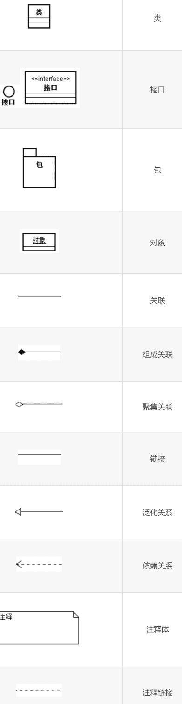
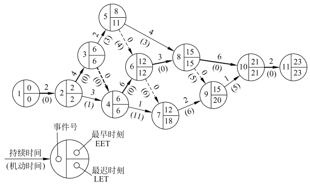

‍

‍

# 8OO引论

‍

‍

## 1 面向对象方法学概述

‍

面向对象方法学的出发点和基本原则，**是尽可能模拟人类习惯的思维方式**，使开发软件的方法与过程尽可能**接近人类认识世界解决问题的方法与过程**，使描述问题的问题空间(问题域)与实现解法的解空间(求解域)在结构上尽可能一致

‍

‍

### 定义

‍

面向对象方法学方程式

‍

	OO = 对象 + 类 + 继承 + 传递消息实现通信

‍

‍

### 要点

‍

#### **对象**

**面向对象的软件系统是由对象组成的**，软件中的**任何元素都是对象**，复杂的软件对象由比较简单的对象组合而成。**用对象分解取代了传统方法的功能分解**，对象是从客观世界中的实体抽象而来的，是不固定的

‍

#### **类**

把所有对象都划分成**各种对象类,** 每个对象类都定义了**一组数据和一组方法**。数据用于表示对象的**静态属性**,是对象的状态信息。类中定义的方法，是允许施加于该类对象上的操作，是该类所有对象共享的，**并不需要为每个对象都复制操作的代码**

‍

#### **继承性**

按子类与父类的关系，**把若干个对象类组成一个层次结构的系统**。**子类自动具有和上层的父类相同的数据和方法**，而且低层的特性将**屏蔽**高层的同名特性

‍

#### 封装性

对象彼此之间仅能通过传递消息互相联系。对象是进行处理的主体，必须发消息请求它执行它的某个操作，处理它的私有数据，而不能从外界直接对它的私有数据进行操作。一切局部于该对象的私有信息，都被封装在该对象类的定义中，就好像装在一个不透明的黑盒子中一样，在外界是看不见的，更不能直接使用

‍

‍

## 2 面向对象的概念

‍

1. 对象：具有相同状态的一组操作的集合，对状态和操作的封装。
2. 类

    对具有相同状态和相同操作的一组相似对象的定义。

    类是一个抽象数据类型。
3. 实例

    实例是由某个特定类所描述的一个具体对象。
4. 消息

    要求某对象执行某个操作的规格说明。

    三部分：

    * 接受消息的对象
    * 消息名
    * 0或多个变元
5. 方法和属性

    * 方法：对象执行的操作，即类中定义的服务。
    * 属性：类中所定义数据，对客观世界实体具体性质的抽象。
6. 继承

    子类自动共享基类中定义的属性和方法的机制。
7. 多态性

    在类等级不同层次可共享一个方法名，不同层次每个类按各自需要实现这个方法。

    * 优点：

      * 提高程序可复用性（接口设计的复用，不是代码实现的复用）
      * 派生类的功能可被基类指针引用，提高程序可扩充性和可维护性。
8. 重载

    1. 函数重载

        在同一作用域内，参数特征不同的函数可使用相同的名字。

        * 优点

          调用者不需记住功能雷同函数名，方便用户；

          程序易于阅读和理解。
    2. 运算符重载

        同一运算符可施加于不同类型操作数上面。

‍

‍

设计原则

* 单一职责原则
* 开闭原则
* 里氏替换原则
* 依赖倒置原则
* 接口隔离原则
* 控制反转
* 依赖注入
* 面向切面编程

‍

‍

## 4 对象模型 UML

‍

‍

### 四种主要关系

1. 关联关系(Association)
2. 依赖关系(Dependency)
3. 泛化(一般化)关系(Generalization)  
    泛化指的是类之间的继承关系
4. 聚集关系(Aggregation)  
    聚集指的是整体与部分之间的关系，在实体域对象之间很常见

‍

‍

### UML中的两类九种图

‍

**静态模型图**：描述系统的结构

1. ==类图==
2. 对象图
3. 组件图
4. 部署图

‍

**动态模型图**：描述系统的行为

1. 用例图
2. 活动图
3. 时序图
4. 协作图
5. 状态图

‍

‍

### 类图的基本符号

‍

​​

‍

‍

‍

#### 定义类

UML中类的图形符号为**长方形**，用两条横线把长方形分**上、中、下**3个区域，3个区域分别放类**的名字、属性和服务**

‍

##### 命名规则

类名应该是**富于描述的、简洁的而且无二义性的**

* 使用**标准术语**，不要随意创造名字
* 使用具有**确切含义**的名词，不要使用空洞或含义模糊的词作名字
* 必要时可用**名词短语**作名字，有时也可以加入形容词

‍

‍

#### 定义属性

‍

可见性属性名： 类型名 = 初值 {性质串}

‍

* **可见性**：有公有的（+）、私有的（-）和保护的（#）

  > 注意，没有默认的可见性
  >
* **类型名**：表示该属性的数据类型

  > 属性名和类型名之间用冒号(:)分隔
  >
* **赋值**：在创建类的实例时应给其他属性赋值，如果给某个属性定义了初值，则该初值可作为创建实例时这个属性的默认值

  > 类型名和初值之间用等号（=）隔开
  >
* **性质串**：明确地列出该属性所有可能取值，用逗号隔开

‍

|符号|表示|
| ------| -----------------------------|
|+|public|
|-|private|
|#|protected|
|~|package(可以理解为静态类型)|

‍

#### 定义服务

‍

可见性操作名（参数表）： 返回值类型{性质串}

‍

* **可见性**：有公有的（+）、私有的（-）和保护的（#）
* **参数表**：用逗号隔开不同参数，每个参数语法为 “`参数名:类型名=默认值`​”

‍

‍

‍

### 表示关系的符号

类与类之间通常具有以下四种关系

‍

#### 关联

关联表示两个类的对象之间存在某种**语义上的联系**

关联使用实线 + 简单箭头

‍

**关联的角色**

在任何关联中都会涉及**参与此关联的对象所扮演的角色**，在某些情况下显式标明角色名有助于别人理解类

如果没有显式标出角色名，则意味着用类名作为角色名

‍

‍

##### (1) 普通关联

普通关联是最常见的关联关系，**只要在类与类之间存在连接关系就可以用普通关联表示**

‍

表示

* 普通关联的图示符号是**连接两个类之间的直线**
* 关联是**双向**的，可为关联起一个名字。在名字前面(或后面)加一个**表示关联方向的黑三角**
* 在表示关联的直线两端可以写上**重数**，它表示该类有多少个对象与对方的一个对象连接。**未明确标出关联的重数，则默认重数是1**

|重数|表示|
| --------------| -------------|
|0··1|0到1个对象|
|0·· *或 *|0到多个对象|
|1 +或1·· *|1到多个对象|
|1··15|1到15个对象|
|3|3个对象|

‍

‍

##### (2) 限定关联

限定关联通常用在一对多或多对多的关联关系中，可以把模型中的重数从一对多变成一对一， 或从多对多简化成多对一

‍

##### (3) 关联类

为了说明关联的性质，可能需要一些**附加信息**。关联类可以用来**记录相关信息**

关联类通过一条**虚线**与关联连接

‍

* 关联类与一般的类一样，也有属性、操作和关联
* 关联中的每个连接与关联类的一个对象相联系

‍

#### 聚集

也称为聚合, 是关联的特例

‍

聚集表示类与类之间的关系是整体与部分的关系。使用的“包含”、“组成”、“分为……部分”等字句，意味着存在聚集关系。有共享聚集和组合聚集两种特殊的聚集关系

‍

##### (1) 一般聚集

部分==可以脱离整体==存在, 一般聚集和共享聚集的图示符号，都是在表示关联关系的直线末端紧挨着整体类的地方画一个**空心菱形**

‍

##### (2) 共享聚集

如果在聚集关系中处于部分方的对象可==同时参与多个==处于整体方对象的构成，则该聚集称为**共享聚集**

‍

##### (3) 组合聚集

如果部分类==完全隶属于==整体类, 部分与整体共存, 整体不存在了部分也会随之消失, 则该聚集称为组合聚集(组成)

组成关系用**实心菱形**示例

‍

‍

‍

#### 泛化(继承)

‍

泛化关系就是继承关系，**它是通用元素和具体元素之间的一种分类关系**。具体元素完全拥有通用元素的信息，并且还可以附加一些其他信息。在UML中，用**一端为空心三角形的实线连线表示泛化关系，三角形的顶角紧挨着通用元素**

泛化关系指出在类与类之间存在“一般--特殊”关系。泛化可进一步划分成普通泛化和受限泛化

---

‍

##### (1) 普通泛化

‍

①：抽象类

**没有具体对象的类称为抽象类**。抽象类通常都有抽象操作，来指定该类的所有子类应具有哪些行为

表示抽象类是在类名下方附加一个标记值{abstract}，表示抽象操作是在操作标记后面跟随一个性质串{abstract}

‍

②：具体类

**具体类有自己的对象，并且该类的操作都有具体的实现方法**

‍

‍

##### (2) 受限泛化

给泛化关系附加约束条件，以进一步说明该泛化关系的使用方法或扩充方法，这样的泛化关系称为受限泛化。

‍

预定义的约束有4种（都是语义约束）

* **多重**：一个子类可以同时多次继承同一个上层基类
* **不相交**：一个子类不能多次继承同一个基类。-般的继承都是不相交继承
* **完全**：父类的所有子类都已在类图中穷举出来了
* **不完全**：父类的子类并没有都穷举出来，随着对问题理解的深入，可不断补充和维护。是默认的继承关系

‍

##### 实现

实现关系用来表示**类与接口**之间的实现关系，用一条**虛线空心箭头**由子类指向父类

(实现是虚线, 继承是实线)

‍

‍

#### 依赖和细化

‍

##### 依赖关系

依赖关系描述两个模型元素之间的**语义连接关系**:

其中**一个模型元素是独立的，另一个模型元素不是独立的**，它依赖于独立的模型元素，**如果独立的模型元素改变了，将影响依赖于它的模型元素**

* 在UML类图中用**带简单箭头的虚线**连接有依赖关系的两个类，箭头指向独立的类。在虚线上可以带一个**版类标签**，具体说明依赖的种类

‍

##### 细化关系

**对同一个事物在不同抽象层次上描述时**，这些描述之间具有细化关系

* 细化的图示符号为由元素B指向元素A的一端为**空心三角形的虚线**

‍

‍

# 9OO分析

‍

* 面向对象分析中，主要由对象模型、动态模型和功能模型组成
* 面向对象分析的关键工作，是分析、确定问题域中的对象及对象间的关系，并建立起问题域的对象模型

‍

‍

## 1 面向对象分析的基本过程

抽取和整理用户需求并建立问题域精确模型的过程

‍

### 概念

‍

#### **主题**

指导读者理解大型、复杂模型的一种机制。即通过划分主题把一个大型、复杂的对象模型分解成几个不同的概念范畴

‍

#### 7 +- 2 原则

短期记忆能力一般限于**一次记忆5~9个对象**

面向对象从两个方面体现这条原则

* 控制可见性：控制读者能见到的层次数目来控制可见性
* 指导读者注意力：增加了主题层，可从高层次描述总体模型，并指导读者的注意力

‍

## 3 建立对象模型

‍

### (1) 基本概念

‍

#### 对象模型

面向对象分析的首要工作就是建立问题域的**对象模型**。

对象模型表示**静态的、结构化的系统的**数据性质。它是对模拟客观世界实体的对象以及对象彼此间的关系的映射，描述了系统的**静态结构**。对象模型为建立动态模型和功能模型，提供了实质性的框架

‍

**原因**

* 静态数据结构对**应用细节**依赖较少，比较容易确定
* 当用户的需求变化时，静态数据结构相对来说**比较稳定**

‍

**信息来源**

需求陈述、应用领域的专业知识、客观世界的常识，是建立对象模型时的主要信息来源

‍

‍

#### 典型的建模步骤

‍

* 确定对象**类和关联**(对于大型复杂问题还要进一步划分出若干个主题)
* 给类和关联增添**属性**，以进一步描述它们
* 使用适当的**继承**关系进一步合并和组织类
* 对类中操作的最后确定，则需等到建立了动态模型和功能模型之后，因为这两个子模型更准确地描述了对类中提供的服务的需求。

‍

‍

### (2) 确定类与对象

‍

#### 找出候选的类与对象

‍

##### 客观事物分类法

‍

**对象是对问题域中有意义的事物的抽象，它们既可能是物理实体，也可能是抽象概念**。

‍

‍

##### 非正式分析法

‍

以用自然语言书写的需求陈述为依据，把陈述中的**名词作为类与对象的候选者**, 用**形容词作为确定属性的线索**，把**动词作为服务的候选者**

这种方法确定的候选者是非常不准确的，其中往往包含大量不正确或不必要的事物，需要经过**更进一步的严格筛选**

‍

‍

#### 筛选出正确的类与对象

‍

##### 冗余

如果两个类表达了同样的信息，则应该保留在此问题域中**最富于描述力**的名称

‍

##### 无关

需要把**与本问题密切相关的类与对象**放进目标系统中

‍

##### 笼统

系统无须记忆**笼统的、泛指的名词信息**，把这些笼统的或模糊的类去掉

‍

##### 属性

把描述的是**其他对象属性的词**从候选类与对象中去掉

‍

##### 操作

慎重考虑**既可作为名词，又可作为动词的词**，以便正确地决定把它们作为类还是作为类中定义的操作。本身具有属性，需独立存在的操作，应该作为类与对象

‍

##### 实现

应该去掉**仅和实现**有关的候选的类与对象

‍

‍

### (3) 确定关联

‍

**关联**

两个或多个对象之间的**相互依赖、相互作用**的关系就是关联。在需求陈述中使用的**描述性动词或动词词组**,通常表示关联关系

‍

**确定关联的重要性**

分析确定关联，能促使分析员考**虑问题域的边缘情况**，有助于发现**尚未被发现的类与对象**

‍

‍

#### 初步确定关联

* 直接提取**动词短语**得出的关联
* **需求陈述**中隐含的关联
* 根据**问题域知识**得出的关联

‍

‍

#### 筛选

根据下述标准**删除**候选的关联

‍

* **已删去的类之间的关联**：如果在分析确定类与对象的过程中已经删掉了某个候选类，则与这个类有关的关联也应该删去，或用其他类重新表达这个关联
* **与问题无关的或应在实现阶段考虑的关联**：应该把处在本问题域之外的关联与实现密切相关的关联删去
* **瞬时事件**：关联应该描述问题域的静态结构，而不应该是一个瞬时事件
* **三元关联**：三个或三个以上对象间的关联，可分解为二元关联或用词组描述成限定的关联
* **派生关联**：去掉那些可以用其他关联定义的冗余关联

‍

‍

#### 完善

‍

* **正名**：仔细选择含义更明确的名字作为关联名
* **分解**：为了能够适用于不同的关联，必要时应该分解以前确定的类与对象
* **补充**：发现了遗漏的关联就应该及时补上
* **标明重数**：应该初步判定各个关联的类型，并粗略地确定关联的重数

‍

如此即可获得原始的类图

‍

‍

### (4) 划分主题

在开发大型、复杂系统的过程中，为了降低复杂程度,把系统再进一步划分成几个不同的主题，即在概念上把系统包含的内容分解成若干个范畴

‍

#### 针对不同类型的方法

* **规模小的系统**：可能无须引入主题层
* **含有较多对象的系统**：首先识别出类与对象和关联，然后划分主题，并用它作为指导开发者和用户观察整个模型的一种机制
* **规模大的系统**：首先由高级分析员粗略地识别对象和关联，然后初步划分主题，经进一步分析，对系统结构有更深入的了解之后，再进一步修改和精炼主题

‍

#### 原则

* 按**问题领域**而不是用功能分解方法来确定主题
* 按照**使不同主题内的对象相互间依赖和交互最少**的原则来确定主题

‍

‍

### (5) 确定属性

属性是对象的性质，借助于属性人们能对类与对象和结构有更深入更具体的认识

* 注意:在分析阶段不要用属性来表示对象间的关系，使用关联能够表示两个对象间的任何关系，而且把关系表示得更清晰、更醒目

‍

#### 分析

* 在需求陈述中用**名词词组**表示属性，用**形容词**表示可枚举的具体属性
* 借助于**领域知识**和**常识**分析需要的属性
* 仅考虑与**具体应用**直接相关的属性，不要考虑那些超出所要解决的问题范围的属性
* 首先找出**最重要**的属性，以后再逐渐把其余属性增添进去
* 不要考虑那些**纯粹用于实现**的属性

‍

‍

#### 选择

从初步分析确定下来的属性中删掉不正确的或不必要的属性

* **误把对象当作属性**：如果某个实体的独立存在比它的值更重要，则应把它作为一个对象而不是对象的属性
* **误把关联类的属性当作一般对象的属性**：如果某个性质依赖于某个关联链的存在，则该性质是关联类的属性，在分析阶段不应把它作为一般对象的属性
* **把限定误当成属性**：如果把某个属性值固定下来以后能减少关联的重数，则应该考虑把这个属性重新表达成一个限定词。
* **误把内部状态当成了属性**：如果某个性质是对象的非公开的内部状态，则应该从对象模型中删除这个属性。
* **过于细化**：在分析阶段应该忽略那些对大多数操作都没有影响的属性
* **存在不一致的属性**：类应该是简单而且一致的。如果得出一些看起来与其他属性毫不相关的属性，则应该考虑把类分解成两个不同的类

‍

‍

### (6) 识别继承关系

‍

#### 建立继承关系的方式

确定了类中应该定义的属性之后，就可以利用继承机制共享公共性质，并对系统中众多的类加以组织。可以使用以下两种方式建立继承关系

‍

* **自底向上**：抽象出现有类的共同性质泛化出父类，这个过程实质上模拟了人类**归纳**思维的过程
* **自顶向下**：把现有类细化成更具体的子类,这模拟了人类的**演绎**思维过程。从应用域中常常能明显看出应该做的自顶向下的具体化工作

‍

#### 多重继承

利用多重继承可以**提高共享程度**，但增加了**概念上以及实现时**的复杂程度

‍

要点

* 指定一个**主要父类**，从它继承大部分属性和行为;
* 次要父类只补充一些属性和行为

‍

‍

### (7) 反复修改

‍

#### 必要性

软件开发过程就是一个**多次反复修改、逐步完善**的过程。仅仅经过一次建模过程很难得到完全正确的对象模型

‍

#### 面向对象在修改时的优点

面向对象的概念和符号在整个开发过程中都是**一致的**，比使用结构分析、设计技术更容易实现反复修改、逐步完善的过程

‍

‍

‍

## 4 建立动态模型

‍

### 概念

‍

#### 适用性

* 对于**仅存储静态数据的**系统来说，动态模型并没有什么意义
* 在开发**交互式系统**时，动态模型却起着很重要的作用
* **收集输入信息**是系统的主要工作时，则在开发时建立正确的动态模型是至关重要的

‍

#### 步骤

1. 编写典型**交互行为**的脚本
2. 从脚本中提取出事件，确定**触发每个事件的动作对象以及接受事件的目标对象**
3. 排列事件发生的**次序**，确定每个对象的**状态及状态间的转换关系**，用**状态图**描绘
4. 比较各个对象的状态图，确保事件之间的**匹配**

‍

‍

### (1) 编写脚本

脚本是指**系统在某一执行期间内出现的一系列事件**。脚本描述用户与目标系统之间的一个或多个典型的交互过程。编写脚本的过程，就是**分析用户对系统交互行为的要求的过程**

‍

#### 目的

保证**不遗漏重要的交互步骤**，有助于确保交互过程的**正确性、清晰性**

‍

#### 内容

脚本描写的范围主要由编写脚本的具体目的决定，既可以包括**系统中发生的全部事件**，也可以只包括由**某些特定对象触发的事件**

‍

#### 方法

* 编写正常情况的脚本
* 考虑特殊情况
* 考虑出错情况

‍

‍

### (2) 设想用户界面

用户界面的美观程度、方便程度、易学程度以及效率等，是用户使用系统时最先感受到的。用户界面的好坏往往对用户是否喜欢、是否接受一个系统起很重要的作用

‍

#### 目的

这个阶段用户界面的细节并不太重要，重要的是在这种界面下的**信息交换方式**。目的是确保能够完成**全部必要的信息交换**，而不会丢失重要的信息

‍

#### 方法

快速地建立起用户界面的原型，供用户试用与评价

‍

‍

### (3) 画事件跟踪图

用自然语言书写的脚本往往**不够简明**，而且有时在阅读时会有二义性。为了有助于建立动态模型，需要画出事件跟踪图

‍

#### 1.确定事件

提取出所有外部事件

* 找出**正常事件**、**异常事件**和**出错条件**(传递信息的对象的动作也是事件)
* 把**对控制流产生相同效果的事件**组合为一类事件，并取一个**唯一的名字**

‍

#### 2.画出事件跟踪图

‍

* 一条竖线代表一个**对象**
* 每个事件用一条**水平的箭头线**表示
* 箭头方向从事件的**发送对象指向接受对象**
* 时间从**上向下**递增
* 用箭头线在垂直方向上的相对位置表示**事件发生的先后**，不表示事件间的时间差

‍

‍

### (4) 画状态图

状态图描绘**事件与对象状态的关系**。当对象接受了一个事件以后，它的下个状态取决于**当前状态及所接受的事件**。由事件引起的改变称为“**转换**”。一张状态图描绘了**一类对象的行为**，它确定了**由事件序列引出的状态序列**

‍

#### 适用性

对于**仅响应与过去历史无关的那些输入事件**,或者**把历史作为不影响控制流的参数类**的对象，状态图是不必要的

‍

‍

#### 方法

* 仅考虑事件跟踪图中**指向某条竖线的那些箭头线**。把这些事件作为状态图中的**有向边**，边上标以**事件名**
* 两个事件之间的间隔就是一个**状态**，每个状态取个有意义的名字。从**事件跟踪图中当前考虑的竖线射出的箭头线**，是这条竖线代表的对象达到某个状态时所做的行为。
* 根据一张事件跟踪图画出状态图后，再把**其他脚本的事件跟踪图**合并到该图中
* 考虑完正常事件后再考虑**边界情况和特殊情况**，包括在不适当时候发生的事件

‍

‍

### (5) 审查动态模型

* 检查系统级的**完整性**和**一致性**
* 审查每个事件，跟踪**它对系统中各对象所产生的效果**，保证与每个脚本都匹配

‍

‍

## 5 建立功能模型

功能模型表明了**系统中数据之间的依赖关系**，以及有关的数据处理功能，它由一组**数据流图**组成。在建立了对象模型和动态模型之后再建立功能模型

‍

### (1) 画出基本系统模型图

基本的系统模型有下述两部分组成:

* **数据源点/终点**：数据源点输入的数据和输出到数据终点的数据，是**系统与外部世界**间交互事件的参数
* **处理框**：代表了**系统加工**、**变换数据**的整体功能

‍

### (2) 画出功能级数据流图

把基本系统模型中单一的处理框分解成**若干个处理框**，以描述系统加工、变换数据的**基本功能**，就得到功能级数据流图

‍

### (3) 描述处理框功能

‍

#### 要点

着重描述**每个处理框所代表的功能**，而不是实现功能的具体算法

‍

#### 分类

* **说明性描述（更为重要）** ：规定了**输入值和输出值**之间的关系，以及**输出值**应遵循的规律
* **过程性描述**：通过算法说明 做什么

‍

‍

‍

# 10OO设计

‍

‍

## 1 面向对象设计的准则

‍

### 模块化

### 抽象

### 信息隐藏

### 高内聚

### 低耦合

### 可重用

‍

‍

## 2 启发规则

‍

‍

### 设计结果应该清晰易懂

### 一般一特殊结构的深度适当

### 设计简单的类

### 使用简单的协议

### 使用简单的服务

### 把设计变动减至最小

‍

‍

## 3 软件重用

**重用也叫再用或复用，是指同一事物不作修改或稍加改动就多次重复使用**

‍

**软件重用可分为以下3个层次**

* 知识重用
* 方法和标准的重用
* 软件成分的重用

‍

‍

### 类构件

面向对象技术中的“类”，是比较理想的可重用软构件

‍

#### 类构件的重用方式

‍

‍

##### 实例重用

* 使用适当的构造函数，按照需要创建类的实例
* 用几个简单的对象作为类的成员创建出一个更复杂的类

‍

‍

##### 继承重用

继承性提供了一种对已有的类构件进行裁剪的机制

‍

‍

##### 多态重用

* 使对象的对外接口更加一般化，降低了消息连接的复杂程度
* 提供一种简便可靠的软构件组合机制

‍

‍

## 4 系统分解

‍

### 分解思想

在设计比较复杂的应用系统时，先把系统分解成**若干个较小部分**，然后分别设计每个部分。这样做有利于降低设计的难度，有利于分工协作，也有利于维护人员对系统理解和维护

‍

### 子系统

**系统的主要组成部分**称为子系统，通常根据所提供的功能来划分子系统

‍

#### 划分原则

* 根据所提供的**功能**来划分子系统，子系统数目应该与系统规模基本匹配
* 各个子系统之间应该具有尽可能简单、明确的接口
* 应该尽量减少子系统彼此间的**依赖性**

‍

#### 面向对象设计模型

​​

* 面向对象设计模型由**主题、类与对象、结构、属性、服务**5个层次组成。这5个层次一层比一层表示的细节更多，可以把这5个层次想象为整个模型的水平切片
* 面向对象设计模型在逻辑上都由4大部分组成，分别对应于组成目标系统的4个子系统,即**问题域子系统**、**人机交互子系统**、**任务管理子系统**和**数据管理子系统**

‍

‍

### 子系统间交互方式

‍

#### 客户-供应商关系

作为“客户”的子系统调用作为“供应商”的子系统，后者完成某些服务工作并返回结果。作为客户的子系统必须了解作为供应商的子系统的接口，后者却无须了解前者的接口

‍

#### 平等伙伴关系

每个子系统都可能调用其他子系统，每个子系统都必须了解其他子系统的接口。由于各个子系统需要相互了解对方的接口，子系统之间的交互复杂，且还可能存在通信环路

> 总地说来，单向交互比双向交互更容易理解，也更容易设计和修改，因此应该**尽量使用客户-供应商关系**

‍

‍

### 组织系统的方案

‍

#### 层次组织

软件系统组织成一个**层次系统**，每层是一个**子系统**。上层在下层的基础上建立，下层为实现上层功能而提供必要的**服务**。每一层内所包含的对象，彼此间**相互独立**，而处于不同层次上的对象，彼此间有关联。在上、下层之间存在**客户-供应商**关系。低层子系统提供服务，上层子系统使用下层提供的服务

‍

* **封闭式**：每层子系统仅仅使用其**直接**下层提供的服务。降低了各层次之间的相互依赖性，更容易理解和修改
* **开放式**：子系统可以使用处于其下面的任何一层子系统所提供的服务。优点是减少了需要在每层重新定义的服务数目，使系统更高效更紧凑。但其不符合**信息隐藏**原则

‍

#### 块状组织

把软件系统**垂直**地分解成若千个**相对独立的、弱耦合**的子系统，一个子系统相当于一块,每块提供**一种类型的服务**

‍

#### 层次和块状的结合

当混合使用层次结构和块状结构时，**同一层次可以由若干块组成，而同一块也可以分为若干层**

‍

‍

‍

# 11OO实现

略

‍

‍

‍

# 12软件项目管理

‍

## 1 估算软件规模

‍

### 代码行技术

‍

### 功能点技术

‍

## 2 工作量估算

工作量是软件规模的函数，工作量的单位通常是**人月(pm)**

‍

‍

## 3 进度计划

‍

### 估算开发时间

成本估算模型也同时提供了估算开发时间T的方程。与工作量方程不同，各种模型估算开发时间的方程很相似

> Brooks规律： 向一个已经延期的项目增加人力，只会使得它更加延期

‍

生产率略

‍

### 甘特图

甘特图是制定进度计划的工具，优点是能形象描述任务分解情况，直观简洁和容易掌握

‍

**缺点**

(1) 不能显式地描绘各项作业彼此间的依赖关系。

(2) 进度计划的关键部分不明确，难于判定哪些部分应当是主攻和主控的对象。

(3) 计划中有潜力的部分及潜力的大小不明确，往往造成潜力的浪费

‍

‍

### 工程网络

> 当把一个工程项目分解成许多子任务，并且它们彼此间的依赖关系又比较复杂时，仅仅用Gantt图作为安排进度的工具是不够的，不仅难于做出既节省资源又保证进度的计划，而且还容易发生差错

工程网络是制定进度计划时另一种常用的图形工具，它同样能描绘任务分解情况以及每项作业的开始时间和结束时间，此外，它还显式地描绘各个作业彼此间的依赖关系

‍

‍

#### 绘制

‍

* 用箭头表示作业(例如，刮旧漆，刷新漆，清理等)
* 用圆圈表示事件(一项作业开始或结束)
* 事件仅仅是可以明确定义的时间点，它并不消耗时间和资源
* 作业通常既消耗资源又需要持续一定时间
* 用开始事件和结束事件的编号标识一个作业
* 虚线箭头表示虚拟作业，也就是事实上并不存在的作业。为了显式地表示作业之间的依赖关系

‍

‍

### 估算工程进度

画出工程网络之后，系统分析员就可以借助它的帮助估算工程进度了。为此需要在工程网络上增加一些必要的信息

‍

#### 补充图例

* 把每个作业估计需要使用的时间写在表示该项作业的箭头上方。

  > 注意，箭头长度和它代表的作业持续时间没有关系，箭头仅表示依赖关系，它上方的数字才表示作业的持续时间
  >
* 为每个事件计算下述两个统计数字： 最早时刻EET和最迟时刻LET

  > 这两个数字将分别写在表示事件的圆圈的右上角和右下角
  >

‍

​​

‍

#### EET

事件的最早时刻是该事件可以发生的最早时间

‍

通常工程网络中第一个事件的最早时刻定义为零，其他事件的最早时刻在工程网络上从左至右按事件发生顺序计算。计算最早时刻EET使用下述3条简单规则

‍

(1) 考虑进入该事件的所有作业

(2) 对于每个作业都计算它的持续时间与起始事件的EET之和

(3) 选取上述和数中的最大值作为该事件的最早时刻EET

‍

#### LET

事件的最迟时刻是在不影响工程竣工时间的前提下，该事件最晚可以发生的时刻。

‍

‍

### 关键路径

关键路径用粗线箭头表示

关键路径上的事件(关键事件)必须准时发生，组成关键路径的作业(关键作业)的实际持续时间不能超过估计的持续时间，否则工程就不能准时结束

‍

> 工程项目的管理人员应该密切注视关键作业的进展情况，如果关键事件出现的时间比预计的时间晚，则会使最终完成项目的时间拖后；如果希望缩短工期，只有往关键作业中增加资源才会有效果

‍

### 机动时间

不在关键路径上的作业有一定程度的机动余地——实际开始时间可以比预定时间晚一些，或者实际持续时间可以比预定的持续时间长一些，而并不影响工程的结束时间

‍

一个作业可以有的全部机动时间等于它的结束事件的最迟时刻减去它的开始事件的最早时刻，再减去这个作业的持续时间：

                             机动时间 = (LET)结束-(EET)开始-持续时间

> 在工程网络中每个作业的机动时间写在代表该项作业的箭头下面的括号里

‍

‍

## 4 人员组织

* 民主制
* 主程序员组
* 现代程序员组

‍

‍

## 5 质量保证

软件质量就是**软件与明确地和隐含地定义的需求相一致的程度**

‍

### 衡量因素

* 正确性
* 健壮性
* 效率
* 完整性
* 可用性
* 风险

‍

‍

### 质量保障措施

‍

* 基于非执行测试（复审或评审）
* 基于执行测试（软件测试）
* 程序正确性的证明（数学方法）

‍

‍

## 6 软件配置管理

**软件配置管理**是在软件生命周期内管理变化的一组活动，用来标识、控制、报告变化，确保适当的实现了变化

‍

‍

### **基线**

通过了正式复审的软件配置项，可以作为进一步开发的基础，只有通过正式的变化控制过程才能改变它

‍

‍

### 软件配置管理过程

* 标识对象
* 版本控制
* 变化控制
* 配置审计
* 状态报告

‍

‍

## 7 能力成熟模型

**能力成熟度模型（CMM）** 是用于评价软件机构的软件过程能力成熟度模型，用于帮助软件开发机构建立一个有规模的，成熟的软件过程。

‍

五个等级从低到高为

* 初始级
* 可重复级
* 已定义级
* 已管理级
* 优化级
