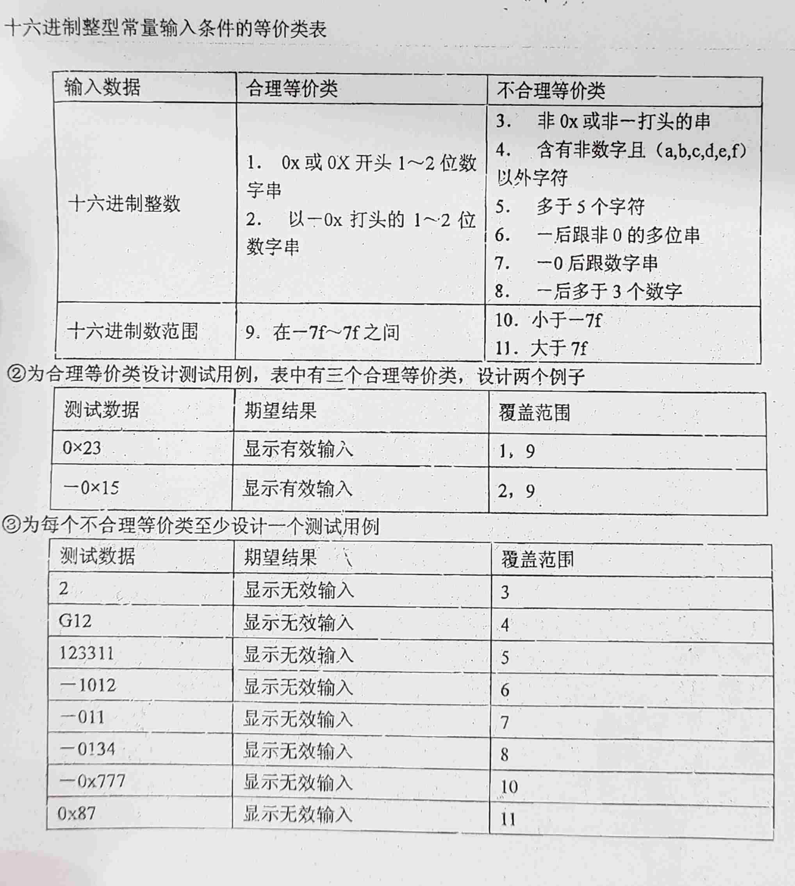

> 存放题库

‍

## 选择

‍

从**工程管理**的角度来看，软件设计分两步完成：

* 概要设计
* 详细设计

‍

捕获系统需求使用 原型模型

‍

顶层数据流图描述系统的输入与输出

‍

耦合度也可以分为七级：其中最松散的耦合是（A）

A. 非直接耦合

B. 数据耦合

C. 特征耦合

D. 控制耦合

‍

判定表由四部分组成：左上部列出（B）

A. 条件组合与动作之间的对应关系

B. 所有条件

C. 所有可能的动作

D. 可能的条件组合

‍

常用的软件项目的估算方法主要有哪4种？

1. 自顶向下的估算方法
2. 自底向上的估算方法
3. 差别估算法
4. 根据经验估算公式

‍

13．原型化方法是一种___A____型的设计过程。  
A．自外向内  
B．自顶向下  
C．自内向外  
D．自底向上

‍

软件结构化设计中，好的软件结构应该力求做到_____B____。  
A．顶层扇出较少，中间扇出较高，底层模块低扇入  
B．顶层扇出较高，中间扇出较少，底层模块高扇入  
C．顶层扇入较少，中间扇出较高，底层模块高扇入  
D．顶层扇入较少，中间扇入较高，底层模块低扇入

‍

‍

## 填空

‍

‍

从结构化的瀑布模型看，在它的生命周期中的八个阶段中，**需求分析阶段**出错，对软件的影响最大。

‍

在结构化的瀑布模型中，（需求分析阶段）定义的标准将成为软件测试中的系统测试阶段的目标

‍

Jackson方法是在软件开发过程中常用的方法，使用Jackson方法时可以实现 从数据结构导出程序结构

‍

软件工程中的 结构化分析SA - 传统软件分析 - 结构化方法 是一种面向(==数据流)==的分析方法

‍

软件复杂性度量的参数包括（规模)

‍

详细设计的结果基本决定了最终程序的（质量)

‍

在下面的软件开发方法中，哪一个对软件设计和开发人员的开发要求最高(原型化方法)。

‍

独立路径是指包括一组以前没有处理的语句或条件的一条路径。从程序图来看:一条独立路径是至少包含有一条(在其他独立路径中未有过)的边的路径

‍

瀑布模型的关键不足在于（不能适应需求的动态变更)

‍

需求分析中开发人员要从用户那里了解（软件做什么.)

‍

结构化程序设计主要强调的是（程序易读性)

‍

对象实现了数据和操作的结合,使数据和操作( 封装)于对象的统一体中

‍

软件调试技术包括（演绎法)

‍

在McCall软件质量度量模型中，(适应性)属于面向软件产品修改.

‍

可行性研究要进行一次:  简化的压缩的 需求分析

(技术评审)是以提高软件质量为目的的技术活动

‍

面向对象方法学的出发点和基本原则是尽可能模拟人类习惯的思维方式,分析、设计和实现一个软件系统的方法和过程,尽可能接近于人类认识世界解决问题的方法和过程。因此面向对象方法有许多特征，如软件系统是由对象组成的, (把对象划分成类,每个对象类都定义一组数据和方法); 对象彼此之间仅能通过传递消息互相联系:层次结构的继承。

‍

**局部化**是指让一些关系密切的软件元素在物理上彼此靠近。

‍

节点是**2条以上的支路的连接点**

‍

软件生存周期是指从形成软件概念起，所开发的软件使用之后，直到失去使用价值，消失为止的整个过程。

‍

从系统设计的角度出发，软件设计方法分为**数据流、数据结构、面向对象**三大类。

‍

复杂问题的对象模型通常由下述五个层次组成：主题层、___类与对象_层、__结构___层、_属性_层和__服务_层。

‍

等价类是指**类中每一个值在测试中的作用与这一类的所有其它值的作用相同**。

‍

模块耦合衡量：模块之间的联系紧密程度  
模块内聚衡量：一个模块内部的紧密程度

‍

软件生存周期一般可以划分为，问题定义、__可行性研究__、__需求分析  
__ *、* 设计 、编码、测试 和 运行与维护

‍

软件可靠性是指在给定的时间间隔内，程序成功运行的（概率）

‍

高级语言：独立于机器，面向过程或面向（对象）

‍

在公式V（G）= E – N + 2中：E为程序图G中边的总数； N 为程序图中结点的总数。V（G）又称为图G的环形（复杂度）

‍

文档（document）—一种数据媒体和其上所记录的（数据）

‍

软件定义过程可通过软件系统的(可行性研究)和需求分析两个阶段来完成

‍

软件的可互操作性，是指多个软件元素相互（通信）并协同完成任务的能力

‍

软件的可维护性差是软件维护工作量和费用激增的直接原因。（√）

‍

按照功能，软部件可划分为系统软件和应用软件两类。（√）

‍

从工程管理的角度软件设计可分为概要设计和（详细）设计两大步骤

‍

测试用例中，不仅要选择合理的输入数据，还要选择（不合理）的输入数据

‍

一般来说，可以从__一致性__、_完整性___、_现实性____和_有效性___四个方面验证软件需求的正确性。

‍

软件是计算机程序及其说明程序的各种文档，软件 = 程序 +文档（＋数据)

‍

‍

## 判断

验证软件需求的方法主要靠人工审查的方法。    T

‍

类是对象的模板，对象是类的实例化 (对应关系别错了)

‍

面向对象软件工程方法就是至上而下、逐步求精的方法。F  自顶向下? 而且这个是面向对象诶

‍

‍

通常紧致性好的语言一致性就好。（X）

‍

完善性维护是提高或完善软件的性能。（√）

‍

‍

一般来说，设计软件时应尽量使用数据耦合，减少控制耦合，限制外部环境耦合和公共数据耦合，杜绝内容耦合。（√）

‍

瀑布模型的核心是按照软件开发的时间顺序将问题简化 。**F**

> 阶段间具有顺序性和依赖性；推迟实现的观点；质量保证的观点。瀑布模型采用结构化的分析与设计方法，将逻辑实现与物理实现分开

‍

## 简答

‍

软件工程定义, 目标和内容是什么

> 软件工程就是用科学的知识和技术原理来定义，开发，维护软件的一门学科。
>
> 软件工程目标：付出较低开发成本；达到要求的功能；取得较好的性能；开发的软件易于移植；只需较低的维护费用；能按时完成开发任务，及时交付使用；开发的软件可靠性高。
>
> 软件工程内容：包括开发技术和开发管理两个方面。

‍

简述软件再工程的过程（无解释给3分，有解释满分）？  
答：（1）库存目录分析；  
包含每个应用系统的信息，如：名称、构建日期、修改次数、过去18个月报告的错误、用户数量、文档质量、预期寿命，等。从中选出再工程的候选者。  
（2）文档重构；  
①如果一个程序走向生命终点，不再经历变化，则保持现状；②重构只针对当前正在修改的软件部分。  
（3）逆向工程；  
逆向工程是一个恢复设计结果的过程，从程序代码中抽取数据结构、体系结构和处理过程的设计信息。  
（4）代码重构；  
分析源代码，标注出与结构化程序设计概念不符的部分，重构它的代码，测试重构代码并更新代码。  
（5）数据重构；  
当数据结构较差时，进行再工程。如以文件方式保存数据变为以数据库方式存储。  
（6）正向工程。  
也称革新或改造，即应用软件工程的原理、概念、技术和方法来重新开发现有系统。

‍

‍

简述静态测试方法和动态测试方法

> ,,,

‍

软件危机原因

> ‍

‍

软件测试步骤

> * 单元
> * 集成
> * 确认
> * 确认

> 单元测试对源程序中每一个程序单元进行测试，检查各个模块是否正确实现规定的功能，从而发现模块在编码中或算法中的错误。该阶段涉及编码和详细设计文档·
>
> 集成测试是为了检查与设计相关的软件体系结构的有关问题，也就是检查概要设计是否合理有效。
>
> 确认测试主要是检查已实现的软件是否满足需求规格说明书中确定了的各种需求。
>
> 系统测试是把已确认的软件与其他系统元素(如硬件、其他支持软件、数据、人工等)结合在一起进行测试。以确定软件是否可以支付使用。

‍

测试目的 -- 发现错误    

> * 发现错误
> * 好的用例是发现没发现错误的
> * 好的测试是发现没发现错误的

‍

‍

容错技术的四种主要手段

> 结构冗余    静态动态混合冗余
>
> 信息冗余    检测错误添加信息
>
> 时间冗余    重复执行消除偶然性
>
> 冗余附加技术, 实现上述技术需要的资源和技术

‍

13．简述提高软件可维护性的方法。（每项1分）  
（1）建立明确的软件质量标准；  
（2）使用先进软件开发技术和工具；  
（3）建立明确的软件质量保证工作；  
（4）选择可维护的程序设计语言；  
（5）改进程序文档。

‍

‍

‍

14、简述软件需求说明书（软件规格说明书）中包含的内容？（每项1分）  
答：

（1）软件系统的开发背景资料（主要相关人、财、物或设备）；  
（2）所开发软件的功能、性能、用户界面及运行环境等作出详细的说明；  
（3）软件系统详细的逻辑模型：数据流图(DFD)+数据词典（DD）或面向对象的三大模型（对象模型、动态模型和功能模型）等  
（4）系统开发计划表  
（5）所有附加文档：调查问卷信息、BPFD等

‍

‍

简述面向对象方法学的4个要点。  
答：概括地说，面向对象方法学具有下述4个要点：  
(1) 把对象(object)作为融合了数据及在数据上的操作行为的统一的软件构件。  
(2) 把所有对象都划分成类(class)。  
(3) 按照父类(或称为基类)与子类(或称为派生类)的关系，把若干个相关类组成一个层次结构的系统(也称为类等级)。  
(4) 对象彼此间仅能通过发送消息互相联系。

‍

‍

结构化程序设计的基本要点

* 自顶向下, 逐步求精
* 单入口单出口
* 三种基本控制结构
* 主程序员组

‍

软件维护的几种类型, 说明哪个最大

> 改正性维护：诊断和改正错误的过程
>
> 适应性维护：为了和变化了的环境适当地配合而进行的修改软件的活动
>
> ==完善性维护==：为了满足用户提出的增加新功能或修改已有功能的要求和一般性改进要求, 一半以上, 修改拟合需求
>
> 预防性维护：当为了改进未来的可维护性或可靠性，或为了给未来的改进奠定更好的基础而修改软件

‍

‍

瀑布等模型各自特点以及适用项目类型

> ...

‍

软件生命周期各阶段的主要任务

> ‍

‍

就程序设计语言的功能特性而言, 对程序编码要求

> * 可移植性
> * 开发工具的可利用性
> * 软件可重用性
> * 可维护性

‍

软件概要设计?该阶段的基本任务是什么?

把一个软件需求转换为软件表示时首先设计出软件总的体系结构。称为概要设计或结构设计。

基本任务:

(1)设计软件系统结构  
(2)进行数据结构及数据库的设计

(3)编写概要设计的文档  
(4)评审

‍

软件设什的基本原理

> ‍

‍

## 特殊

等价类画法示例

​​

‍

‍

‍

## 作图题特供

[【软件工程导论题型大总结】画图题总结_软件工程画图题-CSDN博客](https://blog.csdn.net/qq_39183034/article/details/123399644)

‍

重点考察

* 数据流图
* ~~E-R图~~
* 状态转换图
* 结构图
* 程序流程图和盒图
* 流图
* 判定表
* 类图
* 软件结构图

‍

其他还有, 个人经验

‍

### 数据流图

找出**源点/终点、处理、数据流、数据存储**这四个要素

千人千面, 自己理解逻辑

‍

### 状态转换图

状态与事件, 自动机流程

‍

### 结构图

描述信息的交换

* 最左侧一般是输入
* 中间是处理
* 最右侧是输出

‍

### 程序流程图和盒图

重点掌握程序流程图和盒图的转换, 主要根据流程图画盒图

流程图就是简单箭头模式讲具体逻辑变化

‍

程序流程图 + 测试用例 - 测试大题

‍

### 流图

抽象化的算复杂度的那个, 将一系列程序的运行合并. 合并顺序语句, 合并到一个圆圈内

程序流程图转换为流图，然后根据流图估计程序复杂度

‍

‍

### 判定表

(判定树)

细心画表, 然后结合出所有可能结果后处理即可

‍

‍

### 类图UML

基本的肯定可以画, 关联就是用小三角联系. 继承什么的按照语法来.

‍

### UML用例图 - 大概不考, 不看了

‍

‍

### 软件(模块)结构图

例如输入, 处理, 输出架构

有各种信息传递的图, 有上下传递的箭头文件

‍

‍

### 黑盒测试

设计测试用例-

两张表

1.输入条件+有效无效等价类的表格制作, 主要是判断哪些输入是合法的.

2.测试数据+期望结果+覆盖范围

‍

### 白盒测试

基本路径测试法

是在程序控制流图的基础上，通过分析控制结构的环路复杂性，导出基本可执行路径集合，从而设计出相应的测试用例的方法。设计出的测试用例要保证在测试中程序的语句覆盖100%，条件覆盖100%。

V(G)值正好等于该程序的独立路径的条数

一些已经覆盖过的不需要第二次覆盖

‍

### 问题分析图PAD图

就是那个像旗帜的东西, 从上往下进行

‍

‍

‍
